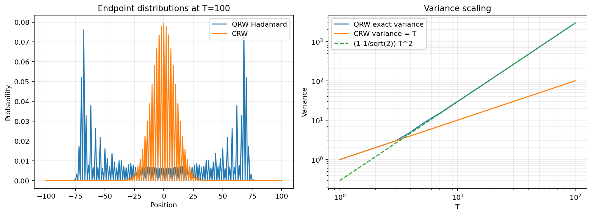

# BÁO CÁO  TOÀN DIỆN

## Lập trình vi cấu trúc thị trường bằng Quantum Random Walks

**Tên tiếng Anh:** Quantum Random Walks for Market Microstructure  
**Đối tượng nghiên cứu:** Dữ liệu giao dịch BTCUSDT ở mức sự kiện  
**Nguồn dữ liệu:** Binance Spot  
**Ngôn ngữ triển khai:** Python  
**Ngày cập nhật tài liệu:** 14/06/2026  
**Trạng thái phần mềm:** 61 kiểm thử tự động PASS; Phase 4, 5 và 6 PASS  
**Trạng thái khoa học:** Kết quả exploratory, chưa chứng minh QRW vượt trội

---

## Mục lục

1. Tóm tắt đồ án
2. Ý nghĩa và động cơ nghiên cứu
3. Mục tiêu, câu hỏi nghiên cứu và phạm vi kết luận
4. Nền tảng lý thuyết
5. Ánh xạ QRW sang vi cấu trúc thị trường
6. Kiến trúc tổng thể và luồng dữ liệu
7. Các giai đoạn thực hiện
8. Cấu trúc thư mục và ý nghĩa từng nhóm file
9. Dữ liệu, schema và feature engineering
10. Các mô hình được triển khai
11. Calibration, chống leakage và giao thức benchmark
12. Chỉ số đánh giá và kiểm định thống kê
13. Giải thích toàn bộ biểu đồ
14. Kết quả thực nghiệm hiện tại
15. Cách đọc đúng các kết quả
16. Hướng dẫn chạy và tái lập
17. Kiểm thử và bảo đảm chất lượng
18. Hạn chế, rủi ro và vấn đề còn mở
19. Hướng phát triển
20. Kết luận
21. Phụ lục tra cứu nhanh

---

## 1. Tóm tắt đồ án

Đồ án xây dựng một hệ thống nghiên cứu hoàn chỉnh để kiểm tra khả năng ứng
dụng **Quantum Random Walk - QRW** vào mô hình hóa vi cấu trúc thị trường tài
chính. QRW ở đây được mô phỏng bằng máy tính cổ điển; đồ án không sử dụng máy
tính lượng tử thật và cũng không giả định thị trường vận hành theo cơ học lượng
tử.

Ý tưởng trung tâm là ánh xạ:

- vị trí của walker thành mức giá tương đối;
- trạng thái coin thành áp lực tăng/giảm tiềm ẩn;
- order-book imbalance hoặc trade-flow imbalance thành tín hiệu điều khiển coin;
- trade intensity thành mức decoherence;
- phép đo vị trí thành một bước dịch chuyển giá quan sát được.

Hệ thống không chỉ chứa mô hình QRW. Nó bao gồm toàn bộ chuỗi nghiên cứu:

1. tài liệu lý thuyết và kiểm chứng toán học;
2. thu thập, làm sạch và chuẩn hóa dữ liệu;
3. tạo feature nhân quả;
4. mô phỏng pure-state QRW và density-matrix QRW;
5. calibration mô hình theo thời gian;
6. xây dựng các baseline cổ điển;
7. benchmark công bằng trên cùng train/holdout;
8. kiểm định phân phối, variance scaling, autocorrelation và tail risk;
9. scorecard tổng hợp;
10. biểu đồ, dashboard, báo cáo PDF và slide.

Kết quả hiện tại:

- dữ liệu thô: 47.636.914 giao dịch;
- feature sau xử lý: 47.099.914 dòng;
- cửa sổ benchmark chính ngày 12/06/2026: 1.908 dòng;
- train: 1.144 dòng;
- holdout: 764 dòng;
- số đường mô phỏng mỗi mô hình: 5.000;
- số bước benchmark: 500;
- mô hình xếp hạng cao nhất: **CRW Correlated**;
- QRW Adaptive đứng hạng 3;
- KS test bác bỏ việc phân phối QRW giống dữ liệu thực ở horizon 1;
- QRW tái hiện chưa tốt heavy tail và scale biến động;
- audit dự báo cho kết quả không ổn định: QRW thắng final holdout nhưng thua
  pooled walk-forward.

Kết luận bảo thủ và đúng với bằng chứng là: **đồ án đạt yêu cầu kỹ thuật và tạo
được một research pipeline có thể tái lập, nhưng chưa có bằng chứng xác nhận QRW
vượt trội về dự báo hoặc mô tả phân phối thị trường.**

---

## 2. Ý nghĩa và động cơ nghiên cứu

### 2.1. Ý nghĩa khoa học

Classical Random Walk thường được dùng như mô hình nền cho chuyển động giá.
Trong mô hình đơn giản nhất, walker đi trái hoặc phải với xác suất cố định và
variance tăng tuyến tính theo thời gian:

```text
Var(X_t) ∝ t
```

QRW thay xác suất cổ điển bằng biên độ phức, coin unitary và giao thoa. Với
Hadamard QRW coherent, variance có thể tăng gần bậc hai:

```text
Var(X_t) ∝ t²
```

Sự khác biệt này tạo ra một câu hỏi có thể kiểm chứng: liệu coin, phase,
interference và decoherence có cung cấp một family mô hình hữu ích hơn cho dữ
liệu sự kiện thị trường hay không?

### 2.2. Ý nghĩa về tài chính

Vi cấu trúc thị trường không chỉ quan tâm giá đóng cửa theo ngày. Nó nghiên cứu:

- chuỗi giao dịch buy/sell;
- bid-ask spread;
- độ sâu sổ lệnh;
- mất cân bằng cung cầu;
- tốc độ xuất hiện giao dịch;
- persistence hoặc reversal của hướng giá;
- biến động và thanh khoản ở horizon rất ngắn.

QRW phù hợp để thử nghiệm trong bối cảnh này vì bản thân nó là mô hình:

- rời rạc theo từng sự kiện;
- có trạng thái hướng nội tại;
- có toán tử chuyển trạng thái;
- có cơ chế mất coherence;
- có phân phối vị trí thay đổi theo thời gian.

### 2.3. Ý nghĩa kỹ thuật

Giá trị đáng kể của đồ án không chỉ nằm ở kết quả QRW. Project cung cấp:

- pipeline dữ liệu hàng chục triệu dòng;
- schema và metadata rõ ràng;
- kiểm soát leakage;
- benchmark nhiều mô hình;
- kiểm định thống kê;
- artifact versioning;
- kiểm thử tự động;
- báo cáo và hình ảnh tái lập được.

Đây là cấu trúc gần với một nghiên cứu định lượng thực tế hơn là một notebook
minh họa đơn lẻ.

### 2.4. Điều đồ án không khẳng định

Đồ án không chứng minh:

- thị trường là một hệ lượng tử vật lý;
- quantum advantage;
- QRW chắc chắn tạo lợi nhuận giao dịch;
- kết quả một ngày có thể tổng quát cho mọi giai đoạn;
- scorecard hạng cao đồng nghĩa với chiến lược đầu tư tốt.

QRW được sử dụng như một **mô hình toán học lấy cảm hứng từ lượng tử**.

---

## 3. Mục tiêu, câu hỏi nghiên cứu và phạm vi kết luận

### 3.1. Mục tiêu tổng quát

Xây dựng và đánh giá một mô hình QRW có thể nhận feature vi cấu trúc thị trường,
sau đó so sánh công bằng với các baseline cổ điển.

### 3.2. Mục tiêu cụ thể

1. Kiểm chứng các tính chất toán học của QRW.
2. Thu thập tối thiểu bảy ngày dữ liệu tick.
3. Xây dựng feature nhân quả, không dùng thông tin tương lai.
4. Mô phỏng QRW pure state và mixed state.
5. Thiết kế adaptive coin và decoherence phụ thuộc thị trường.
6. Calibration theo chronological split.
7. So sánh với CRW, GARCH và GBM.
8. Kiểm định phân phối, scaling, dependence và tail.
9. Xuất báo cáo, hình và slide có thể tái lập.

### 3.3. Câu hỏi nghiên cứu

> Một QRW được calibration nhân quả từ imbalance, tick direction và trade
> intensity có tái hiện dữ liệu vi cấu trúc thị trường tốt hơn các baseline cổ
> điển hay không?

### 3.4. Giả thuyết có thể bác bỏ

- QRW có thể tạo variance scaling khác CRW.
- Adaptive coin có thể tạo directional probability phù hợp với imbalance.
- Decoherence có thể điều chỉnh mức coherent spreading.
- QRW có thể giảm khoảng cách phân phối hoặc ACF MSE so với baseline.
- Nếu các kiểm định và holdout không ủng hộ, giả thuyết superiority phải bị bác
  bỏ hoặc để ở trạng thái chưa đủ bằng chứng.

### 3.5. Phạm vi dữ liệu dùng để kết luận hiện tại

Benchmark chính chỉ sử dụng một cửa sổ BTCUSDT ngày 12/06/2026. Dữ liệu
01-07/06 đã được rebuild bằng pipeline nhân quả nhưng đã từng được quan sát, nên
chỉ được xem là development data. Muốn kết luận confirmatory cần dữ liệu mới,
chưa từng dùng để thiết kế hoặc sửa mô hình.

---

## 4. Nền tảng lý thuyết

### 4.1. Classical Random Walk

Với random walk đối xứng:

```text
X_(t+1) = X_t + ξ_t
P(ξ_t = +1) = P(ξ_t = -1) = 1/2
```

Ta có:

```text
E[X_t] = 0
Var(X_t) = t
```

CRW không có biên độ phức, phase hay interference. Mỗi path là một chuỗi quyết
định xác suất cổ điển.

### 4.2. Không gian trạng thái QRW

QRW một chiều dùng tích tensor:

```text
H = H_coin ⊗ H_position
```

Trong đó:

- `H_coin` có hai basis `|L>` và `|R>`;
- `H_position` chứa các vị trí nguyên trên lattice;
- trạng thái tổng là tổ hợp biên độ phức trên coin và position.

### 4.3. Coin operator

Coin operator là ma trận unitary 2x2. Hadamard coin:

```text
H = 1/sqrt(2) * [[1,  1],
                 [1, -1]]
```

Tính unitary bảo đảm tổng xác suất được bảo toàn.

### 4.4. Conditional shift

Sau coin, thành phần `L` và `R` dịch theo hai hướng:

```text
S|L,x> = |L,x-1>
S|R,x> = |R,x+1>
```

Một bước tiến hóa:

```text
U_t = S(C_t ⊗ I)
|ψ_(t+1)> = U_t |ψ_t>
```

### 4.5. Xác suất vị trí

Xác suất tại vị trí `x` bằng tổng bình phương module của hai coin amplitude:

```text
P(x,t) = |ψ_L(x,t)|² + |ψ_R(x,t)|²
```

### 4.6. Density matrix

Để mô hình mixed state và noise, project dùng:

```text
ρ = |ψ><ψ|
```

Tiến hóa unitary:

```text
ρ' = UρU†
```

### 4.7. Decoherence

Basis dephasing giữ nguyên population trên đường chéo và làm giảm các phần tử
off-diagonal:

```text
ρ_ij <- exp(-γ) ρ_ij, i != j
```

Ý nghĩa:

- `γ = 0`: coherent hoàn toàn;
- `γ` tăng: interference giảm;
- `γ` rất lớn: hành vi tiến gần classical mixture.

Channel trong code là completely positive trace-preserving đối với dephasing
basis được sử dụng.

### 4.8. Pure state và measured path là hai đối tượng khác nhau

Project có hai dạng output:

1. **Position marginal:** phân phối xác suất của density matrix sau nhiều bước,
   chưa đo ở từng bước.
2. **Measured local trajectory:** mỗi event tạo một bước `-1`, `0` hoặc `+1`,
   dùng cho benchmark đường giá.

Không nên đồng nhất hai đối tượng này. Ballistic spreading của coherent QRW là
tính chất của position marginal lý thuyết; path benchmark có movement gate và
được calibration theo dữ liệu thị trường nên có thể gần diffusive hơn.

---

## 5. Ánh xạ QRW sang vi cấu trúc thị trường

| Thành phần QRW | Đại lượng thị trường | Ý nghĩa |
|---|---|---|
| Position `x` | Price level tương đối | Số tick lệch khỏi giá khởi đầu |
| Coin `L/R` | Áp lực giảm/tăng | Trạng thái hướng tiềm ẩn |
| Coin operator | Phản ứng với feature | Chuyển đổi áp lực hướng |
| Conditional shift | Price tick move | Dịch một tick trái/phải |
| Zero-move gate | Giá không đổi | Event xảy ra nhưng price không thay đổi |
| Phase | Thông tin hướng | Điều chỉnh interference mà vẫn giữ unitary |
| Decoherence `γ_t` | Mất thông tin/noise | Giảm coherence khi trạng thái thị trường thay đổi |
| Measurement | Giá quan sát | Chuyển phân phối sang kết quả path |

### 5.1. Order-book imbalance

Với LOB thật:

```text
OBI = (Q_bid - Q_ask) / (Q_bid + Q_ask)
```

`OBI` nằm trong `[-1, 1]`:

- gần `+1`: depth phía bid lớn hơn;
- gần `-1`: depth phía ask lớn hơn;
- gần `0`: cân bằng tương đối.

### 5.2. Trade-flow imbalance proxy

Khi không có LOB đồng bộ:

```text
OBI_proxy =
    (rolling_buy_volume - rolling_sell_volume)
    / (rolling_buy_volume + rolling_sell_volume)
```

Proxy được:

- tính riêng trong mỗi segment;
- dùng trailing window;
- shift một trade;
- loại current trade khỏi feature của chính nó.

Do đó đây là feature nhân quả, nhưng không được hiểu là order-book depth thật.

### 5.3. Adaptive directional signal

Sau chuẩn hóa feature:

```text
s_t = b
    + α_obi       z(OBI_t)
    + α_direction z(direction_t)
    + α_delta     z(ΔOBI_t)
    + α_abs       z(|OBI_t|)
```

### 5.4. Intensity-dependent decoherence

```text
γ_t = γ_base * exp(γ_intensity * z(log(1 + intensity_t)))
```

### 5.5. Xác suất tăng

Trong formulation calibration:

```text
p_up,t = 1/2 + 1/2 * exp(-γ_t) * tanh(s_t)
```

Điều này bảo đảm xác suất thuộc `(0,1)`.

### 5.6. Movement gate

Vì phần lớn trade event không làm đổi giá, project tách:

```text
M_t ~ Bernoulli(p_move)
D_t ∈ {-1, +1}
ΔP_t = tick_size * M_t * D_t
```

`p_move` được ước lượng từ train. Đây là lý do path có bước `-1`, `0`, `+1`
thay vì ép mọi trade phải làm giá đổi một tick.

---

## 6. Kiến trúc tổng thể và luồng dữ liệu

```text
Binance archives / WebSocket
            |
            v
      data/raw
            |
            v
 TickProcessor: validate, deduplicate,
 causal outlier filter, gap segmentation
            |
            v
     data/processed
            |
            v
 FeatureEngineer: direction, intensity,
 OBI/proxy, VWAP, autocorrelation
            |
            v
      data/features
            |
            +-----------------------------+
            |                             |
            v                             v
 Adaptive QRW calibration          Classical baselines
            |                      CRW/GARCH/GBM
            +-------------+---------------+
                          |
                          v
                   BenchmarkSuite
                          |
                          v
               StatisticalTestSuite
                          |
                          v
       CSV results + scorecard + figures
                          |
                          v
           Markdown/PDF/slides/dashboard
```

### 6.1. Nguyên tắc thiết kế

- Dữ liệu đi từ raw sang processed rồi feature; không sửa raw.
- Mọi split theo thứ tự thời gian.
- Artifact có metadata và checkpoint.
- Seed cố định để tái lập.
- Model được so sánh trên cùng horizon và initial price.
- Số liệu dùng cho kết luận nằm trong `results/` và `reports/`.
- Artifact cũ sai protocol được chuyển vào `archive/`, không xóa dấu vết.

---

## 7. Các giai đoạn thực hiện

### Phase 1 - Nền tảng lý thuyết

Mục đích:

- xây formalism DTQRW;
- so sánh QRW và CRW;
- ánh xạ sang thị trường;
- kiểm chứng unitary, normalization và variance.

Kết quả chính:

- unitarity error khoảng `1.047e-15`;
- eigenvalue radius error khoảng `1.443e-15`;
- QRW variance tại `T=100`: `2929.422331`;
- CRW variance tại `T=100`: `100`;
- fitted QRW exponent: `1.997996`.

### Phase 2 - Dữ liệu và feature

Mục đích:

- download/stream trade;
- thu LOB;
- chuẩn hóa timestamp/side/schema;
- làm sạch nhân quả;
- tạo feature.

Kết quả:

- 8 ngày/cửa sổ dữ liệu;
- 47.636.914 raw records;
- 47.099.914 feature rows;
- feature hữu hạn và metadata đầy đủ;
- một tiêu chí chưa đạt: tỷ lệ bị loại `1.127277%` lớn hơn roadmap `0.5%`.

### Phase 3 - Mô hình QRW

Mục đích:

- xây pure-state engine;
- density matrix;
- coin library;
- market-adapted QRW;
- calibration và performance benchmark.

Kết quả:

- probability và trace được bảo toàn;
- path local thuộc `{-1,0,+1}`;
- 1.000 paths x 1.000 steps dưới 60 giây;
- audit chống overfitting có split và bootstrap.

### Phase 4 - Baseline và benchmark

Mục đích:

- so QRW với CRW Simple, Biased, Correlated, GARCH và GBM;
- dùng chung split và metrics.

Kết quả:

- 6 mô hình;
- 7 metrics;
- protocol ex-ante;
- Phase 4 PASS.

### Phase 5 - Kiểm định thống kê

Mục đích:

- kiểm định phân phối;
- variance scaling;
- ACF/PACF và Ljung-Box;
- heavy tail, VaR, CVaR;
- tổng hợp scorecard.

Kết quả:

- cả bốn nhóm kiểm định được persist;
- scorecard hoàn chỉnh;
- CRW Correlated hạng 1, QRW hạng 3;
- Phase 5 PASS ở cấp engineering.

### Phase 6 - Trực quan và báo cáo

Mục đích:

- tạo hình;
- dashboard;
- report và slide;
- kiểm tra tính đầy đủ của artifact.

Kết quả:

- 7/7 hình bắt buộc hợp lệ;
- report PDF 20 trang;
- slide PDF 16 trang;
- 61 tests PASS;
- Phase 6 PASS.

---

## 8. Cấu trúc thư mục và ý nghĩa từng nhóm file

### 8.1. Các file ở thư mục gốc

| File | Mục đích |
|---|---|
| `README.md` | Giới thiệu trạng thái hiện tại và các lệnh chạy chính |
| `requirements.txt` | Danh sách dependency Python tối thiểu |
| `pyproject.toml` | Cấu hình pytest: test path và traceback format |
| `Makefile` | Shortcut `data`, `simulate`, `test`, `report`, `clean` |

Lưu ý: target `clean` trong `Makefile` dùng lệnh `rm`, phù hợp shell Unix hơn
PowerShell. Không nên chạy target này nếu chưa kiểm tra môi trường và artifact
cần giữ.

### 8.2. `config/`

#### `config/data_config.yaml`

Là cấu hình trung tâm của Phase 2:

- exchange: Binance;
- market: spot;
- symbol: BTC/USDT;
- ngày lịch sử 01-07/06/2026;
- đường dẫn raw/processed/features/reports;
- LOB depth và số level dùng cho OBI;
- rolling window;
- outlier threshold;
- gap threshold;
- nguồn OBI và cửa sổ trade imbalance.

Thay đổi file này làm thay đổi cách pipeline dữ liệu hoạt động.

### 8.3. `data/`

| Thư mục/file | Ý nghĩa |
|---|---|
| `data/raw/` | Dữ liệu gốc, không qua làm sạch |
| `data/processed/` | Tick đã chuẩn hóa, loại duplicate/outlier, thêm segment |
| `data/features/` | Ma trận feature dùng cho model |
| `data/README.md` | Hướng dẫn nguồn dữ liệu, proxy OBI và rebuild |

Quy mô hiện tại:

- `raw/`: 9 file, khoảng 0.203 GB;
- `processed/`: 8 file, khoảng 0.435 GB;
- `features/`: 8 file, khoảng 1.662 GB.

Pattern file:

```text
data/raw/tick_BTCUSDT_<date>.csv.gz
data/raw/lob_BTCUSDT_<date>.h5
data/processed/tick_processed_BTCUSDT_<date>.parquet
data/features/features_BTCUSDT_<date>.parquet
```

### 8.4. `notes/`

#### `notes/01_dtqrw_formalism.md`

Tài liệu toán học chính về:

- Hilbert space;
- coin operator;
- shift;
- one-step evolution;
- initial state;
- Fourier representation;
- density matrix;
- invariant dùng cho test.

#### `notes/02_qrw_vs_crw_theory.md`

So sánh:

- diffusive và ballistic scaling;
- hình dạng phân phối;
- vai trò coin;
- initial state;
- decoherence;
- hàm ý thị trường.

#### `notes/03_market_mapping.md`

Giải thích vì sao:

- position có thể đại diện price level;
- coin state đại diện pressure;
- adaptive coin phản ứng với imbalance;
- decoherence đại diện mất thông tin;
- measurement được hiểu trong market context.

### 8.5. `notebooks/`

#### `notebooks/01_theory_verification.ipynb`

Notebook kiểm chứng:

- tính unitary;
- eigenvalue;
- normalization;
- symmetry;
- QRW/CRW variance;
- scaling exponent.

Notebook là bằng chứng số hỗ trợ Phase 1, không phải pipeline production.

### 8.6. `docs/`

| File | Ý nghĩa |
|---|---|
| `ke_hoach_QRW_market_microstructure.md` | Roadmap gốc, task, checkpoint, rủi ro |
| `theory_notes.pdf` | Bản biên dịch tài liệu lý thuyết |
| `final_report.md` | Báo cáo nghiên cứu tiếng Anh sinh tự động |
| `final_report.pdf` | Báo cáo PDF 20 trang |
| `presentation_slides.md` | Nội dung slide |
| `presentation_slides.pdf` | Slide PDF 16 trang |
| `README.md` | Chỉ dẫn tài liệu |
| `bao_cao_do_an_toan_dien.md` | Tài liệu tiếng Việt hiện tại |

### 8.7. `src/data/`

Các file `src/__init__.py` và `src/*/__init__.py` khai báo package Python.
Ngoài docstring mô tả phạm vi, các package `data`, `models`, `evaluation`,
`visualization` và `reporting` còn export những class/hàm công khai qua
`__all__`. Nhờ đó code bên ngoài có thể import từ package thay vì phụ thuộc
vào đường dẫn module nội bộ. Riêng `dashboard/__init__.py` chỉ đánh dấu
dashboard là package tùy chọn.

#### `src/data/common.py`

Chứa hợp đồng schema và helper:

- `normalize_symbol`;
- tự nhận đơn vị timestamp s/ms/us/ns;
- normalize side thành `buy`/`sell`;
- ép DataFrame về canonical schema;
- validate positivity, uniqueness, monotonic time;
- tạo parent directory.

Đây là lớp bảo vệ đầu vào cho toàn bộ data pipeline.

#### `src/data/tick_downloader.py`

Chức năng:

- download daily ZIP từ Binance public data;
- parse `trades` hoặc `aggTrades`;
- đổi `is_buyer_maker` thành aggressive side;
- lưu gzip CSV chuẩn;
- import CSV từ nguồn khác qua column mapping.

#### `src/data/orderbook_collector.py`

Chức năng:

- gọi Binance REST depth endpoint;
- validate bids/asks;
- tính best bid, best ask, spread, mid price;
- tính OBI theo top levels;
- tính volume-weighted mid price;
- lưu snapshot HDF5;
- đọc HDF5 thành DataFrame.

#### `src/data/live_market_collector.py`

Chức năng:

- subscribe trade và partial depth trong một combined WebSocket;
- chỉ ghi trade sau snapshot LOB đầu tiên;
- dùng cùng local receive timestamp cho trade và LOB;
- reconnect khi stream gián đoạn;
- lưu trade vào gzip CSV và LOB vào HDF5.

Việc dùng chung clock tránh lỗi join giữa exchange timestamp và local receipt
timestamp.

#### `src/data/tick_processor.py`

Chức năng:

- loại price/quantity không hợp lệ;
- loại duplicate trade ID;
- sort theo timestamp;
- phát hiện outlier bằng rolling mean/std chỉ dùng quá khứ;
- phân biệt spike với thay đổi regime đã được xác nhận bởi tick trước;
- tạo gap segment;
- tính `price_increment` và `log_return` trong từng segment;
- xuất quality report.

#### `src/data/feature_engineer.py`

Chức năng:

- tạo tick direction;
- tạo trade intensity nhân quả;
- merge LOB hoặc tạo trade-flow proxy;
- tạo OBI validity flag;
- tạo VWAP/mid proxy;
- tính price-mid deviation;
- tính autocorrelation và p-value;
- ghi descriptive statistics và metadata.

### 8.8. `src/models/`

#### `src/models/qrw_core.py`

Core vật lý/toán học:

- `QuantumRandomWalk`: statevector pure state;
- `DensityMatrixQRW`: mixed state;
- coin validation;
- non-wrapping shift;
- boundary guard;
- probability, trace, purity, variance;
- dephasing theo từng bước.

#### `src/models/coin_operators.py`

Chứa:

- Hadamard coin;
- Grover/swap coin;
- biased rotation coin;
- OBI-adaptive phase coin;
- expected step;
- dephasing channel.

Adaptive coin giữ `|U_ij|²` cân bằng nhưng thay đổi phase. Vì vậy chỉ nhìn
magnitude heatmap không đủ để kết luận coin không có bias.

#### `src/models/qrw_market_sim.py`

`MarketQRW` là mô hình market-adapted cơ bản:

- calibration từ OBI và tick direction;
- ước lượng gamma từ autocorrelation;
- chọn regularization bằng chronological validation;
- two-stage calibration;
- exact density simulation;
- measured local path simulation;
- zero-move probability.

#### `src/models/adaptive_market_qrw.py`

Mô hình QRW chính trong benchmark:

- feature vector gồm OBI, direction, delta OBI, absolute OBI, log intensity;
- event-specific decoherence;
- calibration sáu tham số;
- validation chọn candidate;
- post-warmup bias update;
- probability forecast;
- density simulation;
- sampled path simulation.

#### `src/models/classical_rw.py`

Ba baseline:

- `CRW Simple`: hướng 50/50;
- `CRW Biased`: học `p_up`;
- `CRW Correlated`: học xác suất giữ hướng.

Cả ba học `p_move`, vì vậy có thể tạo zero move.

#### `src/models/garch_model.py`

Gaussian GARCH(1,1):

```text
r_t = μ + ε_t
ε_t = σ_t z_t
σ_t² = ω + α ε_(t-1)² + β σ_(t-1)²
```

Code:

- reparameterize để bảo đảm `α + β < 1`;
- fit maximum likelihood;
- retry bằng Powell nếu cần;
- tính AIC/BIC;
- simulate positive price paths.

#### `src/models/gbm_model.py`

Geometric Brownian Motion:

```text
dS/S = μdt + σdW
```

Code ước lượng drift/volatility từ log returns và mô phỏng lognormal paths.

### 8.9. `src/evaluation/`

#### `src/evaluation/benchmark_suite.py`

Là bộ điều phối benchmark:

- chronological split;
- fit tất cả model trên train;
- simulate cùng initial price, horizon và số path;
- tính metrics;
- ghi diagnostics;
- kiểm tra GARCH convergence;
- kiểm tra coherent QRW khác CRW về variance.

Protocol hiện tại:

```text
fixed_origin_ex_ante_zero_inflated_v2
```

QRW benchmark chỉ dùng feature cuối cùng của train để tạo forecast probability;
không đọc feature tương lai trong holdout.

#### `src/evaluation/statistical_tests.py`

Chứa bốn nhóm kiểm định:

1. distribution tests;
2. variance scaling;
3. autocorrelation;
4. tail analysis.

Ngoài ra có:

- Benjamini-Hochberg correction;
- moving-block bootstrap;
- path resampling;
- plot variance scaling và ACF.

#### `src/evaluation/results_compiler.py`

Ghép các bảng kết quả thành:

- `final_comparison_table.csv`;
- `scorecard.csv`.

Scorecard xếp hạng theo khoảng cách đến empirical, không dùng p-value như một
metric chất lượng độc lập để tránh double weighting KS.

### 8.10. `src/visualization/`

#### `src/visualization/plot_suite.py`

Sinh:

- GIF probability evolution;
- variance scaling;
- return distribution;
- ACF;
- sample paths;
- adaptive coin heatmap;
- scorecard;
- dashboard preview.

Mọi hình dùng style và seed có kiểm soát để tái lập.

### 8.11. `src/reporting/`

#### `src/reporting/report_builder.py`

Chức năng:

- đóng gói số liệu trong `ReportContext`;
- sinh Markdown report;
- sinh Markdown slides;
- render PDF bằng Matplotlib;
- chèn hình và quantitative table;
- đếm số trang PDF.

### 8.12. `src/dashboard/`

#### `src/dashboard/app.py`

Dashboard Streamlit exploratory:

- điều chỉnh gamma;
- điều chỉnh coin angle;
- chọn Hadamard/Biased;
- chọn số bước;
- xem position distribution;
- xem variance growth;
- đọc frozen Phase 5 scorecard.

Dashboard không thay đổi kết luận thống kê và không tự chạy lại Phase 5.

### 8.13. `scripts/`

#### `scripts/phase2_pipeline.py`

CLI cho:

```text
download
collect-lob
collect-live
process
features
test
checkpoint
```

#### `scripts/phase3_pipeline.py`

Calibration QRW, exact simulation, local-path performance benchmark và lưu
`calibrated_params.json`.

#### `scripts/phase3_overfitting_audit.py`

Audit một cửa sổ:

- train/validation/test;
- linear OBI baseline;
- fair linear market baseline;
- circular-shift test;
- paired bootstrap;
- rolling stability;
- walk-forward evaluation.

#### `scripts/phase3_multiday_edge_audit.py`

Audit edge nhiều ngày đối với cấu trúc QRW cố định. Các output pre-fix cũ đã
được archive; nếu chạy lại phải dùng protocol và dữ liệu hiện hành.

#### `scripts/phase3_adaptive_decoherence_audit.py`

Audit biến thể adaptive-decoherence và so với logistic baseline, gồm raw và
pairwise design.

#### `scripts/phase4_pipeline.py`

Chạy `BenchmarkSuite`, lưu benchmark/model comparison/GARCH diagnostics và
Phase 4 checkpoint.

#### `scripts/phase5_pipeline.py`

Chạy benchmark, toàn bộ statistical tests, compile scorecard, tạo figure Phase
5 và checkpoint.

#### `scripts/phase6_pipeline.py`

Chạy deliverable cuối:

- kiểm tra artifact Phase 5 có đúng feature/protocol/seed/path/step;
- chạy benchmark cho visualization;
- tạo hình;
- tạo report và slides;
- kiểm tra kích thước hình;
- đếm trang;
- chạy pytest;
- xuất Phase 6 diagnostics/checkpoint.

### 8.14. `tests/`

| File | Phạm vi kiểm thử |
|---|---|
| `conftest.py` | Cấu hình import path cho test |
| `test_data_pipeline.py` | Schema, timestamp, outlier, gap, OBI, causality, parser, persist |
| `test_qrw_implementation.py` | Unitary, normalization, variance và density matrix |
| `test_qrw_market.py` | MarketQRW calibration, coin, simulation, decoherence |
| `test_adaptive_market_qrw.py` | Adaptive intensity, calibration, local paths |
| `test_phase3_pipeline.py` | Tích hợp benchmark Phase 3 và zero move |
| `test_phase3_overfitting_audit.py` | Audit split/bootstrap/fair baseline |
| `test_phase4_baselines.py` | CRW, GARCH, GBM |
| `test_phase4_benchmark.py` | Reproducibility, ex-ante QRW, zero-move |
| `test_phase5_statistical.py` | Bốn nhóm kiểm định và scorecard |
| `test_phase6_artifacts.py` | Artifact version guard và visualization edge case |

### 8.15. `results/`

| File | Ý nghĩa |
|---|---|
| `calibrated_params.json` | Tham số QRW đã calibration |
| `garch_params.json` | Tham số GARCH |
| `benchmark_results.csv` | 7 metrics cho 6 model |
| `model_comparison_table.csv` | Likelihood/AIC/BIC theo family |
| `distribution_tests.csv` | KS, Anderson-Darling, Wasserstein |
| `variance_scaling_results.csv` | Beta, CI, bootstrap |
| `autocorrelation_tests.csv` | ACF MSE, Ljung-Box |
| `tail_analysis.csv` | Kurtosis, tail index, VaR, CVaR |
| `final_comparison_table.csv` | Bảng hợp nhất |
| `scorecard.csv` | Rank từng metric và overall rank |

### 8.16. `reports/`

Nhóm file:

- `phase1_checkpoint.md` đến `phase6_checkpoint.md`: cổng nghiệm thu từng phase;
- `phase*_diagnostics.json`: machine-readable diagnostics;
- `data_quality_*.txt`: báo cáo cleaning từng ngày;
- `feature_metadata_*.json`: provenance và causality;
- `feature_stats_*.csv`: descriptive statistics;
- `performance_benchmark.txt`: tốc độ Phase 3;
- `phase3_overfitting_audit.*`: audit dự báo;
- `live_window_*.md`: tóm tắt cửa sổ live;
- `theory_verification.*`: kiểm chứng Phase 1;
- các file audit ngày 13/06: lịch sử remediation.

### 8.17. `figures/`

Chứa hình cuối được giải thích ở Mục 13.

### 8.18. `archive/`

`reports/archive/` và `results/archive/` giữ artifact đã invalidated do protocol
cũ có leakage hoặc calibration không còn hợp lệ. Mục đích là audit history,
không phải dùng cho kết luận hiện hành.

### 8.19. File sinh tự động không thuộc logic dự án

- `__pycache__/`: bytecode Python;
- `.pytest_cache/`: cache pytest;
- `.test-tmp-*`: thư mục tạm của test.

Các file này không cần đọc để hiểu thuật toán và có thể được tái tạo.

---

## 9. Dữ liệu, schema và feature engineering

### 9.1. Canonical raw tick schema

| Cột | Kiểu/ý nghĩa |
|---|---|
| `timestamp` | Epoch nanosecond |
| `price` | Giá trade |
| `quantity` | Khối lượng |
| `side` | Aggressive side `buy` hoặc `sell` |
| `trade_id` | ID giao dịch duy nhất |

### 9.2. Processed schema

Ngoài raw columns:

| Cột | Ý nghĩa |
|---|---|
| `is_gap_start` | Bắt đầu segment sau time gap |
| `segment_id` | ID vùng liên tục |
| `price_increment` | Thay đổi giá trong segment |
| `log_return` | Log return trong segment |

Không tính return xuyên qua gap.

### 9.3. Feature schema

| Feature | Ý nghĩa |
|---|---|
| `tick_direction` | Hướng move gần nhất, fallback theo trade side |
| `trade_intensity` | Số trade đã quan sát đến hiện tại trong giây |
| `obi` | LOB imbalance hoặc trade-flow proxy |
| `obi_valid` | Feature imbalance đã đủ warmup/match |
| `mid_price` | Mid LOB hoặc trailing VWAP proxy |
| `vwmp` | Volume-weighted mid price |
| `price_mid_deviation` | Trade price trừ mid/proxy |

### 9.4. Vì sao trade intensity phải là cumulative count

Nếu mọi trade trong một giây đều được gán tổng số trade của cả giây, trade đầu
giây đã biết bao nhiêu trade sẽ đến sau nó. Đó là look-ahead leakage.

Implementation hiện tại dùng:

```text
1, 2, 3, ... trong từng epoch second
```

Do đó feature tại event `t` chỉ dùng event đã xảy ra đến `t`.

### 9.5. Gap segmentation

Nếu khoảng cách giữa hai trade lớn hơn 300 giây:

- bắt đầu segment mới;
- reset rolling feature;
- không nối return/autocorrelation qua gap.

### 9.6. Chất lượng dữ liệu hiện tại

PASS:

- đủ số ngày;
- đủ hơn một triệu record;
- không duplicate ID;
- ID tăng qua file;
- feature hữu hạn;
- row count khớp;
- imbalance provenance đầy đủ;
- OBI proxy nhân quả;
- intensity nhân quả;
- test Phase 2 PASS.

FAIL:

- cleaning loại `1.127277%`, lớn hơn ngưỡng roadmap `0.5%`.

FAIL này không phải lỗi code. Nó cho biết tiêu chí dữ liệu ban đầu quá chặt hoặc
dữ liệu thực có nhiều anomaly hơn dự kiến. Không nên tự ý hạ ngưỡng để biến
checkpoint thành PASS.

---

## 10. Các mô hình được triển khai

### 10.1. QRW pure state

Mục đích:

- kiểm tra đúng formalism;
- minh họa interference;
- kiểm tra ballistic spreading.

Không phải model forecast chính.

### 10.2. DensityMatrixQRW

Mục đích:

- mô hình hóa mixed state;
- áp dụng decoherence;
- theo dõi trace và purity;
- tạo cầu nối coherent-classical.

### 10.3. MarketQRW

Mô hình trung gian:

- adaptive coin từ OBI/direction;
- gamma từ lag-1 correlation;
- calibration directional link;
- exact marginal và sampled paths.

### 10.4. AdaptiveDecoherenceQRW

Mô hình chính:

- nhiều feature hơn;
- gamma thay đổi theo intensity;
- regularized optimization;
- split calibration rõ ràng;
- movement gate;
- probability forecast.

Tham số calibration hiện tại trên toàn cửa sổ 1.908 dòng:

| Tham số | Giá trị | Diễn giải thận trọng |
|---|---:|---|
| `gamma` | 0.1430 | Decoherence nền |
| `rho_1` | 0.8667 | Persistence direction dùng để suy ra gamma |
| `obi_bias` | 1.1752 | Intercept directional signal |
| `alpha_obi` | 0.4373 | Hệ số OBI chuẩn hóa |
| `alpha_direction` | -1.1469 | Hệ số direction chuẩn hóa |
| `alpha_obi_change` | -0.6290 | Hệ số thay đổi OBI |
| `alpha_abs_obi` | -1.7924 | Hệ số độ lớn imbalance |
| `gamma_intensity` | -0.9510 | Intensity điều chỉnh decoherence |
| `movement_probability` | 0.1725 | Tỷ lệ event làm đổi giá trên calibration data |

Không nên diễn giải dấu và độ lớn hệ số như quan hệ nhân quả kinh tế vì:

- feature được chuẩn hóa;
- feature tương quan với nhau;
- sample moving event nhỏ;
- `low_sample_warning=true`.

### 10.5. CRW Simple

Mỗi moving event có xác suất tăng/giảm 50/50. Chỉ học `p_move`.

### 10.6. CRW Biased

Học:

```text
p_up = số move tăng / số moving event
```

### 10.7. CRW Correlated

Học persistence:

```text
p_same = P(D_t = D_(t-1))
rho = 2*p_same - 1
```

Đây là baseline đơn giản nhưng phù hợp dữ liệu hiện tại vì empirical return có
autocorrelation dương rõ.

### 10.8. GARCH(1,1)

Mạnh ở volatility clustering và heavy-tail-like conditional mixture, nhưng mô
hình Gaussian GARCH hiện tại có scale path quá lớn so với event tick benchmark.

Tham số:

- `alpha = 0.6738`;
- `beta = 0.3131`;
- persistence `0.9869`;
- optimizer hội tụ.

### 10.9. GBM

Baseline continuous diffusion với drift và volatility hằng. GBM dễ triển khai
nhưng không mô tả event discreteness, zero move hoặc order-flow persistence.

---

## 11. Calibration, chống leakage và giao thức benchmark

### 11.1. Chronological split

Không shuffle time series. Benchmark dùng:

```text
60% train -> 40% later holdout
```

Trong 1.908 dòng:

- train 1.144;
- holdout 764;
- 501 điểm đầu holdout dùng cho path benchmark 500 bước.

### 11.2. Two-stage calibration

Adaptive QRW:

1. lấy 40% đầu làm structural warmup;
2. tách moving events warmup thành fit và validation;
3. fit nhiều regularization candidate;
4. chọn candidate theo validation Brier;
5. không refit structural parameters bằng validation;
6. freeze structure;
7. update riêng bias trên post-warmup data;
8. không reuse warmup cho bias.

### 11.3. Low-sample warning

Structural fit hiện chỉ có 77 moving events cho 6 tham số, khoảng 12.83 event
mỗi tham số. Đây là sample thấp; hệ số có thể không ổn định.

### 11.4. Fixed-origin ex-ante forecast

Trong benchmark Phase 4/5:

- model chỉ fit train;
- QRW dùng probability tại feature vector cuối train;
- probability đó được giữ cố định cho horizon forecast;
- holdout OBI, intensity và direction không được đưa vào simulator.

Điều này tránh biến benchmark thành conditional reconstruction dùng feature
tương lai.

### 11.5. Artifact version guard

Phase 6 từ chối chạy nếu Phase 5 artifact không khớp:

- protocol version;
- feature path;
- file size và modification time;
- train fraction;
- requested steps;
- number of paths;
- random seed.

Mục đích là tránh ghép hình mới với số liệu cũ.

### 11.6. Reproducibility

Seed mặc định:

```text
2026
```

Các model nhận child seed riêng từ `SeedSequence`, tránh vô tình dùng cùng một
random stream.

---

## 12. Chỉ số đánh giá và kiểm định thống kê

### 12.1. `wasserstein_path_mae`

Tại mỗi bước, empirical path là một điểm, còn simulated paths tạo một phân phối
cross-section. Khoảng cách Wasserstein đến một point mass bằng mean absolute
deviation:

```text
mean_i |P_i,t - P_real,t|
```

Sau đó lấy trung bình theo thời gian. Thấp hơn là tốt hơn.

### 12.2. `variance_ratio`

```text
Var(terminal displacement in ticks) / T
```

Với zero-inflated symmetric CRW, target gần `p_move`, không phải luôn bằng 1.

### 12.3. `return_kurtosis`

Đo độ nhọn và tail của return. Gaussian có Pearson kurtosis gần 3. Empirical
kurtosis rất cao cho thấy heavy tail.

### 12.4. Hit rate

`hit_rate_h1`, `h5`, `h10` đo tỷ lệ dấu của expected simulated change trùng dấu
realized change tại horizon 1, 5, 10. Zero realized change bị bỏ qua.

### 12.5. Mean directional log likelihood

Đánh giá xác suất hướng trên moving events. Giá trị ít âm hơn là tốt hơn.

### 12.6. KS test

So sánh empirical và simulated one-step return distribution:

- null: hai sample cùng phân phối;
- p-value nhỏ: bác bỏ null.

Tất cả mô hình hiện bị bác bỏ ở horizon 1.

### 12.7. Anderson-Darling k-sample

Nhạy hơn với khác biệt ở tail; được chạy ở nhiều horizon.

### 12.8. Wasserstein distance

Đo chi phí vận chuyển xác suất giữa hai phân phối. Thấp hơn nghĩa là gần hơn.

### 12.9. Variance scaling exponent

Fit:

```text
Var(Δ_h log P) ∝ h^β
log Var = a + β log h
```

Diễn giải:

- `β ≈ 1`: diffusive;
- `β > 1`: superdiffusive;
- `β ≈ 2`: ballistic.

Formal test dùng non-overlapping log-return displacement và bootstrap.

### 12.10. Moving-block bootstrap

Empirical return có dependence nên không bootstrap từng event độc lập. Code lấy
block liên tiếp, ghép lại thành path rồi fit lại beta.

### 12.11. Path resampling

Đối với simulation, bootstrap chọn lại toàn bộ path, giữ dependence nội path.

### 12.12. ACF MSE

```text
mean_lag (ACF_model(lag) - ACF_empirical(lag))²
```

Thấp hơn là tốt hơn.

### 12.13. Ljung-Box

Kiểm tra chuỗi còn autocorrelation tổng hợp đến một lag hay không.

### 12.14. Tail metrics

- Pearson kurtosis;
- kurtosis test;
- Hill tail index;
- VaR 95%, 99%;
- CVaR/Expected Shortfall 95%, 99%.

Tail index thấp hơn thường biểu thị tail nặng hơn. QRW tail index cực lớn cho
thấy simulated fixed-tick return có tail rất mỏng so với empirical.

### 12.15. Benjamini-Hochberg

Khi chạy nhiều test, p-value được điều chỉnh để kiểm soát false discovery rate.

### 12.16. Scorecard

Scorecard rank bảy nhóm:

- KS statistic;
- Wasserstein;
- khoảng cách variance beta;
- ACF MSE;
- khoảng cách kurtosis;
- khoảng cách VaR 99%;
- khoảng cách CVaR 99%.

Mean rank thấp hơn là tốt hơn. Scorecard không phải utility function đầu tư và
không phản ánh độ lớn kinh tế trực tiếp.

---

## 13. Giải thích toàn bộ biểu đồ

### 13.1. `figures/prob_evolution.gif`


**Mục đích:** minh họa khác biệt lý thuyết QRW và CRW.

- Trục ngang: vị trí walker.
- Trục dọc: xác suất.
- Panel trái: coherent QRW.
- Panel phải: symmetric CRW.

Khi thời gian tăng:

- QRW xuất hiện nhiều peak do interference và lan xa;
- CRW tạo binomial envelope tập trung quanh trung tâm;
- hình này không dùng market feature và không phải forecast BTC.

### 13.2. `figures/variance_scaling.png`


**Mục đích:** quan sát variance tăng theo horizon.

- cả hai trục dùng log scale;
- slope là beta;
- empirical nằm ở scale variance lớn hơn nhiều QRW/CRW tick models;
- QRW/CRW gần beta 1 trong hình;
- CRW Correlated có slope lớn hơn do persistence;
- GARCH có scale variance rất lớn.

**Lưu ý estimator:** beta ghi trên hình được fit từ variance price change chồng
lấn để trực quan. Beta trong `variance_scaling_results.csv` là thống kê chính
thức dùng non-overlapping log-return và bootstrap. Khi hai số khác nhau, dùng
CSV/CI cho kết luận định lượng.

### 13.3. `figures/return_distributions.png`


**Mục đích:** so hình dạng one-step return.

- trục ngang: z-score return;
- trục dọc: KDE density log scale;
- mỗi series được chuẩn hóa riêng;
- chỉ so shape, không so volatility scale.

Empirical có mass và tail phức tạp. QRW/CRW fixed-tick tạo các mode rời rạc và
tail mỏng. GARCH rộng hơn, GBM gần Gaussian hơn.

### 13.4. `figures/acf_comparison.png`


**Mục đích:** so dependence theo lag.

- empirical ACF dương rõ ở nhiều lag;
- QRW, CRW Simple, GARCH và GBM gần zero;
- CRW Correlated giữ được một phần dependence và có ACF MSE thấp nhất.

Điều này giải thích vì sao baseline rất đơn giản lại thắng scorecard tổng.

### 13.5. `figures/sample_paths.png`


**Mục đích:** kiểm tra bằng mắt điều mà metric trung bình có thể che.

- đường đen: empirical BTCUSDT;
- xanh nhạt: QRW sample paths;
- cam nhạt: CRW Simple;
- empirical tăng khoảng 20 USDT;
- QRW/CRW chỉ dao động rất nhỏ quanh initial price.

Hình cho thấy scale mismatch: mô hình fixed one-tick local move không tái hiện
được chuỗi jump và regime move của empirical path.

### 13.6. `figures/coin_operator_heatmap.png`


**Panel trái:** `|U_ij|²`, mỗi ô bằng 0.5.  
**Panel phải:** phase `arg(U_ij)`.

Thông tin direction được mã hóa trong phase, không nhất thiết trong magnitude.
Ma trận vẫn unitary. Đây là điểm cốt lõi của adaptive coin.

### 13.7. `figures/scorecard.png`


- trục ngang: mean metric rank;
- thấp hơn là tốt hơn;
- QRW được tô xanh;
- màu cam là baseline;
- CRW Correlated hạng 1;
- QRW hạng 3.

Chú thích “single-window exploratory ranking” nhắc rằng đây không phải kết luận
confirmatory.

### 13.8. `figures/dashboard_screenshot.png`


Preview trình bày:

- khu vực control;
- empirical event path;
- mean rank;
- top model và QRW rank;
- guardrail về phạm vi một cửa sổ.

Đây là ảnh tĩnh cho report. Dashboard thật trong `src/dashboard/app.py` cho phép
thay gamma, coin và steps để xem density-matrix QRW.

### 13.9. `reports/theory_verification.png`



Hình Phase 1 dùng để xác nhận:

- xác suất được chuẩn hóa;
- QRW lan ballistic;
- CRW lan diffusive;
- công thức và implementation thống nhất.

---

## 14. Kết quả thực nghiệm hiện tại

### 14.1. Phase 4 path benchmark

| Model | Path MAE | Hit@1 | Hit@5 | Hit@10 | Direction log-likelihood |
|---|---:|---:|---:|---:|---:|
| QRW Adaptive | 6.3260 | 75.20% | 79.74% | 81.05% | -0.6187 |
| CRW Simple | 6.5585 | 53.60% | 52.42% | 56.14% | -0.6905 |
| CRW Biased | 6.7012 | 24.80% | 20.26% | 18.95% | -1.0617 |
| CRW Correlated | 6.5647 | 52.00% | 53.30% | 54.04% | -0.6883 |
| GARCH(1,1) | 8.1079 | 55.20% | 70.93% | 81.75% | -0.6868 |
| GBM | 10.1198 | 24.80% | 20.26% | 18.95% | -0.7295 |

QRW có kết quả direction tốt trong fixed-origin benchmark này, nhưng đây không
đủ để kết luận superiority vì:

- direction probability gần như cố định cho cả horizon;
- empirical path có trend mạnh trong cửa sổ;
- phân phối và tail vẫn sai;
- walk-forward audit không xác nhận ổn định.

### 14.2. Distribution test horizon 1

| Model | KS statistic | BH-adjusted p-value |
|---|---:|---:|
| QRW Adaptive | 0.108 | 0.005832 |
| CRW Simple | 0.108 | 0.005832 |
| CRW Biased | 0.142 | 0.000163 |
| CRW Correlated | 0.118 | 0.002815 |
| GARCH(1,1) | 0.472 | ~3.0e-50 |
| GBM | 0.506 | ~7.8e-58 |

Tất cả p-value nhỏ hơn 0.05: không mô hình nào tái hiện đúng one-step empirical
distribution.

### 14.3. Variance scaling chính thức

| Model | Beta | 95% bootstrap interval |
|---|---:|---:|
| Empirical | 1.3845 | [0.8519, 1.4537] |
| QRW Adaptive | 1.0023 | [0.9853, 1.0192] |
| CRW Simple | 0.9983 | [0.9814, 1.0146] |
| CRW Biased | 1.0004 | [0.9841, 1.0164] |
| CRW Correlated | 1.1485 | [1.1301, 1.1649] |
| GARCH(1,1) | 1.0006 | [0.9512, 1.0570] |
| GBM | 1.0020 | [0.9836, 1.0199] |

Empirical estimate bất định rộng do sample ngắn. CRW Correlated gần empirical
point estimate hơn QRW.

### 14.4. ACF

| Model | ACF MSE |
|---|---:|
| CRW Correlated | 0.005615 |
| CRW Biased | 0.009894 |
| CRW Simple | 0.009898 |
| QRW Adaptive | 0.009905 |
| GBM | 0.009907 |
| GARCH(1,1) | 0.010395 |

Empirical Ljung-Box p-value rất nhỏ, xác nhận dependence. Các model gần
white-noise không tái hiện phần này tốt.

### 14.5. Tail

| Model | Kurtosis | Hill tail index |
|---|---:|---:|
| Empirical | 47.1807 | 1.2886 |
| QRW Adaptive | 7.3693 | 1.656e6 |
| CRW Simple | 6.9739 | 2.222e6 |
| CRW Correlated | 7.8719 | 1.228e6 |
| GARCH(1,1) | 27.9031 | 1.6622 |
| GBM | 2.8608 | 5.6267 |

GARCH gần heavy-tail behavior hơn về tail index/kurtosis, nhưng scale và các
metric khác kém.

### 14.6. Scorecard

| Rank | Model | Mean rank |
|---:|---|---:|
| 1 | CRW Correlated | 1.857 |
| 2 | CRW Simple | 2.571 |
| 3 | QRW Adaptive | 2.857 |
| 4 | CRW Biased | 3.571 |
| 5 | GARCH(1,1) | 4.857 |
| 6 | GBM | 5.000 |

### 14.7. Predictive audit Phase 3

| Comparison | QRW minus baseline Brier | 95% interval | Kết quả |
|---|---:|---:|---|
| Final holdout vs fair affine | -0.046880 | [-0.067598, -0.026675] | QRW tốt hơn |
| Pooled walk-forward vs fair affine | +0.049889 | [0.020831, 0.078994] | QRW kém hơn |

Hai kết quả trái dấu cho thấy edge không ổn định theo evaluation scheme.

---

## 15. Cách đọc đúng các kết quả

### 15.1. Một model có hit rate cao chưa chắc có phân phối tốt

QRW có hit rate cao trong cửa sổ benchmark nhưng:

- KS vẫn bác bỏ;
- heavy tail sai;
- path scale sai;
- ACF kém CRW Correlated.

### 15.2. Rank không phải bằng chứng nhân quả

Scorecard chỉ tổng hợp khoảng cách thống kê. Nó không cho biết:

- model có tạo alpha giao dịch sau phí hay không;
- coefficient có causal interpretation hay không;
- kết quả có bền qua regime hay không.

### 15.3. Một holdout thắng không đủ nếu walk-forward thua

Final holdout có thể thuận lợi cho một directional bias cụ thể. Walk-forward đo
độ ổn định trên nhiều origin. Kết quả trái dấu yêu cầu thu thêm dữ liệu.

### 15.4. QRW theoretical ballistic không đồng nghĩa market path ballistic

Coherent pure QRW có beta gần 2. Market-adapted measured path:

- có decoherence;
- có zero move;
- dùng fixed-origin probability;
- có measurement mỗi event.

Do đó beta gần 1 không phải bug; nó cho thấy calibration đã đưa model về vùng
gần diffusive.

### 15.5. OBI proxy không phải LOB thật

Trade-flow imbalance dùng volume giao dịch đã xảy ra. LOB OBI dùng resting
liquidity chưa khớp lệnh. Hai đại lượng liên quan nhưng không giống nhau.

---

## 16. Hướng dẫn chạy và tái lập

### 16.1. Cài dependency

```text
pip install -r requirements.txt
```

### 16.2. Chạy test

```text
python -m pytest
```

Kỳ vọng hiện tại:

```text
61 passed
```

### 16.3. Kiểm tra Phase 2

```text
python scripts/phase2_pipeline.py checkpoint
```

Lệnh có thể trả exit code 1 do tiêu chí cleaning `<0.5%` đang FAIL, dù các kiểm
tra causality và unit test PASS.

### 16.4. Rebuild dữ liệu lịch sử

```text
python scripts/phase2_pipeline.py process
python scripts/phase2_pipeline.py features --obi-source trade_imbalance
python scripts/phase2_pipeline.py checkpoint
```

### 16.5. Chạy calibration Phase 3

```powershell
python scripts/phase3_pipeline.py --feature-path data/features/features_BTCUSDT_2026-06-12.parquet
```

### 16.6. Chạy audit overfitting

```powershell
python scripts/phase3_overfitting_audit.py --feature-path data/features/features_BTCUSDT_2026-06-12.parquet
```

### 16.7. Chạy benchmark

```powershell
python scripts/phase4_pipeline.py --feature-path data/features/features_BTCUSDT_2026-06-12.parquet
```

### 16.8. Chạy statistical tests

```powershell
python scripts/phase5_pipeline.py --feature-path data/features/features_BTCUSDT_2026-06-12.parquet
```

### 16.9. Tạo deliverable cuối

```powershell
python scripts/phase6_pipeline.py --feature-path data/features/features_BTCUSDT_2026-06-12.parquet
```

### 16.10. Chạy dashboard

Streamlit là dependency tùy chọn, không nằm trong `requirements.txt` hiện tại.
Sau khi cài:

```text
pip install streamlit
streamlit run src/dashboard/app.py
```

### 16.11. Dùng Makefile

```text
make test
make data
make simulate
make report
```

Trên Windows PowerShell nên ưu tiên chạy trực tiếp các lệnh Python.

---

## 17. Kiểm thử và bảo đảm chất lượng

### 17.1. Invariant toán học

- coin unitary;
- total probability bằng 1;
- density trace bằng 1;
- probability không âm;
- lattice không wrap;
- coherent QRW variance lớn hơn CRW;
- dephasing giữ population.

### 17.2. Invariant dữ liệu

- timestamp monotonic;
- trade ID unique;
- price/quantity dương;
- side hợp lệ;
- log return hữu hạn;
- gap không bị nối;
- OBI trong `[-1,1]`.

### 17.3. Test chống leakage

- prefix invariance của outlier cleaner;
- thay riêng tick `t+1` không đổi output đến `t`;
- trade intensity prefix invariance;
- synthetic OBI loại current trade;
- QRW forecast bất biến khi sửa holdout covariates.

### 17.4. Test statistical pipeline

- đầy đủ bốn test category;
- CI hợp lệ;
- bootstrap method đúng;
- scorecard không double-count KS p-value;
- artifact mismatch bị từ chối.

### 17.5. Checkpoint

Checkpoint vừa cho người đọc vừa cho máy:

- Markdown: dễ audit;
- JSON/CSV: dễ parse;
- pipeline fail nếu acceptance quan trọng không đạt.

---

## 18. Hạn chế, rủi ro và vấn đề còn mở

### 18.1. Sample benchmark quá ngắn

Một cửa sổ 1.908 event không đủ để kết luận tổng quát.

### 18.2. Moving event ít

Structural calibration chỉ có 77 fit event cho 6 tham số.

### 18.3. Thiếu LOB thật trên nhiều ngày

Phần lớn feature dùng trade-flow proxy. Điều này hạn chế ý nghĩa
market-microstructure của OBI.

### 18.4. Fixed tick-size path

QRW/CRW chỉ tạo `-tick`, `0`, `+tick`. Empirical có jump nhiều tick và regime
move, dẫn đến scale/tail mismatch.

### 18.5. Fixed-origin probability

Protocol ex-ante tránh leakage nhưng đơn giản: probability không được cập nhật
trong horizon 500 bước. Một deployment thật cần forecast feature hoặc
state-space transition mà vẫn không dùng future labels.

### 18.6. Scorecard equal weighting

Mean rank coi các metric ngang nhau và bỏ qua dependence giữa chúng.

### 18.7. Multiple use of historical data

Dữ liệu 01-07/06 đã từng dùng trong quá trình sửa model, nên không còn
confirmatory.

### 18.8. Phase 2 removal threshold

Roadmap yêu cầu `<0.5%`, thực tế là `1.127277%`. Cần phân tích nguyên nhân theo
ngày và loại anomaly trước khi thay threshold.

### 18.9. Không có transaction cost/backtest strategy

Project đánh giá statistical fidelity, chưa xây trading rule, execution model,
fee, slippage hay PnL.

### 18.10. Không có quantum hardware

Mọi phép tính chạy trên NumPy/SciPy. “Quantum” mô tả formalism, không mô tả phần
cứng.

---

## 19. Hướng phát triển

### 19.1. Thu thập dữ liệu confirmatory

- tối thiểu 20 ngày UTC mới;
- synchronized trade + depth;
- freeze protocol trước khi mở labels;
- không chỉnh model sau khi xem confirmatory set.

### 19.2. Mô hình hóa jump size

Tách:

```text
P(move)
P(direction | move)
P(size | move, direction)
```

Thay fixed tick bằng marked distribution có regularization.

### 19.3. Dynamic ex-ante feature forecast

Dự báo OBI/intensity bằng model chỉ dùng lịch sử, sau đó feed predicted feature
vào QRW. Phải benchmark với classical model có cùng thông tin.

### 19.4. Stronger classical baselines

- logistic/probit;
- Hawkes process;
- Markov chain;
- autoregressive sign model;
- state-space model;
- gradient boosting với strict time split;
- marked point process.

### 19.5. Multi-asset hoặc 2D QRW

Hai chiều có thể đại diện:

- price và liquidity;
- hai tài sản;
- bid và ask state.

### 19.6. Continuous-time quantum walk

So sánh CTQW với event-time point process.

### 19.7. Bayesian calibration

Ước lượng posterior và uncertainty thay vì chỉ point estimate.

### 19.8. Economic evaluation

Nếu chuyển sang trading:

- define signal;
- latency;
- fee;
- spread;
- inventory;
- drawdown;
- out-of-sample PnL.

---

## 20. Kết luận

Đồ án đã hoàn thành một hệ thống nghiên cứu QRW cho market microstructure có
phạm vi rộng:

- lý thuyết;
- dữ liệu;
- QRW engine;
- adaptive market model;
- classical baselines;
- benchmark;
- kiểm định;
- visualization;
- dashboard;
- reporting;
- automated tests.

Điểm mạnh nhất của project là tính minh bạch và khả năng bác bỏ giả thuyết:
artifact cũ sai được archive, leakage được sửa, benchmark được chuyển sang
ex-ante, zero move được mô hình hóa và kết luận không bị ép theo kỳ vọng ban
đầu.

Kết quả hiện tại không chứng minh QRW superior. CRW Correlated đứng đầu
scorecard; QRW đứng thứ ba, có directional performance tốt trong một cửa sổ
nhưng không tái hiện đúng distribution, heavy tail và dependence, đồng thời
không giữ được edge trong walk-forward.

Vì vậy giá trị đúng của đồ án hiện tại là:

> một prototype nghiên cứu hoàn chỉnh, có cơ sở toán học, code kiểm thử được,
> pipeline dữ liệu lớn và kết luận khoa học thận trọng; đây là nền tảng tốt cho
> một nghiên cứu confirmatory lớn hơn, chưa phải một mô hình giao dịch đã được
> xác nhận.

---

## 21. Phụ lục tra cứu nhanh

### 21.1. Glossary

| Thuật ngữ | Giải thích |
|---|---|
| QRW | Quantum Random Walk |
| CRW | Classical Random Walk |
| DTQRW | Discrete-Time Quantum Random Walk |
| LOB | Limit Order Book |
| OBI | Order Book Imbalance |
| Coin | Toán tử trộn trạng thái hướng |
| Shift | Toán tử dịch vị trí có điều kiện |
| Coherence | Khả năng duy trì quan hệ phase |
| Decoherence | Suy giảm phần tử off-diagonal |
| Density matrix | Biểu diễn mixed quantum state |
| Tick | Đơn vị thay đổi giá nhỏ nhất |
| Event time | Thời gian đếm theo sự kiện thay vì giây đều |
| Holdout | Dữ liệu sau train, không dùng fit |
| Leakage | Dùng thông tin tương lai |
| Brier score | Mean squared error của xác suất nhị phân |
| KS test | Kiểm định khoảng cách CDF |
| ACF | Autocorrelation function |
| PACF | Partial autocorrelation function |
| VaR | Value at Risk |
| CVaR | Conditional Value at Risk |
| BH correction | Điều chỉnh Benjamini-Hochberg |

### 21.2. Artifact nào là nguồn sự thật?

Ưu tiên theo thứ tự:

1. source code hiện tại trong `src/`;
2. test hiện tại trong `tests/`;
3. diagnostics/checkpoint Phase 4-6;
4. CSV trong `results/`;
5. báo cáo được regenerate gần nhất;
6. audit lịch sử ngày 13/06 chỉ dùng để hiểu quá trình sửa;
7. file trong `archive/` không dùng cho kết luận.

### 21.3. File cần đọc theo mục đích

| Muốn hiểu | File nên đọc |
|---|---|
| Toán QRW | `notes/01_dtqrw_formalism.md` |
| QRW khác CRW | `notes/02_qrw_vs_crw_theory.md` |
| Ánh xạ thị trường | `notes/03_market_mapping.md` |
| Kế hoạch toàn dự án | `docs/ke_hoach_QRW_market_microstructure.md` |
| Làm sạch dữ liệu | `src/data/tick_processor.py` |
| Feature | `src/data/feature_engineer.py` |
| QRW core | `src/models/qrw_core.py` |
| Adaptive QRW | `src/models/adaptive_market_qrw.py` |
| Benchmark | `src/evaluation/benchmark_suite.py` |
| Statistical tests | `src/evaluation/statistical_tests.py` |
| Kết quả rank | `results/scorecard.csv` |
| Kết luận phase cuối | `reports/phase6_checkpoint.md` |
| Báo cáo tiếng Anh | `docs/final_report.pdf` |
| Báo cáo tiếng Việt toàn diện | `docs/bao_cao_do_an_toan_dien.md` |

### 21.4. Câu trả lời ngắn cho hội đồng

**Đề tài làm gì?**  
Xây dựng QRW thích nghi với feature vi cấu trúc và kiểm tra nó với baseline cổ
điển trên dữ liệu BTCUSDT.

**Điểm mới là gì?**  
Kết hợp adaptive phase coin, intensity-dependent decoherence, zero-move gate và
pipeline kiểm định nhân quả.

**QRW có thắng không?**  
Chưa. QRW hạng 3; kết quả dự báo không ổn định và phân phối bị KS test bác bỏ.

**Đồ án có thành công không?**  
Thành công ở cấp kỹ thuật và nghiên cứu exploratory; chưa thành công ở mục tiêu
chứng minh superiority.

**Bước tiếp theo quan trọng nhất?**  
Freeze protocol và thu dữ liệu multi-day synchronized LOB hoàn toàn mới.
