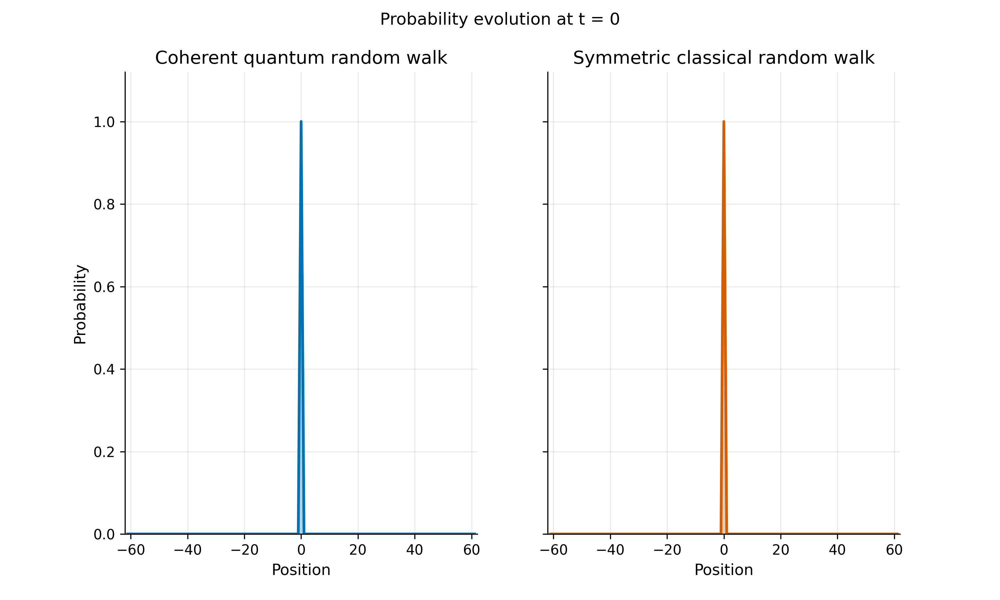
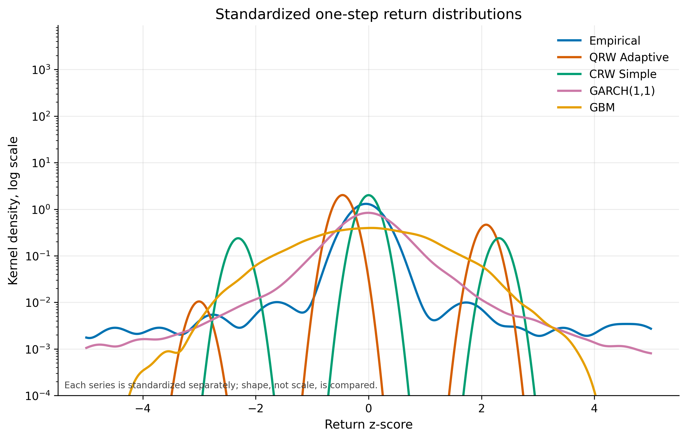

# Quantum Random Walks for Market Microstructure

## Abstract

This project evaluates whether a discrete-time quantum random walk (QRW) can
serve as a useful engineering model for short-horizon market microstructure.
The implementation maps order-book imbalance, tick direction, imbalance
changes, and trade intensity into a unitary adaptive coin and an
intensity-dependent dephasing channel. It compares the resulting QRW against
simple, biased, and correlated classical random walks, GARCH(1,1), and
geometric Brownian motion under one chronological train/holdout protocol.
The active dataset contains 3,115,358
causally processed BTCUSDT observations from June 12, 2026. Phase 5 uses
1,869,214 training rows, 1,246,144 later holdout
rows, 3,000 simulated paths per model, and a fixed random seed of
2026. The scorecard ranks CRW Correlated first with mean
metric rank 2.143; QRW Adaptive ranks
7 with mean rank 5.286. The QRW
one-step distribution is rejected against the empirical sample
(Benjamini-Hochberg adjusted KS p-value
9.553e-04), while its variance exponent
is 1.0026 with 95% interval
[0.9841, 1.0183]. The empirical
tail index is 2.4748, far from the QRW estimate of
1.598e+06. These results validate a reproducible software
and statistical pipeline, but this does not establish QRW predictive
superiority. Confirmation requires a frozen protocol and fresh multi-day,
synchronized limit-order-book holdout data.

## 1. Introduction

Market microstructure is driven by discrete event arrivals, persistent order
flow, changing liquidity, and heavy-tailed price changes. Classical random
walks provide a transparent baseline but cannot express interference or a
controlled transition from coherent to diffusive dynamics. QRWs supply those
mechanisms through a coin state, conditional shift, and decoherence channel.

The research question is deliberately modest: can a causally calibrated QRW
reproduce selected empirical distributional, scaling, dependence, and tail
properties better than standard baselines? The project treats this as an
engineering and falsification exercise, not as evidence that markets are
quantum mechanical.

## 2. Theoretical Framework

A one-dimensional coined QRW evolves on
`H_coin tensor H_position`. One step applies a unitary coin `C_t`, followed by
a conditional shift `S`, so `|psi_(t+1)> = S(C_t tensor I)|psi_t>`. The
position probability is obtained by summing squared coin amplitudes. For a
symmetric coherent Hadamard walk, variance grows ballistically, approximately
as `t^2`; a symmetric classical walk grows diffusively as `t`.

The mixed-state implementation evolves `rho` and applies basis dephasing after
each unitary step. Off-diagonal entries are multiplied by `exp(-gamma_t)`,
preserving trace and populations. As coherence is reduced, the walk approaches
classical diffusion.

## 3. Market Mapping

The adaptive coin uses a bounded nonlinear signal from current order-book
imbalance, tick direction, imbalance change, and absolute imbalance. Market
activity modifies the event-level dephasing rate. The operator remains unitary;
directional information is phase encoded, so the magnitude-squared coin matrix
alone is intentionally symmetric.

This mapping is causal at each event. Calibration is chronological, structural
selection excludes its validation segment from refitting, and the later bias
update does not reuse structural warmup observations.

## 4. Data and Methodology

Active feature artifact: `data\features\features_BTCUSDT_2026-06-12.parquet`.

| Protocol item | Value |
|---|---:|
| Chronological training rows | 1,869,214 |
| Later holdout rows | 1,246,144 |
| Simulation steps | 500 |
| Paths per model | 3,000 |
| Random seed | 2026 |

The active June 12 dataset is the only window used for the final benchmark.
Historical June 1-7 processed and feature artifacts were rebuilt with the
causal pipeline, but remain development-only rather than confirmatory data.
Distribution and tail tests use matched empirical and simulated sample sizes.
Variance scaling uses the same comparison horizon for empirical and simulated
paths. Test-family p-values receive Benjamini-Hochberg correction.

## 5. Model Implementations

The benchmark includes QRW Adaptive, CRW Simple, CRW Biased, CRW Correlated,
GARCH(1,1), and GBM. All models receive the same chronological split and
simulation horizon. Directional likelihoods are compared only within the
Bernoulli family; continuous Gaussian likelihood AIC/BIC values are not ranked
against directional likelihoods.

## 6. Results

### 6.1 Probability Evolution

The coherent QRW spreads ballistically with interference peaks, whereas the
symmetric CRW remains concentrated around a diffusive binomial envelope.

### 6.2 Variance Scaling

The empirical fitted exponent is 1.2847. QRW Adaptive
has beta 1.0026 with 95% interval
[0.9841, 1.0183].

### 6.3 Return Distributions

The plot standardizes each model separately to compare shape rather than scale.
The QRW and classical tick models do not reproduce the empirical heavy tail.

### 6.4 Autocorrelation

QRW has return-ACF mean squared error 0.003275, the best
scorecard value in this category, but no single metric supports a superiority
claim.

### 6.5 Sample Paths

Sample paths expose the scale mismatch and directional behavior that aggregate
rankings can hide.

### 6.6 Adaptive Coin

The magnitude-squared entries remain balanced while the complex phase changes
with the market signal. This distinction is required to interpret the
adaptive operator correctly.

### 6.7 Scorecard

| Quantity | Observed value |
|---|---:|
| Top-ranked model | CRW Correlated |
| Top mean metric rank | 2.143 |
| QRW overall rank | 7 |
| QRW mean metric rank | 5.286 |
| QRW KS p-value | 5.459e-04 |
| QRW KS p-value, BH adjusted | 9.553e-04 |
| QRW variance beta | 1.0026 |
| QRW beta 95% interval | [0.9841, 1.0183] |
| Empirical tail index | 2.4748 |
| QRW tail index | 1.598e+06 |

## 7. Discussion

The QRW is competitive on variance scaling and autocorrelation distance, but
CRW Simple has the best aggregate rank. More importantly, the empirical return
distribution is strongly rejected for every model at the one-step horizon.
QRW tail behavior is especially unrealistic because its zero-inflated,
fixed-tick local moves still produce an extremely thin effective tail. GARCH
better represents heavy tails but performs poorly under other scorecard
components.

The Phase 3 predictive audit is mixed after the causal rebuild: QRW beats the
fair affine baseline on the final holdout but loses in pooled walk-forward
evaluation. That instability and the Phase 5 scorecard answer different
questions, but neither supports a current general superiority claim.

## 8. Limitations

1. The benchmark uses one short June 12, 2026 event window.
2. Structural QRW calibration has a low observations-per-parameter ratio.
3. Rebuilt June 1-7 data remain development-only after prior inspection.
4. Real synchronized limit-order-book coverage is limited.
5. The scorecard averages ranks and therefore hides metric scale and dependence.
6. Fixed tick moves cannot reproduce empirical jump size or heavy tails.
7. The optional dashboard is exploratory and does not alter inference.

## 9. Conclusion and Future Work

The project completes a reproducible QRW market-microstructure prototype,
classical benchmarks, statistical tests, visualization suite, and reporting
pipeline. The defensible conclusion is an engineering pass with no validated
QRW predictive or distributional superiority.

Future work should: freeze a confirmatory protocol before new labels are
observed; collect at least 20 fresh UTC days with synchronized LOB data; add a
learned but regularized coin benchmarked against equally flexible classical
links; study two-dimensional QRWs for multi-asset state spaces; and compare
continuous-time quantum walks with marked point-process baselines.

## References

1. Aharonov, Davidovich, and Zagury (1993). Quantum random walks.
2. Ambainis et al. (2001). One-dimensional quantum walks.
3. Konno (2002). Quantum random walks in one dimension.
4. Kempe (2003). Quantum random walks: an introductory overview.
5. Kendon (2007). Decoherence in quantum walks.
6. Cont and de Larrard (2013). Price dynamics in a Markovian limit order market.
7. Cont, Kukanov, and Stoikov (2014). The price impact of order book events.
8. Engle (1982). Autoregressive conditional heteroscedasticity.
9. Bollerslev (1986). Generalized autoregressive conditional heteroskedasticity.
10. Black and Scholes (1973). The pricing of options and corporate liabilities.
11. Mandelbrot (1963). The variation of certain speculative prices.
12. Hill (1975). A simple general approach to inference about the tail.
13. Ljung and Box (1978). On a measure of lack of fit in time series models.
14. Benjamini and Hochberg (1995). Controlling the false discovery rate.
