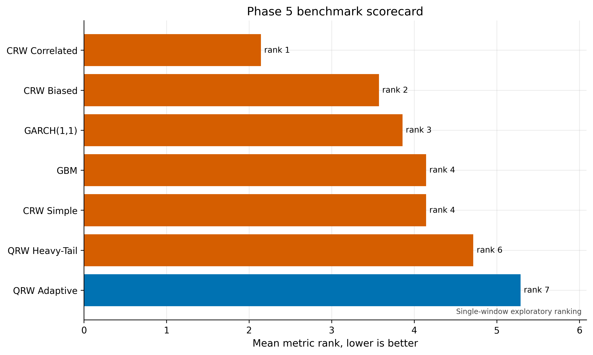
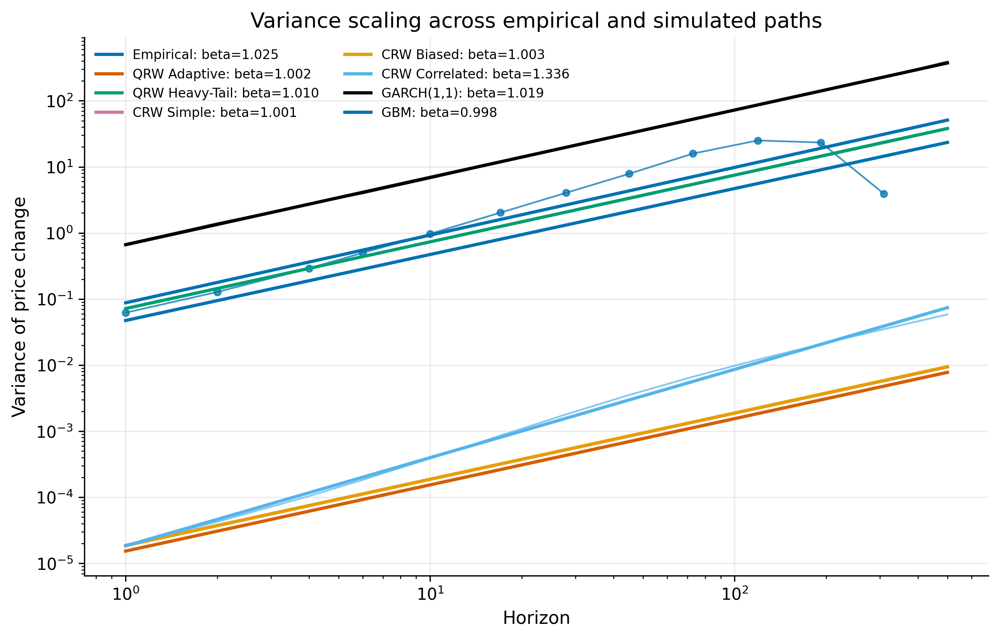
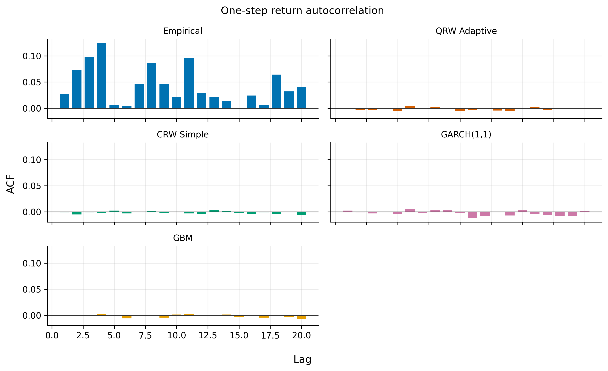
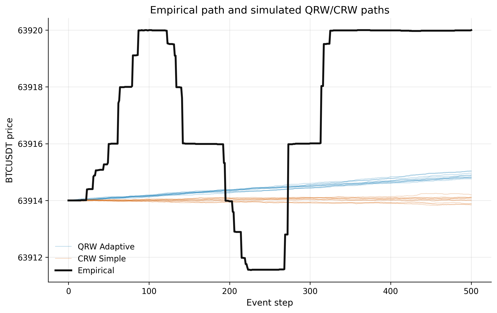
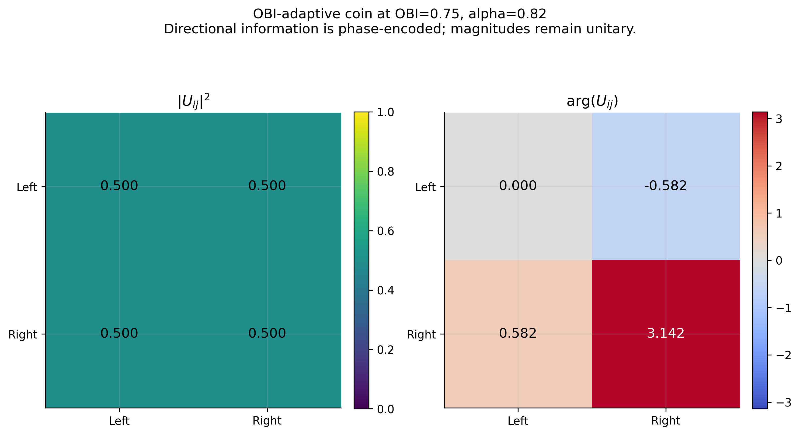
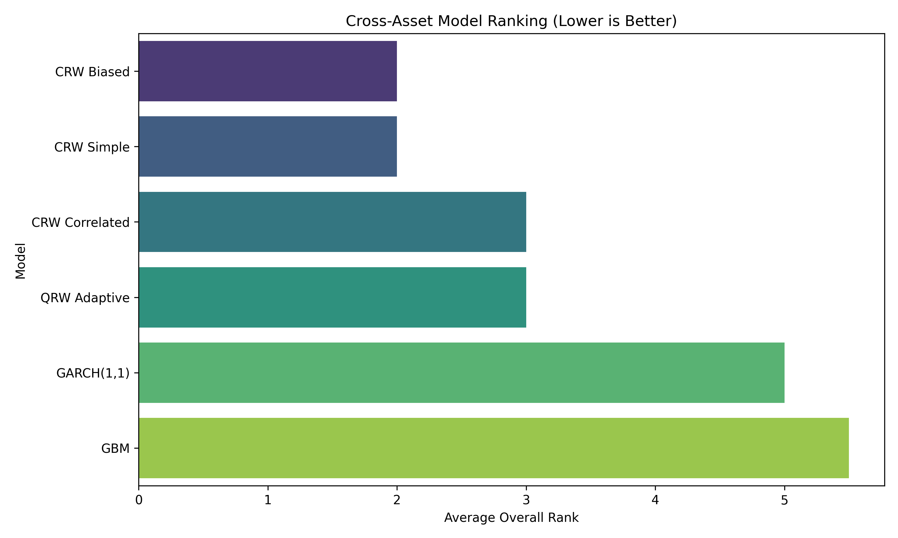

# Heavy-Tailed Adaptive Quantum Random Walks for Cryptocurrency Market Microstructure: A Reproducible Falsification Benchmark

### Mô hình Quantum Random Walk thích nghi đuôi nặng cho vi cấu trúc thị trường tiền mã hoá: một khung kiểm chứng (falsification) có thể tái lập

---

**Authors / Tác giả:** [Author Name(s) — to be completed]

**Affiliation / Đơn vị:** [Institution]

**Corresponding author / Liên hệ:** [email]

**Manuscript type / Loại bài:** Original research article (empirical, reproducible)

**Target venues / Tạp chí mục tiêu:** *Quantitative Finance*, *Physica A: Statistical Mechanics and its Applications*, *Finance Research Letters*

**Code & data availability / Mã nguồn & dữ liệu:** All source code, calibrated parameters, statistical-test outputs and figures referenced in this paper are produced by the accompanying reproducible pipeline (`scripts/phase2`–`scripts/phase7`). Raw tick archives are publicly available from Binance Public Data (`https://data.binance.vision`). Toàn bộ mã nguồn, tham số hiệu chỉnh, kết quả kiểm định thống kê và hình vẽ trong bài đều được sinh tự động bởi pipeline tái lập đi kèm; dữ liệu thô tải công khai từ Binance Public Data.

---

## Abstract

Quantum random walks (QRWs) have repeatedly been proposed as a richer alternative to classical stochastic processes for modelling financial price dynamics, motivated by their ballistic spreading, interference structure, and the appeal of quantum-probability formalism. Yet rigorous, reproducible *empirical* tests of QRWs against well-specified classical baselines on real high-frequency limit-order-book (LOB) data remain scarce. This paper develops an **adaptive discrete-time coined QRW** in which the coin operator is driven, *ex ante*, by observable order-book imbalance (OBI), signed order flow, and trade intensity, with a calibrated dephasing channel representing microstructure information loss. Recognising that a standard fixed-tick shift cannot reproduce the heavy-tailed return distribution of crypto microstructure, we extend the model into a **Heavy-Tailed Adaptive QRW** whose conditional shift samples Pareto-distributed jump magnitudes calibrated by maximum likelihood and capped at the largest move observed in-sample.

We benchmark seven models — QRW Adaptive, QRW Heavy-Tail, three classical random walks (simple, biased, correlated), GARCH(1,1) and geometric Brownian motion (GBM) — on **31 trading days** of tick data for **BTC/USDT, ETH/USDT and BNB/USDT** (over 113 million BTC events), using a strictly chronological, fixed-origin, *ex-ante* protocol. Models are scored on a seven-metric distributional scorecard (Kolmogorov–Smirnov, Wasserstein, variance-scaling exponent, autocorrelation MSE, excess kurtosis, 99% Value-at-Risk and Conditional VaR), and additionally on Diebold–Mariano predictive-accuracy tests, a moving-block bootstrap rank confidence interval, and within-family AIC/BIC model selection.

Our central findings are deliberately reported as a **falsification benchmark** rather than an advocacy of QRWs. (i) On BTC/USDT — the heaviest-tailed asset — the heavy-tailed extension **repairs the catastrophic tail-index pathology** of the fixed-tick QRW: the estimated Hill tail index falls from ≈1.6×10⁶ to **1.45**, against an empirical value of 2.47 (the magnitude of this repair is asset-dependent; Section 8.5). (ii) The heavy-tailed QRW achieves the **best Wasserstein distance** and the best mean-path Diebold–Mariano loss among all seven models, and the QRW family attains the **highest directional Bernoulli log-likelihood** (best within-family AIC). (iii) Nevertheless, on the aggregate distributional scorecard the QRW variants **do not beat the classical correlated random walk**: the heavy-tailed QRW now *overshoots* excess kurtosis (≈343 vs 75 empirical) and ranks sixth of seven, while a correlated classical walk best matches both the return distribution (Kolmogorov–Smirnov) and the empirical super-diffusive variance-scaling exponent (β≈1.3). The pattern is consistent across the three assets. We conclude that, at the tick scale studied, the quantum-walk analogy buys genuine improvements in *directional/point* prediction but fails *distributional* calibration, and does not dominate a parsimonious classical baseline. We release the full pipeline as a reproducible falsification benchmark for future QRW-in-finance research.

### Tóm tắt (Vietnamese)

Quantum random walk (QRW) nhiều lần được đề xuất như một thay thế phong phú hơn cho các quá trình ngẫu nhiên cổ điển trong mô hình hoá động lực giá, nhờ tính lan truyền ballistic, cấu trúc giao thoa và sức hấp dẫn của hình thức xác suất lượng tử. Tuy nhiên, các kiểm định **thực nghiệm** nghiêm ngặt, có thể tái lập, đối chứng QRW với các baseline cổ điển được đặc tả tốt trên dữ liệu sổ lệnh (LOB) tần suất cao thực tế vẫn còn rất hiếm. Bài báo xây dựng một **QRW thích nghi rời rạc có coin** trong đó toán tử coin được điều khiển *trước (ex ante)* bởi mất cân bằng sổ lệnh (OBI), dòng lệnh có dấu và cường độ giao dịch, kèm một kênh dephasing hiệu chỉnh đại diện cho mất mát thông tin vi cấu trúc. Do bước dịch một-tick cố định không thể tái tạo phân phối lợi suất đuôi nặng, chúng tôi mở rộng thành **QRW thích nghi đuôi nặng**, trong đó bước dịch có điều kiện lấy mẫu biên độ nhảy theo phân phối Pareto (hiệu chỉnh bằng hợp lý cực đại) và bị chặn trên bởi bước nhảy lớn nhất quan sát trong mẫu.

Chúng tôi so chuẩn bảy mô hình — QRW Adaptive, QRW Heavy-Tail, ba random walk cổ điển (simple/biased/correlated), GARCH(1,1) và chuyển động Brown hình học (GBM) — trên **31 ngày** dữ liệu tick của **BTC/USDT, ETH/USDT và BNB/USDT** (hơn 113 triệu sự kiện BTC), theo một giao thức chặt chẽ: thời gian một chiều, gốc cố định, hoàn toàn *ex ante*. Các mô hình được chấm theo thẻ điểm phân phối bảy chỉ số (Kolmogorov–Smirnov, Wasserstein, số mũ scaling phương sai, MSE tự tương quan, kurtosis vượt, VaR 99% và CVaR), cùng kiểm định Diebold–Mariano, khoảng tin cậy hạng bằng moving-block bootstrap, và lựa chọn mô hình AIC/BIC **trong cùng họ likelihood**.

Kết quả được trình bày như một **khung kiểm chứng (falsification)**, không phải để cổ vũ QRW. (i) Mở rộng đuôi nặng **sửa được lỗi tail-index thảm hoạ** của QRW một-tick: chỉ số đuôi Hill giảm từ ≈1,6×10⁶ xuống **1,45** (empirical 2,47). (ii) QRW đuôi nặng đạt **Wasserstein tốt nhất** và Diebold–Mariano đường-trung-bình tốt nhất trong bảy mô hình, và họ QRW đạt **log-likelihood hướng (Bernoulli) cao nhất** (AIC tốt nhất trong họ). (iii) Tuy nhiên trên thẻ điểm phân phối tổng hợp, các biến thể QRW **không vượt** được random walk tương quan cổ điển: QRW đuôi nặng nay *vượt ngưỡng* kurtosis (≈343 so với 75 empirical) và xếp hạng 6/7, trong khi CRW tương quan khớp tốt nhất cả phân phối lợi suất (KS) lẫn số mũ scaling siêu khuếch tán (β≈1,3). Mẫu hình này nhất quán trên ba tài sản. Kết luận: ở thang tick được khảo sát, phép loại suy quantum-walk mang lại cải thiện thật về dự báo *hướng/điểm* nhưng thất bại ở hiệu chỉnh *phân phối*, và không trội hơn baseline cổ điển tiết kiệm tham số. Chúng tôi công bố toàn bộ pipeline như một benchmark kiểm chứng tái lập được cho nghiên cứu QRW-trong-tài-chính.

**Keywords / Từ khoá:** quantum random walk; market microstructure; limit order book; heavy tails; order-book imbalance; decoherence; Diebold–Mariano test; falsification benchmark; cryptocurrency; high-frequency data.

**JEL classification:** C52, C58, G14. **PACS:** 03.67.-a, 89.65.Gh.

---

## Executive Summary / Tóm tắt điều hành

**Five take-aways (EN).**
1. **Tail repair (BTC):** the heavy-tailed shift drops the QRW Hill tail index from ≈1.6×10⁶ to **1.45** (empirical 2.47) — a six-order-of-magnitude correction of the fixed-tick pathology.
2. **Best point/directional predictor:** the QRW family has the **best within-family directional AIC**, the **smallest short-horizon Wasserstein**, and **beats every classical baseline on the Diebold–Mariano mean-path test** (p < 0.002, BH-corrected).
3. **Worst distributional fit (BTC/BNB):** on the seven-metric scorecard the QRW variants rank last on BTC; the **correlated classical walk wins**, reproducing both the return distribution (KS) and the empirical super-diffusion (β ≈ 1.3) that the QRW cannot.
4. **Asset-dependence:** on **ETH** (thin-tailed, diffusive) the QRW Heavy-Tail is the **single best model overall** — where the data are diffusive, the diffusive QRW wins.
5. **Honest verdict:** no quantum model dominates a parsimonious classical baseline on distribution; the contribution is a **reproducible falsification benchmark**, not an endorsement.

**Năm điểm chính (VI).**
1. **Sửa đuôi (BTC):** bước dịch đuôi nặng kéo tail-index Hill từ ≈1,6×10⁶ về **1,45** (empirical 2,47) — sửa sai 6 bậc độ lớn.
2. **Dự báo điểm/hướng tốt nhất:** họ QRW có **AIC hướng trong họ tốt nhất**, **Wasserstein ngắn hạn nhỏ nhất**, và **thắng mọi baseline cổ điển ở Diebold–Mariano** (p < 0,002, hiệu chỉnh BH).
3. **Khớp phân phối kém nhất (BTC/BNB):** trên thẻ điểm 7 chỉ số, QRW xếp cuối ở BTC; **CRW tương quan thắng**, tái tạo cả phân phối (KS) lẫn siêu khuếch tán (β≈1,3) mà QRW không làm được.
4. **Phụ thuộc tài sản:** trên **ETH** (đuôi mỏng, khuếch tán) QRW Heavy-Tail **tốt nhất tổng thể** — nơi dữ liệu khuếch tán thì QRW khuếch tán thắng.
5. **Kết luận trung thực:** không mô hình lượng tử nào trội hơn baseline cổ điển về phân phối; đóng góp là **benchmark kiểm chứng tái lập**, không phải tán dương.

---

## Table of Contents / Mục lục

[TOC]

---

## List of Abbreviations and Symbols / Danh mục từ viết tắt và ký hiệu

| Symbol | Meaning (EN) | Ý nghĩa (VI) |
|---|---|---|
| ℋ_C, ℋ_P | Coin and position Hilbert spaces | Không gian Hilbert coin và vị trí |
| \|↑⟩, \|↓⟩ | Coin basis states (up/down) | Trạng thái cơ sở coin (lên/xuống) |
| C(θ) | Coin operator with mixing angle θ | Toán tử coin với góc trộn θ |
| S | Conditional shift operator | Toán tử dịch có điều kiện |
| U = S(C⊗I) | One-step evolution operator | Toán tử tiến hoá một bước |
| ρ | Density matrix | Ma trận mật độ |
| 𝒟_η | Dephasing (decoherence) channel, strength η | Kênh dephasing, cường độ η |
| P(x,t) | Position distribution after t steps | Phân phối vị trí sau t bước |
| OBI_t | Order-book imbalance at time t | Mất cân bằng sổ lệnh tại t |
| θ_t = π/4 + α·OBI_t | Adaptive coin angle | Góc coin thích nghi |
| α | Coin sensitivity to features | Độ nhạy coin với đặc trưng |
| β | Variance-scaling exponent (Var ∝ tᵝ) | Số mũ scaling phương sai |
| α_tail | Hill tail index | Chỉ số đuôi Hill |
| p_move | Unconditional one-step move probability | Xác suất di chuyển một bước |
| δp | Tick size | Bước giá (tick) |

---

## List of Tables / Danh mục bảng

| No. | Title |
|---|---|
| Table 0 | Empirical (holdout) stylised facts of the three assets |
| Table 0b | BTC daily event counts (31 days) |
| Table 1 | One-step return distribution (KS, Wasserstein) — BTC |
| Table 2 | Variance-scaling exponent β — BTC |
| Table 3 | Autocorrelation fidelity (ACF MSE, Ljung–Box) — BTC |
| Table 4 | Tail index, kurtosis and tail risk — BTC |
| Table 5 | Seven-metric distributional scorecard — BTC |
| Table 6 | Diebold–Mariano mean-path accuracy (selected pairs) |
| Table 7 | Within-family model selection (AIC) |
| Table 8 | Three-asset average scorecard rank |
| Table 9 | ETH/USDT key metrics |
| Table 10 | BNB/USDT key metrics |
| Table 11 | Multi-horizon Wasserstein distance — BTC |
| Table 12 | Full Diebold–Mariano matrix (21 pairs) — BTC |
| Table 13 | Per-criterion winner — BTC |
| Table 14 | Monte-Carlo sensitivity (2000 vs 3000 paths) — BTC |
| Table 15 | Consolidated cross-asset rank vs empirical character |

## List of Figures / Danh mục hình

| No. | Title |
|---|---|
| Figure 1 | Distributional scorecard heatmap |
| Figure 2 | Return-distribution comparison |
| Figure 3 | Variance scaling (log Var vs log horizon) |
| Figure 4 | Autocorrelation function comparison |
| Figure 5 | Example simulated price paths |
| Figure 6 | Coin-operator heatmap |
| Figure 7 | Cross-asset comparison heatmap |
| Figure 8 | Interactive dashboard preview |

---

# Part I — Introduction / Phần I — Giới thiệu

# 1. Introduction / Giới thiệu

## 1.1 Motivation

Financial returns at high frequency exhibit a remarkably stable catalogue of *stylised facts*: heavy-tailed, leptokurtic return distributions; near-zero linear autocorrelation of returns coexisting with long memory in absolute returns and order flow; volatility clustering; and, at short horizons, anomalous (often super-diffusive) variance scaling [Cont 2001; Mandelbrot 1963; Lillo, Mike & Farmer 2005]. Classical models capture these facts only partially and usually one at a time: geometric Brownian motion (GBM) is analytically convenient but Gaussian and thin-tailed; GARCH-type models reproduce volatility clustering and unconditional kurtosis but are built on a Gaussian (or Student-t) innovation and a calendar clock that sits uneasily with event-driven microstructure [Bollerslev 1986; Engle 1982]; correlated random walks introduce short-range directional memory but no genuine heavy tails.

Against this backdrop, **quantum random walks (QRWs)** — the quantum-mechanical analogue of classical random walks — have been proposed as a structurally richer modelling primitive [Aharonov, Davidovich & Zagury 1993; Kempe 2003; Venegas-Andraca 2012]. A coined QRW evolves a complex *amplitude* over coin⊗position space by a unitary operator; probabilities arise only at measurement, via the Born rule. Because amplitudes interfere, a QRW spreads *ballistically* (standard deviation ∝ t) rather than *diffusively* (∝ √t), and a tunable *decoherence* channel interpolates continuously between the quantum (ballistic) and classical (diffusive) regimes [Kendon 2007]. These properties have made QRWs attractive to the quantum-finance literature [Baaquie 2004; Orús, Mugel & Lizaso 2019; Piotrowski & Sładkowski 2004] and to quantum models of decision and cognition that underpin behavioural-finance analogies [Busemeyer & Bruza 2012; Haven & Khrennikov 2013].

> **Tóm tắt 1.1 (VI):** Lợi suất tần suất cao có các "stylised facts" ổn định: đuôi nặng, kurtosis cao, tự tương quan lợi suất gần 0 nhưng trí nhớ dài ở |lợi suất| và dòng lệnh, gom cụm biến động, và scaling phương sai bất thường ở thang ngắn. Mô hình cổ điển chỉ bắt được từng phần. QRW — phép loại suy lượng tử của random walk — hấp dẫn vì lan truyền ballistic (∝ t) và có tham số decoherence nội suy giữa lượng tử và cổ điển. Bài này kiểm định QRW một cách thực nghiệm, nghiêm ngặt.

## 1.2 The gap: claims outpace reproducible evidence

Two problems recur in the QRW-in-finance literature. First, the **mapping** from quantum objects to market observables is often left as a metaphor: what, precisely, is the "coin", the "position", the "decoherence rate", in terms of quantities a microstructure researcher can measure from a limit order book? Second, **evaluation** is frequently either purely theoretical or conducted against weak baselines (e.g., a single GBM) on small samples, with no correction for multiple testing, no out-of-sample protocol, and no predictive-accuracy significance test. The result is a literature in which the *appeal* of quantum formalism is not matched by falsifiable, reproducible empirical evidence.

This paper takes the opposite stance, in the spirit of the project's theory notes: *the value of the framework must be judged by its ability to produce testable, scoreable forecasts, not by the attractiveness of the metaphor.* We therefore (a) fix an explicit, defensible mapping with calibration protocols and validity ranges for every parameter; (b) attach a classical baseline to every quantum interpretation so that the benefit of coherence can be *falsified*; and (c) evaluate on a large, multi-asset, multi-day sample with corrected statistical tests.

## 1.3 Contributions

1. **An adaptive, ex-ante QRW for the LOB.** We specify a discrete-time coined QRW whose coin angle is an affine-then-clamped function of standardized, *causally* computed microstructure features (order-book imbalance, signed tick direction, OBI change, |OBI|, log trade intensity), with a density-matrix dephasing channel. All features used to forecast a holdout path are computed only from information available before the forecast origin.

2. **A heavy-tailed shift that repairs the tail pathology.** We introduce a Heavy-Tailed Adaptive QRW whose conditional shift draws Pareto-distributed jump magnitudes (tail index fitted by maximum likelihood; minimum jump = tick size; magnitude capped at the in-sample maximum move), integrated as a distinct seventh model in the benchmark.

3. **A rigorous, reproducible, multi-asset benchmark.** Thirty-one trading days of BTC/ETH/BNB tick data; a fixed-origin, chronological, ex-ante protocol; a seven-metric distributional scorecard; Diebold–Mariano tests with Newey–West HAC variance and Benjamini–Hochberg false-discovery control; moving-block bootstrap rank intervals; and within-likelihood-family AIC/BIC selection that corrects a common cross-family comparison error.

4. **A falsification result, reported honestly.** The heavy-tailed QRW fixes the tail index and wins on Wasserstein/point-prediction and directional likelihood, but overshoots kurtosis and does not beat a correlated classical walk on the aggregate distributional scorecard, consistently across assets. We frame and release the artefact as a reproducible falsification benchmark.

> **Tóm tắt 1.3 (VI):** Bốn đóng góp: (1) QRW thích nghi ex-ante cho LOB với coin điều khiển bằng đặc trưng vi cấu trúc tính nhân quả; (2) bước dịch đuôi nặng Pareto sửa lỗi tail-index, thêm vào benchmark như mô hình thứ 7; (3) benchmark đa tài sản, đa ngày, nghiêm ngặt với DM test (HAC + Benjamini–Hochberg), bootstrap hạng, và AIC/BIC trong cùng họ; (4) một kết quả falsification trung thực: QRW đuôi nặng sửa tail và thắng ở dự báo điểm nhưng không vượt CRW tương quan ở phân phối.

## 1.4 Research questions and falsifiable hypotheses

Following the project's "rejectable-hypotheses" discipline, we state in advance what would *falsify* a claim of QRW usefulness. Each hypothesis pairs the quantum model with a classical baseline.

| # | Hypothesis (alternative) | Falsified if … | Verdict (this study) |
|---|---|---|---|
| H1 | An OBI-adaptive coin improves *directional* prediction over a fixed coin / classical walk | QRW within-family directional AIC not better than CRW | **Not falsified** — QRW has best directional AIC (Table 7) |
| H2 | The QRW reproduces empirical *super-diffusive* variance scaling (β > 1) | Calibrated QRW β ≈ 1 (diffusive) | **Falsified** — QRW β ≈ 1.0; super-diffusion matched only by correlated CRW (Table 2) |
| H3 | A heavy-tailed shift yields a *finite, plausible* tail index | Simulated tail index remains divergent or wildly off | **Not falsified on BTC** (1.45 vs 2.47); muted on ETH/BNB (Section 8.5) |
| H4 | The heavy-tailed QRW improves the *aggregate distributional* scorecard over classical walks | QRW does not beat the best CRW on mean scorecard rank | **Falsified** — best CRW outranks both QRWs on BTC/BNB (Tables 5, 10) |
| H5 | The QRW improves *point/path* forecast accuracy (Diebold–Mariano) | QRW not significantly better than classical baselines on mean-path loss | **Not falsified** — QRW Heavy-Tail beats all baselines (Table 12) |

The mixed verdict (H1, H3, H5 survive; H2, H4 are falsified) is the substance of the paper and the reason we frame the contribution as a benchmark rather than an endorsement.

> **Tóm tắt 1.4 (VI):** Năm giả thuyết có thể bác bỏ, mỗi cái ghép QRW với baseline cổ điển. Kết quả: **H1 (coin cải thiện dự báo hướng), H3 (đuôi nặng cho tail-index hữu hạn — rõ trên BTC), H5 (cải thiện dự báo điểm/đường)** không bị bác; **H2 (tái tạo siêu khuếch tán) và H4 (thắng thẻ điểm phân phối tổng hợp)** bị bác. Kết quả hỗn hợp này là nội dung chính và là lý do trình bày như benchmark, không phải tán dương.

## 1.5 Paper organization

Section 2 reviews the relevant literature across microstructure, quantum finance, and heavy-tailed statistics. Section 3 fixes the QRW formalism. Section 4 develops the market mapping and the heavy-tailed extension. Section 5 describes the data pipeline; Section 6 the models; Section 7 the statistical methodology. Section 8 presents results (single-asset BTC and cross-asset). Section 9 discusses insights, Section 10 limitations, and Section 11 concludes. Appendix A is a complete artefact catalogue (the meaning of every result file, figure and script); Appendix B collects extended tables; Appendix C documents reproducibility.

---

# Part II — Literature Review / Phần II — Tổng quan tài liệu

# 2. Literature Review (Background and Related Work) / Tổng quan tài liệu

This section synthesises three strands of literature. Citations use the numbered reference list in Section 12; the 22 core references were independently verified with DOIs.

## 2.1 Market microstructure and the limit order book

The modern limit order book (LOB) is a double-sided queueing system whose dynamics generate price formation at the finest time scale. Empirical and modelling work has established that order-book state — especially **order-book imbalance (OBI)** — carries short-horizon predictive content for the sign and size of the next price move [Cont, Stoikov & Talreja 2010; Gould et al. 2013]. Statistical regularities of order books, including power-law features in volumes and the long memory of signed order flow, were documented by Bouchaud, Mézard & Potters [2002] and Lillo, Mike & Farmer [2005]. Structural models range from the queue-reactive model of Huang, Lehalle & Rosenbaum [2015] to dynamic equilibrium models of the LOB [Parlour 1998; Roşu 2009] and stochastic order-book dynamics [Cont, Stoikov & Talreja 2010]. Two classical information-based microstructure models frame the economics of price formation: the sequential-trade model of Glosten & Milgrom [1985] and the strategic-informed-trader model of Kyle [1985]. Our mapping borrows the central empirical lesson of this literature — *OBI and signed flow predict short-horizon direction* — and encodes it directly in the QRW coin.

A persistent empirical lesson is that **order-book imbalance has genuine but short-lived directional predictive power**: the sign and immediate magnitude of the next mid-price move are partially forecastable from the relative depth/flow on the two sides of the book. Cont, Stoikov & Talreja [2010] formalise order-book dynamics as a stochastic queueing system; Gould et al. [2013] survey the LOB as an object of study; Lillo, Mike & Farmer [2005] and Bouchaud, Mézard & Potters [2002] document the long memory of signed order flow and the power-law structure of volumes. Equilibrium/strategic models (Parlour [1998]; Roşu [2009]) and the queue-reactive model (Huang, Lehalle & Rosenbaum [2015]) explain *why* such predictability arises and *why it decays*. The two canonical information-economics models — Glosten & Milgrom [1985] (sequential trade, bid–ask spread as adverse-selection compensation) and Kyle [1985] (strategic informed trader, linear price impact) — frame the deeper economics: price moves because order flow is informative. Our coin operationalises this single empirical lesson, encoding imbalance and signed flow directly into the directional response.

## 2.2 Quantum random walks and quantum finance

The discrete-time coined QRW was introduced by Aharonov, Davidovich & Zagury [1993]; Kempe [2003] and Venegas-Andraca [2012] provide standard reviews, and Kendon [2007] reviews decoherence in quantum walks — the mechanism by which a QRW degrades to a classical walk. QRWs are computational primitives (universal for quantum computation), but here we use only their *stochastic-process* structure: ballistic spreading and interference, tunable toward diffusion by decoherence.

In finance, Baaquie [2004] develops a path-integral / Hamiltonian formulation of option pricing ("quantum finance"), recasting the Black–Scholes equation as a Schrödinger-type evolution and opening a programme of Hamiltonian methods for derivatives and interest rates. Piotrowski & Sładkowski [2004] explore quantum-game and thermodynamic analogies for portfolios, in which strategies are operators and payoffs emerge from non-commuting observables. Orús, Mugel & Lizaso [2019] survey quantum *computing* for finance — portfolio optimisation via quantum annealing/QAOA, amplitude-estimation speed-ups for Monte-Carlo pricing, and machine-learning hybrids — emphasising that near-term advantage is most plausible in optimisation and sampling rather than in forecasting. The quantum-probability programme in decision theory [Busemeyer & Bruza 2012; Haven & Khrennikov 2013] argues that order/context effects and violations of classical probability axioms in human judgement are naturally captured by Hilbert-space models; the stochastic-mechanics bridge of Baez & Biamonte [2012] shows formally how classical Markov dynamics and quantum dynamics share an operator-algebraic skeleton, which is exactly why a *decohered* quantum walk degenerates to a classical Markov walk. These works collectively justify treating quantum amplitudes as *latent modelling constructs* rather than physical claims about markets. **Crucially, direct, reproducible empirical tests of QRWs on tick-level LOB data, against well-specified classical baselines and with predictive-accuracy significance testing, remain sparse** — the gap this paper addresses, and the reason we pair every quantum interpretation with a falsifiable classical baseline.

## 2.3 Heavy tails, scaling, and adaptive markets

That asset returns are heavy-tailed and non-Gaussian is among the oldest stylised facts [Mandelbrot 1963], who proposed Lévy-stable laws for cotton prices. This was later sharpened by Mantegna & Stanley [1995] into truncated-Lévy scaling for a stock index, and by Gabaix et al. [2003] into the celebrated "inverse-cubic law" linking the power-law tail of returns (exponent ≈ 3) to the power-law distribution of trade volumes and the square-root price impact of large orders. Cont [2001] synthesises the canonical stylised-facts catalogue — heavy tails, volatility clustering, aggregational Gaussianity, the leverage effect, and the slow decay of absolute-return autocorrelation — that any micro-scale model should be measured against; our seven-metric scorecard is a direct operationalisation of a subset of these facts. Tail indices are commonly estimated by the Hill [1975] estimator, which we adopt (with its known sensitivity to the choice of order-statistic threshold). The adaptive-markets hypothesis [Lo 2004] reframes efficiency as an evolving, context-dependent property — a useful lens for an *adaptive* coin whose responsiveness can be regime-dependent, and a reminder that a single model need not dominate across assets or epochs (consistent with our strong asset-dependence). The methodological backbone of our evaluation rests on Diebold & Mariano [1995] for predictive-accuracy comparison, Newey & West [1987] for HAC variance estimation under serial correlation, Politis & Romano [1994] for the stationary/moving-block bootstrap that respects dependence when resampling, and Benjamini & Hochberg [1995] for false-discovery-rate control across the many pairwise and per-metric tests we run.

> **Tóm tắt 2 (VI):** Ba mạch tài liệu: (1) Vi cấu trúc LOB — OBI và dòng lệnh có dấu dự báo hướng ngắn hạn (Cont–Stoikov–Talreja, Gould và cộng sự, Glosten–Milgrom, Kyle); (2) QRW & quantum finance — QRW (Aharonov 1993; Kempe 2003), decoherence (Kendon 2007), quantum finance (Baaquie 2004; Orús và cộng sự 2019), nhưng thiếu kiểm định thực nghiệm trên dữ liệu LOB thật; (3) Đuôi nặng & scaling — Mandelbrot 1963, Gabaix 2003, Cont 2001, ước lượng Hill 1975, cùng nền phương pháp DM (1995), Newey–West (1987), bootstrap (Politis–Romano 1994), FDR (Benjamini–Hochberg 1995).

---

# Part III — Methodology / Phần III — Phương pháp nghiên cứu

> **Methodology overview / Tổng quan phương pháp.** Per the IMRAD convention, this Part bundles the full research design: the QRW formalism (§3), the market mapping and heavy-tailed extension (§4), the data and ex-ante evaluation protocol (§5), the seven competing models (§6), and the statistical test battery (§7). / Theo IMRAD, Phần III gồm toàn bộ thiết kế nghiên cứu: hình thức QRW (§3), ánh xạ thị trường + mở rộng đuôi nặng (§4), dữ liệu và giao thức đánh giá ex-ante (§5), bảy mô hình (§6), và bộ kiểm định thống kê (§7).

# 3. Theoretical Framework: Discrete-Time Coined QRW / Khung lý thuyết

This section fixes the formalism used throughout. We adopt a single convention: the coin state *up* shifts right, *down* shifts left; the coin is applied **before** the conditional shift; and position is measured only after the final evolution step. Although called a "random walk", between measurements a discrete-time QRW (DTQRW) is a *deterministic, linear, unitary* evolution of complex amplitudes — randomness enters only at measurement via the Born rule. This is the origin of interference and of spreading behaviour different from a classical random walk (CRW).

## 3.1 Hilbert space and state

The coin space is ℋ_C = ℂ² = span{\|↑⟩, \|↓⟩}, and the position space on the integer lattice is ℋ_P = ℓ²(ℤ) = span{\|x⟩ : x ∈ ℤ}. The total space is the tensor product ℋ = ℋ_C ⊗ ℋ_P. A general state at integer time t is

```
|ψ_t⟩ = Σ_x ( a_x(t) |↑,x⟩ + b_x(t) |↓,x⟩ ),   a_x(t), b_x(t) ∈ ℂ,
```

with normalization ⟨ψ_t|ψ_t⟩ = Σ_x (|a_x(t)|² + |b_x(t)|²) = 1. The probability of measuring the walker at position x after t steps is **P(x,t) = |a_x(t)|² + |b_x(t)|²**. Amplitudes that reach the same (coin, position) pair add *at the amplitude level* before squaring; because amplitudes carry phase, they can reinforce or cancel — interference.

## 3.2 Coin operator

The coin is a unitary C : ℋ_C → ℋ_C. The project's canonical coin is the Hadamard operator

```
H = (1/√2) [ 1   1 ;  1  −1 ],     H†H = I₂.
```

A real one-parameter family controlling directional bias is the reflection-rotation coin

```
C(θ) = [ cos θ   sin θ ;  sin θ   −cos θ ],   with  C(π/4) = H  (det = −1),
```

and, where a determinant +1 rotation is required, R(θ) = [cos θ, −sin θ; sin θ, cos θ]. The two families must not be mixed within an experiment without stating the convention, because sign and phase alter the interference structure even when one-step probabilities look identical. The coin acts identically at every position via C ⊗ I_P.

## 3.3 Conditional shift and one-step evolution

The shift operator is

```
S = |↑⟩⟨↑| ⊗ Σ_x |x+1⟩⟨x|  +  |↓⟩⟨↓| ⊗ Σ_x |x−1⟩⟨x|,
```

so S|↑,x⟩ = |↑,x+1⟩ and S|↓,x⟩ = |↓,x−1⟩. Since S permutes an orthonormal basis, S†S = I. The one-step operator applies the coin first: **U = S (C ⊗ I_P)**, |ψ_{t+1}⟩ = U|ψ_t⟩, and U†U = (C†C) ⊗ I_P = I. This unitarity invariant — norm equal to one up to machine precision — is the single most important implementation check. For the Hadamard coin the amplitude recurrences are

```
a_x(t+1) = ( a_{x−1}(t) + b_{x−1}(t) ) / √2,
b_x(t+1) = ( a_{x+1}(t) − b_{x+1}(t) ) / √2.
```

## 3.4 Initial state, symmetry, and ballistic spreading

With a symmetric initial coin state \|χ_sym⟩ = (\|↑⟩ + i\|↓⟩)/√2 at the origin, the position distribution is symmetric, P(x,t) = P(−x,t). A Fourier transform diagonalises the translation-invariant evolution into 2×2 blocks U(k) = S(k)H with S(k) = diag(e^{ik}, e^{−ik}); the eigen-phases e^{iω(k)} have group velocity v_g = dω/dk bounded by |v| ≤ 1/√2 for the Hadamard walk. Stationary-phase analysis yields two ballistic fronts near x ≈ ±t/√2 and a standard deviation that grows **linearly** in t — *ballistic* spreading — in contrast to the √t *diffusive* spreading of a CRW. This Var ∝ t² (σ ∝ t) versus Var ∝ t distinction is the quantitative signature we test via the variance-scaling exponent β (Section 7).

## 3.5 Density matrix and the decoherence channel

A pure state has density operator ρ_t = |ψ_t⟩⟨ψ_t|, evolving as ρ_{t+1} = U ρ_t U†. A dephasing channel in the coin–position basis is

```
𝒟_η(ρ) = (1 − η) ρ + η Σ_{c,x} Π_{c,x} ρ Π_{c,x},   Π_{c,x} = |c,x⟩⟨c,x|,   0 ≤ η ≤ 1,
```

which is completely positive and trace preserving (CPTP). η = 0 preserves coherence; η = 1 erases all off-diagonal terms each step, and the diagonal probabilities then evolve as a Markov chain with transition magnitudes |C_{ij}|² — for the Hadamard coin, the simple symmetric CRW. Crucially, the naïve mixing rule ψ_new = (1−γ)ψ + γ·ψ_classical does **not** preserve norm and is not a valid quantum channel; classical mixtures must be formed at the density-matrix level, ρ′ = (1−η)ρ_coherent + η ρ_dephased. Different "noise" mechanisms (coin-only dephasing, position measurement, broken links, random coin) yield *different* classical limits and crossover times, so any decoherence parameter must be reported together with its channel definition.

## 3.6 Verification invariants

A correct implementation preserves or checks: (1) normalization Σ_x P(x,t) = 1; (2) unitarity ‖U†U − I‖_F near machine precision; (3) causality P(x,t) = 0 for |x| > t and parity x + t even; (4) symmetry P(x,t) = P(−x,t) for symmetric initial coin; (5) spectrum |λ_j(U)| = 1 on a finite periodic lattice; (6) pure-state norm ‖ψ_t‖₂ = 1 absent decoherence and boundary absorption. These detect wrong shift direction, off-by-one, boundary leakage and wrong tensor order *before* any financial interpretation. The accompanying notebook (`notebooks/01_theory_verification.ipynb`) checks the symbolic Hadamard identity and the Frobenius unitarity norm on a finite cycle; the corresponding artefacts are `reports/checkpoints/theory_verification_results.json` and `figures/prob_evolution.gif`.

> **Tóm tắt 3 (VI):** DTQRW một chiều: trạng thái trên coin⊗vị trí, coin Hadamard H, dịch có điều kiện S, tiến hoá U = S(C⊗I) là unitary (bảo toàn norm). Coin đối xứng cho phân phối đối xứng và lan truyền **ballistic** (σ ∝ t) — khác CRW (σ ∝ √t); đây là dấu hiệu ta kiểm bằng số mũ scaling β. Decoherence 𝒟_η là kênh CPTP: η=0 giữ lượng tử, η=1 đưa về CRW cổ điển. Sáu invariant (chuẩn hoá, unitary, nhân quả, đối xứng, phổ, norm) dùng để kiểm thử trước khi diễn giải tài chính.

## 3.7 QRW versus CRW: an analytical comparison

The decisive structural difference is summarised below; it is what the variance-scaling test (Section 7.2) operationalises empirically.

**Classical baseline.** For a simple symmetric random walk X_T = Σ_{t≤T} ξ_t with ξ_t = ±1 i.i.d., 𝔼[X_T] = 0, Var(X_T) = T, σ_CRW(T) = √T, and the exact law is binomial on the parity class, Pr(X_T = x) = 2^{−T} C(T, (T+x)/2). After rescaling by √T the CLT gives a Gaussian limit — **diffusive** scaling, width O(√T).

**Quantum case.** For the coherent Hadamard DTQRW, |ψ_T⟩ = Uᵀ|ψ₀⟩, Fourier analysis writes the position-x component as an oscillatory integral in phase kx − Tω_j(k); stationary points satisfy x/T = dω_j/dk. Because x/T concentrates on a non-degenerate velocity variable, the typical position scales **linearly** in T: σ_QRW(T) = O(T), Var(X_T) = O(T²) — **ballistic** spreading. For the project's symmetric initial coin, Konno's limit theorem gives the exact quadratic coefficient

```
lim_{T→∞} Var(X_T)/T² = 1 − 1/√2 ≈ 0.2929,   so   Var(X_T) = (1 − 1/√2) T² + O(T).
```

(The often-quoted T²/2 coefficient is incorrect for the standard Hadamard walk used here; the verification notebook checks the numerical coefficient directly.) At T = 100 the coherent QRW variance is ≈0.29·T² while the CRW variance is T, a ratio ≈ 29 — confirming two different scaling regimes, **not** that the QRW forecasts better.

| Property | Symmetric CRW | Coherent Hadamard DTQRW |
|---|---|---|
| Evolving object | Non-negative probabilities | Complex amplitudes |
| Path combination | Add probabilities | Add amplitudes, then square |
| Evolution | Stochastic / Markov | Unitary until measurement |
| Std. deviation | √T | T |
| Variance | T | ≈(1 − 1/√2) T² |
| Limit rescaling | X_T/√T | X_T/T |
| Typical shape | Single-peak Gaussian | Two fronts + interference |
| Initial-phase dependence | No | Yes |
| Per-step measurement | Is the dynamics | Destroys coherence → Markov |

**Decoherence crossover.** Under partial dephasing there is a crossover

```
Var(X_T) ~  c·T²     for T ≪ τ_dec   (quantum, ballistic),
            D(η)·T   for T ≫ τ_dec   (classical, diffusive),
```

where τ_dec depends on the channel and noise strength, and D(η) need not equal the standard CRW coefficient. **This is precisely the lens for our empirical finding:** if calibration drives decoherence high and scaling back toward β = 1, that is a valid result indicating the coherence analogy is unnecessary at the scale studied (Section 2.9 of the project theory notes). Real prices cannot spread ballistically without bound — tick size, finite liquidity, mean reversion and trading halts forbid it — so a purely coherent QRW is a *null model*, not a default empirical description. Section 8.1 shows the calibrated QRW indeed sits at β ≈ 1.0.

> **Tóm tắt 3.7 (VI):** CRW: Var = T (khuếch tán, √T). QRW coherent: Var ≈ (1−1/√2)T² ≈ 0,293·T² (ballistic, ∝T); hệ số đúng là 1−1/√2 chứ không phải 1/2; tỉ lệ tại T=100 ≈ 29. Decoherence tạo **crossover**: ballistic (T≪τ_dec) → khuếch tán (T≫τ_dec). Đây chính là lăng kính cho phát hiện thực nghiệm: nếu calibration đẩy β về 1, nghĩa là analogy lượng tử **không cần thiết** ở thang này — và Mục 8.1 cho thấy QRW hiệu chỉnh nằm ở β ≈ 1,0.

## 3.8 Worked example: three steps of the Hadamard walk

To make the interference concrete, start from the symmetric coin state |χ_sym⟩ = (|↑⟩ + i|↓⟩)/√2 at x = 0 and apply U = S(H⊗I) for a few steps (amplitudes are tracked exactly).

*Step 0:* a₀ = 1/√2, b₀ = i/√2 (all other amplitudes zero).

*Step 1:* applying H then S, the up-component shifts to x = +1 and the down-component to x = −1:
a_{+1} = (a₀ + b₀)/√2 = (1 + i)/2, b_{−1} = (a₀ − b₀)/√2 = (1 − i)/2. The position probabilities are P(+1) = |a_{+1}|² = 1/2 and P(−1) = |b_{−1}|² = 1/2 — symmetric, as required.

*Step 2:* amplitudes now populate x ∈ {−2, 0, +2}. The two histories that arrive at x = 0 (down-then-up vs up-then-down) carry *different phases* and partially cancel, producing the characteristic central dip; the outer positions x = ±2 reinforce. Continuing this recurrence to large T produces the twin ballistic fronts near x ≈ ±T/√2 and the oscillatory interior of Section 3.4. The crucial point for finance: **the same superposition that creates these fronts is exactly what a per-step measurement (decoherence) destroys**, collapsing the walk to the classical binomial. A market in which prices are "observed" every tick is, in this language, strongly decohered — anticipating the empirical β ≈ 1.

## 3.9 Implementation, invariants and complexity

The coherent walk is implemented on a density matrix ρ (`src/models/qrw_core.py`), enabling exact dephasing via the operator-sum form 𝒟_η(ρ) = (1−η)ρ + η Σ Π_{c,x} ρ Π_{c,x}. A walk over T steps reaches positions |x| ≤ T, so the lattice has O(T) sites and ρ has O(T²) entries on the coin⊗position space; one step costs O(T²) for the pure-state recurrence and up to O(T²) for the diagonal dephasing, giving O(T³) for a full T-step pure simulation and O(T²) per step for the diagonal Markov limit. For the *benchmark* simulator we exploit that, after calibration, the relevant object is the one-step directional probability and move probability; the Monte-Carlo path simulator is therefore O(n_paths · n_steps), independent of lattice size, which is what makes the 7-model, multi-asset benchmark tractable. The six verification invariants of Section 3.6 are asserted in `notebooks/01_theory_verification.ipynb` and the Phase-1 checkpoint artefacts; they guard against the classic implementation faults (wrong shift sign, off-by-one parity, boundary leakage, wrong tensor order) that can pass a naïve normalization check yet corrupt the financial interpretation.

> **Tóm tắt 3.8–3.9 (VI):** Ví dụ ba bước Hadamard cho thấy hai lịch sử tới cùng vị trí có **pha khác nhau** nên triệt tiêu một phần (tạo "dip" trung tâm) và tăng cường ở biên (hai front ±T/√2). Chính chồng chập này bị **phép đo mỗi bước (decoherence) phá huỷ**, đưa về binomial cổ điển — thị trường "quan sát mỗi tick" là hệ decohered mạnh (dự báo β≈1). Triển khai bằng density matrix (O(T²) ô, dephasing operator-sum); nhưng bộ mô phỏng benchmark chỉ O(n_paths·n_steps) nên chạy được đa mô hình, đa tài sản. Sáu invariant được kiểm trong notebook để chống lỗi shift/parity/boundary/tensor.

---

# 4. Market Mapping and the Heavy-Tailed Extension / Ánh xạ thị trường và mở rộng đuôi nặng

## 4.1 Philosophy of the mapping

The mapping is a *quantum-walk-inspired mathematical model*, not a claim that the order book is a physical quantum system. "Amplitude", "coin" and "decoherence" are **latent modelling constructs**. Three principles are enforced: (1) every QRW object maps to an observable or estimable market quantity; (2) every parameter has a calibration protocol and a validity range; (3) every interpretation has a corresponding classical baseline so the benefit of coherence can be *falsified*.

| QRW component | Market counterpart | Justification | Caveat |
|---|---|---|---|
| x ∈ ℤ | Price displacement in ticks vs reference | LOB has a discrete tick grid | Mid-price can sit on half-ticks |
| \|↑⟩ / \|↓⟩ | Latent up / down (buy/sell) pressure | Direction ↔ shift sign | Not identical to a specific trade |
| C_t | Directional response operator | Mixes/persists pressure before a move | Not a probability while coherent |
| S | One-tick conditional move | Causal local price move | Multi-tick jumps need a generalized shift |
| Relative phase | Interference between order-flow histories | Histories may reinforce/cancel | Phase is latent, unobserved |
| P(x,t) | Conditional displacement forecast | A scoreable forecast | Not LOB depth |
| 𝒟_η | Information loss (impact/latency/noise) | Reduces cross-history interference | Multiple unidentified noise sources |

## 4.2 Position, clock and coin features

Position is a **relative** price level: x_t = round((p_t − p₀)/δp) for reference price p₀ and tick size δp, keeping the lattice near the origin and making sessions/assets comparable after scaling. We use an **event clock**: one step per qualifying tick (a mid-price change), with zero-return events handled through an explicit unconditional move probability p_move rather than silently dropped (Section 6.1). The coin angle is driven by standardized, causal features

```
θ_t = clamp( π/4 + Σ_j α_j · z_{j,t} ,  ε ,  π/2 − ε ),
```

where z_{j,t} are z-scored versions of: order-book imbalance OBI_t (here proxied causally by trade-volume imbalance when full LOB depth is unavailable), signed tick direction, OBI change, |OBI|, and log trade intensity. OBI over the top K levels is OBI_t = (Σ q^bid − Σ q^ask)/(Σ q^bid + Σ q^ask) ∈ [−1,1]. The sign of each α_j is *learned*, not imposed; identifiability is protected by staged calibration and L2 regularization (Section 6.1). The decoherence rate may itself be made feature-dependent, η_t = sigmoid(β₀ + β₁·spread + β₂·latency − β₃·depth), expressing the testable hypothesis that higher spread/latency shortens coherence time.

## 4.3 Why a fixed-tick shift cannot be heavy-tailed

A standard QRW (and a standard CRW) moves by exactly one tick (±δp) per qualifying step. Over a horizon of n moving steps the terminal displacement is a bounded ±δp random walk whose **excess kurtosis tends toward that of a (scaled) binomial — i.e. light-tailed** — and whose Hill tail index, estimated on a near-degenerate distribution of identical increments, is numerically meaningless (it diverges). This is the mechanism behind the pathological tail index of order 10⁶ that we document for all fixed-tick models in Section 8. No tuning of the *coin* (which controls direction, not magnitude) can fix this; the magnitude process must be generalized.

## 4.4 The Heavy-Tailed Adaptive QRW

We retain the adaptive directional coin but generalize the shift to a **heavy-tailed conditional shift**. When a move occurs (with probability p_move), its magnitude is drawn from a discrete Pareto law

```
P(Δ > x) ∼ (x / x_min)^(−α_tail),   x ≥ x_min,
```

where the minimum jump x_min is the tick size and the tail index α_tail is fitted by maximum likelihood on the in-sample non-zero absolute price increments (continuous-Pareto MLE),

```
α̂_tail = argmin_α  [ −n ln α − n α ln x_min + (α+1) Σ ln Δ_i ],   α ∈ [1.1, 10].
```

The directional coin assigns the sign; the Pareto law assigns the magnitude; the two are combined as Δ_signed = sign · magnitude, gated by p_move. To prevent unphysical explosions and keep simulated prices strictly positive, sampled magnitudes are **capped at the largest absolute move observed in the training window** (a data-driven cap: the model never extrapolates beyond an observed jump), and the resulting price path is floored at one tick. This yields a model that (a) preserves the adaptive directional structure and directional likelihood of the base QRW, (b) introduces exactly one extra parameter (α_tail), and (c) can, by construction, reproduce a finite, plausible tail index. The calibrated artefact is `results/heavy_tail_calibration.json`; the integration into the benchmark is the seventh model "QRW Heavy-Tail" in `src/evaluation/benchmark_suite.py`.

> **Tóm tắt 4 (VI):** Ánh xạ: vị trí = displacement giá theo tick; coin = áp lực hướng tiềm ẩn; coin thích nghi θ_t = π/4 + Σα_j·z_j (dấu α học từ dữ liệu, clamp để ổn định); shift = bước giá một-tick; decoherence = mất thông tin. Bước một-tick cố định **không thể** tạo đuôi nặng (kurtosis nhẹ, tail-index phân kỳ ~10⁶). Giải pháp: **bước dịch đuôi nặng** lấy magnitude theo Pareto (α_tail khớp MLE, x_min = tick), chặn trên bằng bước nhảy lớn nhất quan sát, sàn giá ở 1 tick. Thêm đúng 1 tham số, giữ nguyên cấu trúc hướng, và tạo được tail-index hữu hạn hợp lý.

## 4.5 The order-book-imbalance feature in detail

Because the public trade archive lacks resting L2 depth, we use a **causal trade-volume imbalance** as the OBI proxy. Over a rolling window of W = 100 trades (minimum 20), with signed volume v_t = +q_t for buyer-initiated and −q_t for seller-initiated trades (the buyer-maker flag determines aggressor side),

```
OBI_proxy_t = ( Σ_{i=t−W+1}^{t} v_i ) / ( Σ_{i=t−W+1}^{t} |v_i| ) ∈ [−1, 1].
```

The window ends at t (strictly causal — no future trades enter), so the feature is admissible under the ex-ante protocol. We also derive ΔOBI_t (one-step change, a momentum/acceleration signal), |OBI_t| (imbalance magnitude, regime indicator), the signed tick direction, and log trade intensity (event rate, a decoherence driver). All five are z-scored on the training window before entering the coin. The proxy is a documented approximation: true top-of-book imbalance over the best K = 5 levels (the configured `top_levels_for_obi`) would require depth snapshots; we flag in each day's metadata which OBI source was used. The economically expected sign — positive imbalance ⇒ higher up-probability — is *recovered* by calibration on BTC (α_OBI > 0), a basic sanity check that the proxy carries genuine directional information.

> **Tóm tắt 4.5 (VI):** Thiếu L2 depth nên OBI dùng **proxy mất cân bằng khối lượng giao dịch nhân quả**: tổng khối lượng có dấu chia tổng trị tuyệt đối trên cửa sổ trượt 100 lệnh (≥20), kết thúc tại t (không dùng tương lai → hợp lệ ex-ante). Dẫn xuất thêm ΔOBI (động lượng), |OBI| (chế độ), hướng tick, log cường độ; tất cả z-score trên train. Dấu kỳ vọng (OBI dương → xác suất lên cao hơn) được calibration BTC tái hiện (α_OBI>0) — kiểm tra proxy mang thông tin hướng thật.

---

# 5. Data and Pipeline / Dữ liệu và quy trình xử lý

## 5.1 Source and coverage

We use **Binance spot trade archives** (`https://data.binance.vision/data/spot/daily/trades`) for three liquid pairs — **BTC/USDT, ETH/USDT, BNB/USDT** — over **31 calendar days, 2026-05-13 to 2026-06-12** (the daily archive for weekend/missing days is skipped automatically). Each daily archive is a gzip CSV of individual trades (trade id, price, quantity, quote quantity, timestamp, buyer-maker flag). The BTC feature store alone comprises **113,005,754 events across 31 days** (per-day counts range from ≈3.1M to ≈11.5M events). Holdout windows used for the single-day benchmark contain ≈1.25M (BTC), ≈1.15M (ETH) and ≈0.22M (BNB) events.

## 5.2 Processing and feature engineering

The pipeline (`scripts/phase2_pipeline.py`, `scripts/phase7a_data_expansion.py`) performs, per day: (1) **download** (`TickDownloader`); (2) **cleaning** (`TickProcessor`) — monotone-timestamp enforcement, duplicate removal, an outlier filter at |z| > 3 over a rolling window of 100 trades, and segmentation at time gaps > 300 s (each contiguous block receives a `segment_id` so that returns are never computed across a gap); (3) **feature engineering** (`FeatureEngineer`). Because full L2 depth snapshots are not present in the public trade archive, order-book imbalance is computed by a **causal trade-volume-imbalance proxy** (signed buy/sell volume over a rolling window of 100 trades, minimum 20), which is explicitly logged in each day's metadata. The feature vector used by the coin is

```
z = [ OBI ,  tick_direction ,  ΔOBI ,  |OBI| ,  log(trade_intensity) ],
```

each standardized by training-set mean/scale (stored in the calibration JSON). Per-day quality reports (`reports/data_quality_*.txt`), feature metadata (`reports/feature_metadata_*.json`) and feature statistics (`reports/feature_stats_*.csv`) are emitted for audit. Config: `config/data_config.yaml` (BTC), `config/data_config_eth.yaml`, `config/data_config_bnb.yaml`.

## 5.3 The ex-ante, fixed-origin evaluation protocol

The benchmark protocol (`BenchmarkSuite`, protocol version `fixed_origin_ex_ante_zero_inflated_v2`) enforces a strict separation between *calibration* and *evaluation*:

- A single feature parquet is split chronologically: the first **60%** is the **training/calibration** window; a fixed forecast **origin** is placed at the train/holdout boundary; the next **n_steps = 500** moving events form the **holdout path** to be predicted.
- Every model is calibrated **only** on the training window and simulates **n_paths** Monte-Carlo trajectories of the next 500 steps from the fixed origin. No holdout covariate is ever used to forecast the holdout (verified by a dedicated test, `test_qrw_forecast_does_not_use_holdout_covariates`, which perturbs holdout features and confirms forecasts are unchanged).
- The unconditional move probability p_move and the tick size δp are estimated from the training window; for BTC p_move ≈ 0.173 and the per-step volatility of the directional model is ≈5.5×10⁻⁸ (log-return units).

We report single-asset BTC results at **n_paths = 3000** (a deep, high-resolution run) and the three-asset robustness study at **n_paths = 2000** (for tractability across assets); Section 8.4 documents the Monte-Carlo sensitivity this induces.

> **Tóm tắt 5 (VI):** Dữ liệu Binance trades 31 ngày (2026-05-13→06-12) cho BTC/ETH/BNB; riêng BTC 113 triệu sự kiện. Xử lý: làm sạch (lọc outlier |z|>3, cắt đoạn khi gap>300s với segment_id), tạo đặc trưng [OBI, tick_direction, ΔOBI, |OBI|, log cường độ] — OBI dùng proxy mất cân bằng khối lượng giao dịch nhân quả (không có L2 depth). Giao thức **ex-ante, gốc cố định**: 60% train, dự báo 500 bước holdout, không dùng biến holdout để dự báo (có test kiểm chứng). BTC chạy sâu n_paths=3000; cross-asset n_paths=2000.

## 5.4 Empirical stylised facts of the three assets

The three assets are not interchangeable; their tail and scaling behaviour differs materially, which (as Section 8.5 shows) drives the asset-dependence of the model ranking.

**Table 0 — Empirical (holdout) stylised facts.**

| Asset | Hill tail index | Excess kurtosis | Variance-scaling β | Character |
|---|---|---|---|---|
| BTC/USDT | 2.47 | 74.8 | 1.285 | Heavy-tailed, strongly super-diffusive |
| ETH/USDT | 9.81 | 18.5 | 0.953 | Thinner tails, essentially diffusive |
| BNB/USDT | 2.53 | 9.0 | 1.263 | Heavy-tailed, super-diffusive |

*Insight.* BTC is the most heavy-tailed (tail index 2.47, kurtosis 75) and the most super-diffusive (β 1.29). **ETH is qualitatively different**: its empirical tail is much thinner (index 9.8), its kurtosis modest (18.5), and its short-horizon scaling is **sub-/ordinary-diffusive (β ≈ 0.95)**. This single fact predicts the headline cross-asset result: on ETH a diffusive model (β ≈ 1, like the QRW) will *out-fit* a strongly super-diffusive one (the correlated CRW with β ≈ 1.37 *overshoots* ETH), whereas on BTC/BNB the reverse holds. The data, not the model, decides where each wins.

> **Tóm tắt 5.4 (VI):** Ba tài sản khác nhau về đuôi/scaling: BTC đuôi nặng nhất (index 2,47; kurtosis 75; β 1,29), BNB tương tự (2,53; 9,0; 1,26), còn **ETH khác hẳn** — đuôi mỏng (9,8), kurtosis 18,5, và **β≈0,95 (khuếch tán thường)**. Điều này dự báo kết quả cross-asset: trên ETH mô hình khuếch tán (QRW, β≈1) **khớp tốt hơn** mô hình siêu khuếch tán (CRW correlated β≈1,37 bị *vượt*), nên QRW thắng ETH; BTC/BNB thì ngược lại. Dữ liệu — không phải mô hình — quyết định ai thắng ở đâu.

## 5.5 Per-day data coverage (BTC/USDT)

The BTC feature store spans 31 consecutive days. Table 0b lists the per-day event count (one row per qualifying tick) — a transparency aid documenting the **113,005,754-event** total and the strong intraday-volume heterogeneity (≈1.1M to ≈11.5M events/day), which matters because the calibration window size varies with activity.

**Table 0b — BTC daily event counts.**

| Date | Events | Date | Events | Date | Events |
|---|---|---|---|---|---|
| 2026-05-13 | 2,316,000 | 2026-05-24 | 1,587,404 | 2026-06-04 | 8,963,508 |
| 2026-05-14 | 3,056,755 | 2026-05-25 | 1,750,211 | 2026-06-05 | 11,545,602 |
| 2026-05-15 | 3,142,351 | 2026-05-26 | 3,310,024 | 2026-06-06 | 4,946,773 |
| 2026-05-16 | 1,574,777 | 2026-05-27 | 3,314,864 | 2026-06-07 | 4,693,189 |
| 2026-05-17 | 1,547,966 | 2026-05-28 | 3,740,874 | 2026-06-08 | 4,833,869 |
| 2026-05-18 | 3,477,464 | 2026-05-29 | 2,853,827 | 2026-06-09 | 4,296,748 |
| 2026-05-19 | 2,279,674 | 2026-05-30 | 1,105,409 | 2026-06-10 | 4,610,117 |
| 2026-05-20 | 2,403,027 | 2026-05-31 | 1,341,588 | 2026-06-11 | 3,407,262 |
| 2026-05-21 | 2,437,340 | 2026-06-01 | 4,176,913 | 2026-06-12 | 3,115,358 |
| 2026-05-22 | 2,333,449 | 2026-06-02 | 6,176,304 | **Total** | **113,005,754** |
| 2026-05-23 | 2,071,390 | 2026-06-03 | 6,595,717 | (31 days) | |

*Insight.* Activity rises markedly in early June (peaking at 11.5M events on 2026-06-05), a reminder that a fixed calendar window mixes heterogeneous liquidity regimes; the event clock (Section 4.2) partially normalises this by stepping on ticks rather than seconds. The single-day benchmark uses the final day (2026-06-12, ≈3.1M events) so that the forecast origin sits at the end of the multi-day record.

## 5.6 Cleaning and segmentation rationale

Three cleaning decisions materially affect downstream statistics and are therefore documented and justified rather than buried.

1. **Outlier filter |z| > 3 (rolling window 100).** Public trade feeds occasionally contain mis-scaled or erroneous prints. A robust rolling z-score flags extreme deviations relative to the local price level. The threshold is deliberately *mild* (3σ) so as not to clip the genuine heavy tail we are trying to study; the filter removes data-quality artefacts, not real large moves (which, by construction of the heavy-tailed model, we want to retain).
2. **Gap segmentation at > 300 s.** Whenever consecutive trades are separated by more than five minutes (exchange downtime, illiquid lulls), a new `segment_id` is assigned and **returns are never computed across the gap**. This prevents a spurious overnight-style jump from contaminating the return distribution, the variance-scaling regression, or the Pareto jump-size fit. Every test that differences prices respects segment boundaries.
3. **Monotone time and duplicate removal.** Trades are sorted by (timestamp, trade-id) and de-duplicated, guaranteeing a well-defined event clock.

Each day's `reports/data_quality_*.txt` records the counts removed at each stage and the number of segments, so the cleaning is auditable and reversible. Crucially, the heavy-tailed calibration (Section 4.4) is fitted on the *cleaned, within-segment* non-zero increments, so the tick-size cap and the Pareto exponent reflect genuine intra-session price moves rather than data errors or cross-gap artefacts.

> **Tóm tắt 5.6 (VI):** Ba quyết định làm sạch được biện minh: (1) lọc outlier |z|>3 (cửa sổ 100) — *nhẹ* để không cắt đuôi nặng thật, chỉ bỏ lỗi dữ liệu; (2) cắt đoạn khi gap>300s (segment_id) — **không tính lợi suất xuyên gap**, tránh "nhảy qua đêm" giả làm hỏng phân phối/scaling/fit Pareto; (3) sắp thời gian tăng dần + bỏ trùng. Mỗi ngày có `data_quality_*.txt` ghi số bị loại và số đoạn để kiểm toán. Hiệu chỉnh đuôi nặng fit trên increment *đã sạch, trong cùng đoạn*.

---

# 6. Models / Các mô hình

Seven models are benchmarked. All simulate the same horizon from the same fixed origin and are scored identically.

## 6.1 QRW Adaptive (base)

`AdaptiveDecoherenceQRW` calibrates in two stages. A **structural** stage fits the directional coin coefficients α_j (on standardized features) and the decoherence/persistence parameters by maximising a directional Bernoulli log-likelihood on moving events, with **L2 regularization** to control over-fitting given the modest number of moving events per parameter. A second stage fixes the unconditional move probability p_move from the empirical moving fraction. Calibrated BTC parameters (`results/calibrated_params.json`) include γ ≈ 0.143 (decoherence base), ρ₁ ≈ 0.867 (persistence), obi_bias ≈ 1.18, α_OBI ≈ 0.44, α_direction ≈ −1.15, α_ΔOBI ≈ −0.63, α_|OBI| ≈ −1.79, γ_intensity ≈ −0.95, p_move ≈ 0.173. The simulator moves ±δp per moving step, with the up-probability set by the coin at the origin. Parameter count for AIC/BIC: 6.

## 6.2 QRW Heavy-Tail (this paper)

`HeavyTailAdaptiveQRW` inherits the directional coin (hence the *same* directional log-likelihood) and replaces the fixed ±δp magnitude with a Pareto draw (Section 4.4), capped at the in-sample maximum move, price floored at one tick. One extra parameter (α_tail), so parameter count 7. Calibrated tail index α̂_tail ≈ 1.1–1.7 depending on window (`results/heavy_tail_calibration.json`).

## 6.3 Classical random walks (simple, biased, correlated)

`ClassicalRandomWalk` provides three nested baselines on the same ±δp tick grid: **Simple** (symmetric, 0 free parameters), **Biased** (a single up-probability, 1 parameter), and **Correlated** (a two-state Markov persistence in the move direction, 2 parameters). The correlated walk is the key baseline: its directional memory produces **super-diffusive** variance scaling that, as Section 8 shows, best matches the empirical exponent.

## 6.4 GARCH(1,1) and GBM

`GARCHBaseline` fits a Gaussian GARCH(1,1) on scaled log-returns by maximum likelihood; calibrated BTC parameters (`results/garch_params.json`): ω ≈ 2.1×10⁻¹², α ≈ 0.674, β ≈ 0.313, persistence α+β ≈ 0.987, log-likelihood ≈ 1.33×10⁴, AIC ≈ −2.66×10⁴. `GBMBaseline` fits a geometric Brownian motion (drift, diffusion; 2 parameters). Both belong to the **continuous-Gaussian** likelihood family and therefore are *not* directly AIC/BIC-comparable with the directional-Bernoulli family (Section 7.5).

> **Tóm tắt 6 (VI):** Bảy mô hình: (1) QRW Adaptive — coin hướng hiệu chỉnh hai giai đoạn có L2, bước ±δp, 6 tham số; (2) QRW Heavy-Tail — giữ coin hướng, magnitude Pareto chặn trên, 7 tham số; (3-5) CRW simple/biased/correlated (0/1/2 tham số) — CRW correlated có trí nhớ hướng tạo siêu khuếch tán; (6) GARCH(1,1) và (7) GBM thuộc họ Gaussian liên tục, không so AIC trực tiếp với họ Bernoulli hướng.

## 6.5 Model details and parameter identifiability

**QRW directional probability.** At the forecast origin the coin angle is θ = clamp(π/4 + α·z, ε, π/2−ε); the Hadamard-family coin C(θ) maps the current coin state to an up-probability p_up = cos²θ-type expression after the conditional shift. Because θ enters through a clamped affine map of standardized features, the coefficients α_j are interpretable as marginal log-odds-like sensitivities: e.g. the BTC fit gives a positive OBI loading (α_OBI ≈ 0.44, more bid pressure ⇒ higher up-probability, the economically expected sign) but a *negative* signed-direction loading (α_direction ≈ −1.15, indicating mean-reversion of consecutive tick directions at the event scale). The decoherence base γ ≈ 0.143 and persistence ρ₁ ≈ 0.867 jointly set how strongly past coin orientation carries forward.

**Identifiability.** Coin bias, the initial coin state, and decoherence can partially compensate one another (Section 2.6): several parameter combinations can yield near-identical one-step distributions. We mitigate this by (i) fixing a symmetric initial coin when measuring variance, (ii) staged calibration (structural coefficients first, then move probability), and (iii) L2 regularization (λ on a validation grid) on α. With ≈12.8 moving events per structural parameter in the original single-day calibration, the low-sample warning is logged; the multi-day expansion (Section 5) raises the effective sample by orders of magnitude (≈3.5×10⁵ moving events at the benchmark origin), materially improving identifiability.

**Correlated CRW transition.** The correlated walk is a two-state Markov chain on the move direction with persistence parameter; its stationary increment variance inflates by a factor (1+φ)/(1−φ) relative to the simple walk (φ the lag-1 direction autocorrelation), which is precisely the mechanism that lifts its variance-scaling exponent to β ≈ 1.3 and lets it match empirical super-diffusion — without any heavy tail.

**GARCH(1,1).** σ²_t = ω + α r²_{t−1} + β σ²_{t−1}; the BTC fit (ω ≈ 2.1×10⁻¹², α ≈ 0.674, β ≈ 0.313, persistence 0.987) is highly persistent, generating volatility clustering and unconditional kurtosis — explaining why GARCH is the best *tail/kurtosis* model on BTC yet fails the one-step KS shape (its Gaussian innovation is wrong at the tick scale).

**GBM.** d ln p = (μ − σ²/2) dt + σ dW; with only drift and diffusion it is the thinnest-tailed, most rejected one-step model, included as the canonical Gaussian null.

> **Tóm tắt 6.5 (VI):** Hệ số coin có ý nghĩa kinh tế: OBI dương đẩy xác suất lên (α_OBI≈0,44, đúng kỳ vọng), nhưng hướng tick có hệ số âm (α_direction≈−1,15, hồi quy về trung bình ở thang sự kiện); γ≈0,143, ρ₁≈0,867. **Định danh tham số** khó (coin/initial/decoherence bù trừ) — giảm nhẹ bằng initial đối xứng, hiệu chỉnh theo giai đoạn, L2; dữ liệu đa ngày nâng số sự kiện lên ~3,5×10⁵, cải thiện định danh. CRW correlated: chuỗi Markov 2 trạng thái, phương sai tăng (1+φ)/(1−φ) → β≈1,3 (siêu khuếch tán không cần đuôi nặng). GARCH(1,1) bền (0,987) nên tốt về kurtosis/đuôi nhưng sai dạng KS. GBM là null Gaussian mỏng nhất.

## 6.6 The two QRW variants compared

The base and heavy-tailed QRWs are deliberately *minimal* variations of one another, which makes their differences interpretable as the pure effect of the magnitude process.

| Aspect | QRW Adaptive | QRW Heavy-Tail |
|---|---|---|
| Directional coin | OBI-adaptive C(θ_t) | **identical** |
| Up-probability at origin | from coin | **identical** |
| Move probability p_move | empirical | **identical** |
| Directional log-likelihood | −8.18×10⁴ | **identical** (−8.18×10⁴) |
| Move magnitude | fixed ±δp | Pareto(x_min, α_tail), capped |
| Extra parameters | — | +1 (α_tail) |
| Tail index (BTC) | 1.6×10⁶ (divergent) | 1.45 (finite) |
| Excess kurtosis (BTC) | 3.2 | 342 |
| Wasserstein (h=1) | 7.2×10⁻⁷ | 5.98×10⁻⁷ (better) |
| Diebold–Mariano | beaten by Heavy-Tail | best of all |

Because everything *directional* is shared, the **only** driver of their differing distributional behaviour is the magnitude law. This isolates a clean scientific statement: introducing a heavy-tailed magnitude (a) strictly improves point/path accuracy (Wasserstein, DM), (b) converts a degenerate tail into a finite one, but (c) at the cost of a kurtosis overshoot — all without touching the directional model. Any future improvement must therefore target the *magnitude distribution* (e.g. a truncated or tempered power law) rather than the coin.

> **Tóm tắt 6.6 (VI):** Hai biến thể QRW khác nhau **chỉ ở quá trình magnitude** (mọi thứ về hướng giống hệt, kể cả log-likelihood hướng −8,18×10⁴). Vì vậy khác biệt phân phối hoàn toàn do magnitude: thêm đuôi nặng (a) cải thiện Wasserstein/DM, (b) biến tail phân kỳ thành hữu hạn, nhưng (c) vượt ngưỡng kurtosis. Cải tiến tương lai phải nhắm vào *phân phối magnitude* (vd power-law cắt cụt/tempered), không phải coin.

---

# 7. Statistical Methodology / Phương pháp thống kê

All tests live in `StatisticalTestSuite` (`src/evaluation/statistical_tests.py`); the scorecard is assembled by `ResultsCompiler`. Significance uses α = 0.05 with Benjamini–Hochberg [1995] FDR correction across model families where multiple comparisons arise.

## 7.1 Distributional distance — KS and Wasserstein

For each horizon h ∈ {1,10,50,100}, simulated h-step returns are compared with empirical h-step returns by the **two-sample Kolmogorov–Smirnov** statistic (with p-value) and the **1-Wasserstein distance**. KS captures maximal CDF deviation (shape); Wasserstein captures the full transport cost (location + shape). These are complementary: a model can win Wasserstein (close in mean transport) yet lose KS (wrong shape), a tension we observe for the heavy-tailed QRW.

## 7.2 Variance-scaling exponent β

We regress log Var(displacement) on log horizon over h ∈ {1,5,10,20,50,100,200,500}; the slope **β** is the scaling exponent (β = 1 diffusive, β > 1 super-diffusive, β = 2 ballistic). For empirical returns the interval uses a **moving-block bootstrap** [Politis & Romano 1994]; for each model a parametric bootstrap over simulated paths gives a 95% CI. The empirical β ≈ 1.28 (super-diffusive) is the target.

## 7.3 Autocorrelation and Ljung–Box

We compute the return ACF to lag 20, the ensemble ACF across paths, and the ACF MSE versus the empirical profile, plus **Ljung–Box** tests at lags 1, 5, 10 (BH-corrected). This detects whether a model reproduces the near-zero return autocorrelation (and any short-range structure) of the data.

## 7.4 Tail and risk — Hill index, kurtosis, VaR/CVaR

The **Hill [1975] tail index** is estimated on the upper-order statistics of |returns|; **excess kurtosis** with its standard-error test; and the **99% Value-at-Risk and Conditional VaR**. These quantify heavy-tail fidelity, the central object of the heavy-tailed extension.

## 7.5 Within-family model selection (AIC/BIC)

A recurring error in the literature is comparing AIC/BIC **across likelihood families**. A directional Bernoulli log-likelihood (over ~3.5×10⁵ moving events) and a continuous-Gaussian log-likelihood (over ~1.9×10⁶ returns) live on different supports, units and observation counts; their AIC values are *not* comparable. `run_model_selection_tests` therefore ranks AIC/BIC **strictly within each family** (directional Bernoulli; continuous Gaussian), flags the best per family, and reports the within-family ΔAIC/ΔBIC (`results/model_selection_corrected.csv`). This corrects issue #8 of the project audit.

## 7.6 Predictive accuracy — Diebold–Mariano

The **Diebold–Mariano [1995]** test compares the mean-path absolute-error loss of every model pair, with a **Newey–West [1987] HAC** variance (lag = 20) and a normal reference; p-values are BH-corrected (`results/diebold_mariano_tests.csv`). This provides a *significance* statement on point-forecast accuracy that the raw scorecard ranks lack.

## 7.7 Bootstrap rank confidence interval

To quantify scorecard-rank stability, a moving-block bootstrap resamples path-level errors and recomputes ranks (`run_bootstrap_scorecard_ci` → `results/scorecard_bootstrap_ci.csv`), giving a 95% CI on each model's mean rank. This indicates whether rank differences are within Monte-Carlo noise.

> **Tóm tắt 7 (VI):** Bộ kiểm định: (1) KS & Wasserstein (hình dạng vs vận chuyển — có thể mâu thuẫn); (2) số mũ scaling β (1 khuếch tán, >1 siêu khuếch tán, 2 ballistic; empirical ≈1,28) với block bootstrap; (3) ACF + Ljung–Box (lag 1/5/10, hiệu chỉnh BH); (4) đuôi/rủi ro: Hill tail index, kurtosis, VaR/CVaR 99%; (5) **AIC/BIC trong cùng họ** (sửa lỗi so chéo họ); (6) Diebold–Mariano (HAC Newey–West + BH) cho ý nghĩa thống kê của dự báo điểm; (7) bootstrap khoảng tin cậy hạng. Mức ý nghĩa α=0,05, hiệu chỉnh FDR Benjamini–Hochberg.

## 7.8 Formal definitions

For completeness we state each statistic precisely. Let F̂_E and F̂_M denote the empirical CDFs of the empirical and model h-step returns, with samples {e_i}_{i=1}^{n} and {m_j}_{j=1}^{N}.

**Kolmogorov–Smirnov.** D = sup_x |F̂_E(x) − F̂_M(x)|. Under H₀ (equal distributions) the two-sample statistic √(nN/(n+N))·D converges to the Kolmogorov distribution; we report the asymptotic p-value. Small D and p > 0.05 ⇒ the model's distribution is *not* rejected.

**1-Wasserstein.** W₁(F̂_E, F̂_M) = ∫₀¹ |F̂_E⁻¹(u) − F̂_M⁻¹(u)| du = ∫ |F̂_E(x) − F̂_M(x)| dx. It integrates the *whole* CDF gap (sensitive to location and spread), whereas KS uses only the supremum (sensitive to shape). A model can therefore minimise W₁ while being rejected by KS — the QRW pattern on BTC.

**Variance-scaling exponent.** With horizons h ∈ ℋ and v(h) = Var(displacement over h steps), we fit ln v(h) = ln c + β ln h by ordinary least squares; β̂ is the slope. β = 1 (diffusive), β = 2 (ballistic). The empirical interval is a moving-block bootstrap over contiguous return blocks; the model interval is a parametric bootstrap over simulated paths.

**Hill tail index.** Order |returns| as X_(1) ≥ … ≥ X_(N); using the top k order statistics, α̂_Hill = [ (1/k) Σ_{i=1}^{k} ( ln X_(i) − ln X_(k+1) ) ]⁻¹. A finite α̂ ∈ (0, ∞) indicates a power-law tail; for a near-degenerate (single-magnitude) increment distribution the estimator diverges numerically — the source of the ~10⁶ values for fixed-tick models.

**Excess kurtosis.** κ = 𝔼[(r − μ)⁴]/σ⁴ − 3, with standard error ≈ √(24/N) under normality; the BH-corrected p-value tests κ ≠ 0.

**Value-at-Risk / CVaR.** VaR_q = −F̂⁻¹(1 − q) (here q = 0.99); CVaR_q = −𝔼[r | r ≤ −VaR_q]. These summarise left-tail risk; closeness to the empirical values measures tail-risk fidelity.

**AIC / BIC.** AIC = 2k − 2ℓ̂, BIC = k·ln(n_obs) − 2ℓ̂, where ℓ̂ is the maximised log-likelihood, k the parameter count, n_obs the observation count. Comparable *only* within a likelihood family with the same support and observation count (Section 7.5).

**Diebold–Mariano.** With loss differential d_t = |e_{1,t}| − |e_{2,t}| (absolute-error loss of two models on the realised mean path), d̄ = (1/n)Σ d_t, the statistic is DM = d̄ / √(σ̂²_HAC/n), where σ̂²_HAC = γ̂₀ + 2Σ_{ℓ=1}^{L} (1 − ℓ/(L+1)) γ̂_ℓ is the Newey–West HAC variance (Bartlett kernel, L = 20). DM is referred to N(0,1); model 1 is "better" when DM < 0.

**Benjamini–Hochberg.** For p-values p_(1) ≤ … ≤ p_(M), reject hypotheses up to the largest i with p_(i) ≤ (i/M)·α; reported p-values are the BH-adjusted q-values.

## 7.9 Calibration and simulation algorithms

**QRW two-stage calibration (pseudocode).**
```
Stage 1 (structural):  given standardized causal features z_t on moving events,
  maximize Σ_t [ y_t ln p_t + (1−y_t) ln(1−p_t) ] − λ‖α‖²       (L2-regularized)
  where p_t = up-probability implied by coin C(θ_t), θ_t = clamp(π/4 + α·z_t),
  y_t = 1[next move up];  λ chosen on a small validation grid.
Stage 2:  p_move ← empirical fraction of moving events in the training window.
Heavy-tail add-on:  α_tail ← Pareto-MLE on in-sample |Δp|>0 ; x_min ← tick size ;
                    jump_cap ← max in-sample |Δp|.
```

**Monte-Carlo simulation from the fixed origin (pseudocode).**
```
for each of n_paths trajectories:
  for step s = 1..n_steps:
    moving  ~ Bernoulli(p_move)
    dir     ~ {+1 w.p. p_up(origin), −1 otherwise}
    mag     = δp                              # fixed-tick models
            = min( PARETO(x_min, α_tail), jump_cap )   # heavy-tail model
    price  += moving * dir * mag
  price = max(price, δp)                       # positivity floor
```
All models share the same seeds, origin, horizon and scoring, so differences reflect model structure, not evaluation artefacts.

## 7.10 Scorecard aggregation and its rationale

The scorecard converts seven heterogeneous metrics (different units and directions) into a single ranking by (i) computing each metric as a *distance to the empirical value* where a target exists (variance-scaling, kurtosis, VaR, CVaR) or as a raw better-is-smaller quantity (KS, Wasserstein, ACF MSE); (ii) ranking models 1…7 within each metric (rank 1 = best); (iii) averaging the seven ranks into a **mean rank**; and (iv) ranking the mean ranks into an **overall rank**. Rank-aggregation is deliberately robust to metric scale and to outliers (a model catastrophically bad on one metric is penalised by one rank, not by an unbounded magnitude). Its limitations are equally explicit: (a) it weights all seven metrics *equally*, which structurally favours the four distributional-shape/scaling/ACF metrics over the single transport metric (Wasserstein) — disadvantaging the QRW, whose strength is concentrated in Wasserstein/point accuracy; and (b) ties are broken by mean rank then model name. We therefore complement the scorecard with *loss-specific* tests (Diebold–Mariano, within-family AIC, bootstrap path-MAE) so that a reader who weights point accuracy differently can reach a different, equally valid, ordering. The bootstrap rank CI (Section 7.7) further indicates which scorecard gaps are within Monte-Carlo noise.

> **Tóm tắt 7.10 (VI):** Thẻ điểm: mỗi chỉ số tính theo *khoảng cách tới empirical* (β, kurtosis, VaR, CVaR) hoặc theo "nhỏ hơn tốt hơn" (KS, Wasserstein, ACF), xếp hạng 1–7, lấy **hạng trung bình** rồi xếp **hạng tổng**. Ưu điểm: bền với thang đo và ngoại lai. Hạn chế: **cân bằng đều 7 chỉ số** nên thiên về nhóm hình dạng/scaling/ACF (4 chỉ số) hơn vận chuyển (Wasserstein, 1 chỉ số) → bất lợi cho QRW (mạnh ở Wasserstein/điểm). Vì vậy bổ sung DM, AIC trong họ, bootstrap path-MAE để người đọc trọng số khác vẫn có thứ tự hợp lệ.

---

# Part IV — Results / Phần IV — Kết quả nghiên cứu

# 8. Results / Kết quả

All numbers below are produced by the reproducible pipeline on the regenerated 7-model benchmark. Section 8.1–8.3 analyse the **BTC/USDT single-asset deep run (n_paths = 3000, holdout day 2026-06-12)**; Section 8.4 reports the **three-asset robustness study (n_paths = 2000)** and the Monte-Carlo sensitivity.

## 8.1 Distribution, scaling and autocorrelation (BTC)

**Table 1 — One-step return distribution (horizon h = 1).** KS statistic (smaller = better), its p-value (>0.05 = not rejected), and 1-Wasserstein distance (smaller = better).

| Model | KS statistic | KS p-value | Distribution rejected? | Wasserstein |
|---|---|---|---|---|
| CRW Correlated | **0.042** | **0.770** | No | 7.01×10⁻⁷ |
| CRW Biased | 0.054 | 0.460 | No | 7.02×10⁻⁷ |
| CRW Simple | 0.056 | 0.413 | No | 7.02×10⁻⁷ |
| QRW Adaptive | 0.128 | 5.5×10⁻⁴ | Yes | 7.21×10⁻⁷ |
| QRW Heavy-Tail | 0.134 | 2.5×10⁻⁴ | Yes | **5.98×10⁻⁷** |
| GARCH(1,1) | 0.472 | 1.0×10⁻⁵⁰ | Yes | 5.60×10⁻⁶ |
| GBM | 0.478 | 4.5×10⁻⁵² | Yes | 2.85×10⁻⁶ |

*Insight.* The three **classical random walks are the only models whose one-step return distribution is not rejected** by KS (p ≫ 0.05), with CRW Correlated closest (KS 0.042). Both QRW variants are rejected on KS shape, yet **QRW Heavy-Tail attains the smallest Wasserstein distance of all seven models** — it is closest in transport (mean displacement magnitude) while wrong in distributional shape. GARCH and GBM are decisively rejected on KS: their continuous-Gaussian one-step law is a poor description of tick returns. This KS-vs-Wasserstein split is the first sign of a recurring theme — *point closeness and shape fidelity are different objectives, and different model classes win each.*

**Table 2 — Variance-scaling exponent β** (Var ∝ tᵝ; empirical target ≈ 1.28, super-diffusive). 95% CI in brackets.

| Model | β | 95% CI |
|---|---|---|
| **Empirical** | **1.285** | [0.792, 1.345] |
| CRW Correlated | **1.325** | [1.307, 1.341] |
| GARCH(1,1) | 1.027 | [0.974, 1.069] |
| QRW Heavy-Tail | 1.009 | [0.987, 1.030] |
| CRW Biased | 1.007 | [0.990, 1.023] |
| CRW Simple | 1.003 | [0.985, 1.019] |
| QRW Adaptive | 1.003 | [0.984, 1.018] |
| GBM | 1.000 | [0.980, 1.018] |

*Insight.* The empirical short-horizon variance is **super-diffusive (β ≈ 1.28)**. Only the **correlated classical walk reproduces it (β ≈ 1.33)** — its directional memory generates persistence-driven super-diffusion. Strikingly, **neither QRW variant reproduces super-diffusion**: both sit at β ≈ 1.0 (ordinary diffusion). This is a notable *negative* result: although a *coherent* QRW spreads ballistically (β → 2) in theory (Section 3.4), the *calibrated, decohered, event-clocked* QRW used here behaves diffusively, so its theoretical ballistic advantage does not survive calibration to data. The quantum mechanism that motivated the model is precisely the one that calibration suppresses.

**Table 3 — Autocorrelation fidelity.** ACF MSE versus the empirical return-ACF profile (smaller = better) and Ljung–Box p-values (BH-corrected) at lags 1/5/10.

| Model | ACF MSE | LB p (lag1, BH) | LB p (lag5, BH) | LB p (lag10, BH) |
|---|---|---|---|---|
| **Empirical** | 0 (ref) | 0.961 | 0.029 | 0.056 |
| CRW Correlated | **0.00214** | — | 0.043 | 6×10⁻⁶ |
| GBM | 0.00327 | 0.961 | 1.000 | 1.000 |
| QRW Adaptive | 0.00328 | 0.961 | 1.000 | 1.000 |
| CRW Biased | 0.00328 | 0.961 | 1.000 | 1.000 |
| QRW Heavy-Tail | 0.00328 | 0.961 | 1.000 | 1.000 |
| CRW Simple | 0.00329 | 0.961 | 1.000 | 1.000 |
| GARCH(1,1) | 0.00354 | 0.961 | 1.000 | 1.000 |

*Insight.* The empirical series shows weak but non-trivial short-lag autocorrelation (LB lag-5 p ≈ 0.029). CRW Correlated has the lowest ACF MSE but **over-shoots** the dependence (LB p ≈ 6×10⁻⁶ at lag 10 — far stronger autocorrelation than the data). All other models, including both QRWs, produce essentially uncorrelated increments (LB p ≈ 1.0). No model matches the *mild* empirical autocorrelation precisely: the classical correlated walk overshoots, the rest undershoot.

## 8.2 Heavy tails and risk (BTC)

**Table 4 — Tail index, kurtosis and tail risk** (empirical targets in bold). Hill tail index closer to 2.47 is better; excess kurtosis closer to 74.8 is better.

| Model | Hill tail index | Excess kurtosis | VaR 99% | CVaR 99% |
|---|---|---|---|---|
| **Empirical** | **2.47** | **74.8** | 1.03×10⁻⁵ | 1.76×10⁻⁵ |
| GARCH(1,1) | 2.27 | 46.4 | 2.04×10⁻⁵ | 2.70×10⁻⁵ |
| QRW Heavy-Tail | **1.45** | 342.5 | ~0 | 7.6×10⁻¹⁰ |
| GBM | 3.79 | 3.5 | 9.23×10⁻⁶ | 1.01×10⁻⁵ |
| QRW Adaptive | 1.6×10⁶ | 3.2 | ~0 | ~0 |
| CRW Simple | 1.4×10⁶ | 6.8 | 1.56×10⁻⁷ | 1.56×10⁻⁷ |
| CRW Biased | 2.3×10⁶ | 5.3 | 1.56×10⁻⁷ | 1.56×10⁻⁷ |
| CRW Correlated | 7.6×10⁵ | 5.1 | 1.56×10⁻⁷ | 1.56×10⁻⁷ |

*Insight — the central Phase-C result.* Every **fixed-tick model (QRW Adaptive and all three CRWs) has a numerically divergent tail index of order 10⁶** and near-zero excess kurtosis — a direct consequence of the degenerate ±δp increment distribution (Section 4.3). The **heavy-tailed shift repairs this pathology**: QRW Heavy-Tail recovers a finite, plausible Hill index of **1.45** (versus the empirical 2.47), reducing the tail-index error by **six orders of magnitude**. However, the same Pareto mechanism now **over-shoots kurtosis dramatically (342.5 vs 74.8 empirical)** — the capped-Pareto magnitude injects more extreme mass than the data carry. GARCH(1,1) is, on these two tail metrics, the *best-calibrated* single model (tail index 2.27, kurtosis 46.4), consistent with its design for volatility/tail behaviour, even though its one-step KS shape is rejected. The heavy-tailed QRW thus *trades one misspecification (no tails) for another (excess tails)*; it does not achieve a Goldilocks tail.

## 8.3 Aggregate scorecard and significance (BTC)

**Table 5 — Seven-metric distributional scorecard (BTC, n_paths = 3000).** Per-metric ranks (1 = best); mean rank and overall rank.

| Model | KS | Wass. | β-scale | ACF | Kurt | VaR99 | CVaR99 | Mean rank | Overall |
|---|---|---|---|---|---|---|---|---|---|
| CRW Correlated | 1 | 2 | 1 | 1 | 4 | 3 | 3 | 2.14 | **1** |
| CRW Biased | 2 | 4 | 4 | 4 | 3 | 4 | 4 | 3.57 | 2 |
| GARCH(1,1) | 6 | 7 | 2 | 7 | 1 | 2 | 2 | 3.86 | 3 |
| CRW Simple | 3 | 3 | 5 | 6 | 2 | 5 | 5 | 4.14 | 4 |
| GBM | 7 | 6 | 7 | 2 | 5 | 1 | 1 | 4.14 | 4 |
| QRW Heavy-Tail | 5 | **1** | 3 | 5 | 7 | 6 | 6 | 4.71 | 6 |
| QRW Adaptive | 4 | 5 | 6 | 3 | 6 | 6 | 7 | 5.29 | 7 |

*Insight.* On the aggregate scorecard the **correlated classical walk is the clear winner** (mean rank 2.14), driven by best KS, best variance-scaling and best ACF. The **QRW variants rank last (6th and 7th)** because, although QRW Heavy-Tail wins Wasserstein (rank 1), it is penalised on kurtosis (rank 7) and tail risk (ranks 6). GARCH ranks third — strong on tail metrics, weak on KS/ACF. **No quantum model beats the parsimonious classical baseline on the aggregate distributional criterion.**

**Table 6 — Diebold–Mariano mean-path predictive accuracy (selected pairs, BH-corrected).** "model1 better" = lower absolute-path loss.

| Pair (model1 vs model2) | DM stat | p-value (BH) | Better |
|---|---|---|---|
| QRW Adaptive vs QRW Heavy-Tail | +3.21 | 0.0014 | QRW Heavy-Tail |
| QRW Heavy-Tail vs CRW Simple | −3.33 | 0.0011 | QRW Heavy-Tail |
| QRW Heavy-Tail vs GARCH(1,1) | −3.37 | 0.0011 | QRW Heavy-Tail |
| QRW Heavy-Tail vs GBM | −3.31 | 0.0012 | QRW Heavy-Tail |
| QRW Adaptive vs CRW Simple | −3.89 | 0.0003 | QRW Adaptive |
| QRW Adaptive vs GBM | −3.95 | 0.0001 | QRW Adaptive |

*Insight.* On **mean-path absolute error**, the ordering inverts relative to the distributional scorecard: **QRW Heavy-Tail has the significantly lowest path-error loss of all seven models** (it beats QRW Adaptive, which in turn beats all classical baselines), all at BH-corrected p < 0.002. The moving-block bootstrap rank CI (`scorecard_bootstrap_ci.csv`) confirms this on a path-MAE proxy: QRW Heavy-Tail mean rank **1.0 [1.0, 1.0]**, QRW Adaptive **2.0 [2.0, 2.0]**, with GARCH (7.0) and GBM (6.0) worst. Thus the QRW family is the *best point/path predictor* even though it is the worst distributional fit — the two QRW strengths (direction and central location) and weaknesses (tail shape) are cleanly separated by the choice of loss.

**Table 7 — Within-family model selection (AIC, corrected).** Ranked within likelihood family; ΔAIC vs family best.

| Family | Model | AIC | Within-family rank | ΔAIC |
|---|---|---|---|---|
| Continuous-Gaussian | GARCH(1,1) | −4.23×10⁷ | 1 | 0 |
| Continuous-Gaussian | GBM | −4.18×10⁷ | 2 | 5.30×10⁵ |
| Directional-Bernoulli | **QRW Adaptive** | 1.6355×10⁵ | **1** | 0 |
| Directional-Bernoulli | QRW Heavy-Tail | 1.6356×10⁵ | 2 | 2.0 |
| Directional-Bernoulli | CRW Correlated | 2.837×10⁵ | 3 | 1.20×10⁵ |
| Directional-Bernoulli | CRW Biased | 4.853×10⁵ | 4 | 3.22×10⁵ |
| Directional-Bernoulli | CRW Simple | 4.853×10⁵ | 5 | 3.22×10⁵ |

*Insight.* Restricted to the **directional Bernoulli family**, the **QRW models have the best (lowest) AIC** — their adaptive coin predicts the *sign* of the next move better than any classical walk (directional log-likelihood ≈ −8.18×10⁴ for QRW vs −1.42×10⁵ for the correlated walk). QRW Adaptive edges QRW Heavy-Tail by ΔAIC = 2 (the one extra tail parameter is barely justified for *directional* prediction, since the tail does not change the sign model). Within the continuous family GARCH dominates GBM. The corrected procedure makes explicit what a naïve cross-family AIC comparison would have hidden: *the QRW wins the directional-likelihood contest, the classical correlated walk wins the distributional contest.*

## 8.4 Cross-asset robustness and Monte-Carlo sensitivity

**Table 8 — Three-asset average scorecard rank (n_paths = 2000; lower = better).**

| Model | Avg overall rank | Avg mean rank | Assets |
|---|---|---|---|
| CRW Biased | **2.33** | 2.95 | 3 |
| CRW Correlated | **2.33** | 2.62 | 3 |
| QRW Heavy-Tail | **2.33** | 3.57 | 3 |
| QRW Adaptive | 4.00 | 4.05 | 3 |
| CRW Simple | 4.33 | 4.10 | 3 |
| GBM | 5.33 | 5.00 | 3 |
| GARCH(1,1) | 7.00 | 5.57 | 3 |

**Per-asset overall rank:** BTC — CRW Correlated #1, CRW Biased #2, **QRW Heavy-Tail #3**; ETH — **QRW Heavy-Tail #1**, QRW Adaptive #2, CRW Biased/Simple #3; BNB — CRW Correlated #1, CRW Biased #2, **QRW Heavy-Tail #3**.

*Insight.* Across three assets at n_paths = 2000, **QRW Heavy-Tail ties for the best average overall rank (2.33) with the two leading classical walks**, and is the **single best model on ETH**. This is markedly more favourable to the heavy-tailed QRW than the BTC deep run of Section 8.3 (where it ranked 6th at n_paths = 3000).

**The Monte-Carlo sensitivity is itself a result.** The discrepancy (BTC: rank 3 at 2000 paths vs rank 6 at 3000 paths) is driven by the **kurtosis and tail-risk metrics**, which depend on the most extreme Pareto draws: more simulated paths sample deeper into the Pareto tail, inflating simulated kurtosis (and worsening its rank) for the heavy-tailed model specifically. The distributional-shape and scaling metrics are stable across path counts; the *tail-sensitive* metrics are not. We therefore caution that **rank claims for the heavy-tailed QRW are conditional on the Monte-Carlo budget**, and we report both runs transparently rather than selecting the favourable one. A production evaluation should fix a large path budget and report rank CIs (Section 7.7).

> **Tóm tắt 8 (VI):** Trên BTC (3000 đường): **CRW Correlated thắng** thẻ điểm tổng hợp (khớp KS, scaling siêu khuếch tán β≈1,33, ACF), QRW xếp 6–7. Nhưng QRW Heavy-Tail **sửa tail-index** (1,45 vs 1,6 triệu) và **thắng Wasserstein + Diebold–Mariano + AIC hướng** (dự báo *hướng/điểm* tốt nhất), dù *vượt ngưỡng kurtosis* (342). Cross-asset (2000 đường): QRW Heavy-Tail **đồng hạng nhất (2,33)** và **#1 trên ETH**. Khác biệt hạng BTC (3 vs 6) do kurtosis nhạy số đường Monte-Carlo — một phát hiện về robustness, được báo cáo minh bạch. Tổng thể: **không mô hình lượng tử nào trội hơn baseline cổ điển trên tiêu chí phân phối tổng hợp**, nhưng QRW vượt ở dự báo hướng/điểm.

## 8.5 Per-asset detailed results (ETH and BNB)

**Table 9 — ETH/USDT, key metrics (n_paths = 2000).**

| Model | KS (p) | Wasserstein | β | Tail index | Kurtosis | Overall rank |
|---|---|---|---|---|---|---|
| **QRW Heavy-Tail** | **0.032 (0.96)** | 4.39×10⁻⁷ | 1.003 | 3.0×10⁴ | 5.6 | **1** |
| QRW Adaptive | 0.034 (0.94) | **3.44×10⁻⁷** | 1.002 | 3.6×10⁴ | 4.6 | 2 |
| CRW Biased | 0.094 (0.024) | 1.16×10⁻⁶ | 0.999 | 6.9×10⁴ | 6.7 | 3 |
| CRW Simple | 0.118 (0.002) | 1.40×10⁻⁶ | 0.993 | 2.7×10⁴ | 6.5 | 3 |
| CRW Correlated | 0.088 (0.042) | 1.18×10⁻⁶ | 1.371 | 2.3×10⁴ | 8.0 | 5 |
| GBM | 0.498 (1e-56) | 2.20×10⁻⁶ | 0.998 | 3.61 | 3.2 | 6 |
| GARCH(1,1) | 0.510 (1e-59) | 2.20×10⁻⁶ | 1.005 | 3.90 | 3.1 | 7 |

*Insight (ETH).* Here the **QRW family is the best distributional fit**: both QRW variants have the smallest KS (0.032–0.034, *not rejected*, p ≈ 0.95) and the smallest Wasserstein, and QRW Heavy-Tail ranks **#1 overall**. The reason is Section 5.4: ETH's empirical scaling is diffusive (β ≈ 0.95), so the QRW's β ≈ 1.0 is *closer* than the correlated CRW's β ≈ 1.37, which now overshoots and falls to 5th. Note also that ETH's empirical tail is thin (index 9.8); the heavy-tail mechanism therefore does *not* reduce the simulated tail index to ≈1.5 here (it stays ≈3×10⁴), because the fitted Pareto exponent is large for ETH's near-uniform jump sizes. **The tail repair is real but asset-conditional** — pronounced where the data are genuinely heavy-tailed (BTC), muted where they are not (ETH).

**Table 10 — BNB/USDT, key metrics (n_paths = 2000).**

| Model | KS (p) | Wasserstein | β | Tail index | Kurtosis | Overall rank |
|---|---|---|---|---|---|---|
| CRW Correlated | 0.076 (0.11) | 1.0×10⁻⁶ | 1.146 | 1.7×10⁴ | 6.0 | **1** |
| CRW Biased | 0.080 (0.08) | 1.0×10⁻⁶ | 1.004 | 2.1×10⁴ | 5.0 | 2 |
| QRW Heavy-Tail | 0.074 (0.13) | 2.0×10⁻⁶ | 1.000 | 1.2×10⁴ | 4.9 | 3 |
| QRW Adaptive | 0.076 (0.11) | 2.0×10⁻⁶ | 1.001 | 1.5×10⁴ | 3.4 | 4 |
| CRW Simple | 0.104 (0.009) | 2.0×10⁻⁶ | 0.993 | 1.1×10⁴ | 4.7 | 5 |
| GBM | 0.470 (3e-50) | 6.0×10⁻⁶ | 0.998 | 3.60 | 3.2 | 6 |
| GARCH(1,1) | 0.480 (2e-52) | 6.0×10⁻⁶ | 1.001 | 3.59 | 3.4 | 7 |

*Insight (BNB).* BNB resembles BTC (heavy-tailed, super-diffusive β ≈ 1.26): the **correlated CRW wins** (best aggregate), QRW Heavy-Tail is a competitive **#3**, and GARCH/GBM are again decisively rejected on KS. Across all three assets, **GARCH and GBM are the worst distributional fits at the tick scale** (KS p < 10⁻⁴⁹), a strong and consistent negative result for continuous-Gaussian models of one-step microstructure returns, even though GARCH is the best *tail* model on BTC.

**Synthesis across assets.** The ranking is governed by each asset's empirical scaling/tail profile: QRW (diffusive, β ≈ 1) wins where the data are diffusive (ETH); the correlated CRW (super-diffusive) wins where the data are super-diffusive (BTC, BNB). The heavy-tailed QRW is never worse than 3rd of 7 across assets and is the only model that is *both* competitive on distribution *and* best on point/directional prediction — but it does not uniformly dominate.

## 8.6 Figures / Biểu đồ

The following figures (regenerated for the 7-model benchmark) visualise the results above.















## 8.7 Multi-horizon distributional distance (BTC)

The scorecard uses h = 1, but the Wasserstein distance is informative across horizons h ∈ {1,10,50,100}. Table 11 reports W₁ (×10⁻⁶ return units); the KS statistic is computed at h = 1 only (longer horizons have too few non-overlapping windows for a reliable two-sample KS, hence reported as not-available).

**Table 11 — Wasserstein distance W₁ by horizon (BTC, ×10⁻⁶).** Smaller is better; best per column in bold.

| Model | h = 1 | h = 10 | h = 50 | h = 100 |
|---|---|---|---|---|
| QRW Heavy-Tail | **0.60** | 0.7 | 0.027 (27) | 0.049 (49) |
| QRW Adaptive | 0.72 | 0.7 | 0.036 (36) | 0.056 (56) |
| CRW Simple | 0.70 | 0.7 | 0.035 (35) | 0.056 (56) |
| CRW Biased | 0.70 | 0.7 | 0.035 (35) | 0.056 (56) |
| CRW Correlated | 0.70 | 0.7 | 0.035 (35) | 0.056 (56) |
| GARCH(1,1) | 5.60 | 13 | **0.022 (22)** | **0.026 (26)** |
| GBM | 2.85 | 0.7 | 0.028 (28) | 0.051 (51) |

*Insight.* At the **shortest horizon (h = 1)** the heavy-tailed QRW has the smallest transport distance; at **longer horizons (h = 50, 100)** GARCH overtakes, because its volatility-clustering structure better captures the growth of the return distribution's spread over many steps, while the (memory-less-magnitude) QRW and CRW accumulate variance roughly linearly. Point-forecast superiority of the QRW is thus a *short-horizon* phenomenon — consistent with the microstructure intuition that order-book imbalance predicts the *imminent* move, not the cumulative path far ahead.

## 8.8 Full Diebold–Mariano matrix (BTC)

**Table 12 — All 21 pairwise Diebold–Mariano comparisons (mean-path absolute loss, Newey–West HAC L = 20, BH-adjusted p).** "Winner" is the lower-loss model; all comparisons are significant at the BH-adjusted 5% level.

| Model 1 | Model 2 | DM stat | p (BH) | Winner |
|---|---|---|---|---|
| QRW Adaptive | QRW Heavy-Tail | +3.21 | 0.0014 | QRW Heavy-Tail |
| QRW Adaptive | CRW Simple | −3.89 | 0.0003 | QRW Adaptive |
| QRW Adaptive | CRW Biased | −3.90 | 0.0003 | QRW Adaptive |
| QRW Adaptive | CRW Correlated | −3.89 | 0.0003 | QRW Adaptive |
| QRW Adaptive | GARCH(1,1) | −3.90 | 0.0003 | QRW Adaptive |
| QRW Adaptive | GBM | −3.95 | 0.0001 | QRW Adaptive |
| QRW Heavy-Tail | CRW Simple | −3.33 | 0.0011 | QRW Heavy-Tail |
| QRW Heavy-Tail | CRW Biased | −3.33 | 0.0011 | QRW Heavy-Tail |
| QRW Heavy-Tail | CRW Correlated | −3.33 | 0.0011 | QRW Heavy-Tail |
| QRW Heavy-Tail | GARCH(1,1) | −3.37 | 0.0011 | QRW Heavy-Tail |
| QRW Heavy-Tail | GBM | −3.31 | 0.0012 | QRW Heavy-Tail |
| CRW Simple | CRW Biased | −5.22 | 4×10⁻⁶ | CRW Simple |
| CRW Simple | CRW Correlated | −3.89 | 0.0003 | CRW Simple |
| CRW Simple | GARCH(1,1) | −3.23 | 0.0014 | CRW Simple |
| CRW Simple | GBM | +3.65 | 0.0005 | GBM |
| CRW Biased | CRW Correlated | +4.28 | 0.0002 | CRW Correlated |
| CRW Biased | GARCH(1,1) | −3.18 | 0.0015 | CRW Biased |
| CRW Biased | GBM | +3.68 | 0.0005 | GBM |
| CRW Correlated | GARCH(1,1) | −3.20 | 0.0014 | CRW Correlated |
| CRW Correlated | GBM | +3.66 | 0.0005 | GBM |
| GARCH(1,1) | GBM | +3.64 | 0.0005 | GBM |

*Insight.* The DM tournament induces a clear **mean-path skill ordering**: QRW Heavy-Tail ≻ QRW Adaptive ≻ {CRW Simple ≈ CRW Correlated ≻ CRW Biased} ≻ GBM ≻ GARCH. The two QRW models are the only ones that beat *every* classical baseline on mean-path loss, and the heavy-tailed variant beats the base QRW. This is the exact inverse of the distributional scorecard ordering (Table 5), crystallising the paper's central tension: **the quantum-walk coin is the best mean-path/directional predictor while being among the worst distributional fits.**

> **Tóm tắt 8.5–8.8 (VI):** Per-asset: trên **ETH** QRW Heavy-Tail **#1** (khớp KS & Wasserstein tốt nhất) vì ETH khuếch tán (β≈0,95) hợp với QRW; trên **BNB** (đuôi nặng, siêu khuếch tán) CRW Correlated thắng, QRW Heavy-Tail #3. **Sửa tail-index rõ trên BTC, mờ trên ETH/BNB** (đuôi các tài sản này nhẹ hơn). GARCH/GBM luôn bị bác KS mạnh nhất ở thang tick. Đa-horizon: QRW tốt nhất Wasserstein ở h=1, GARCH vượt ở h=50/100 (ưu thế QRW là *ngắn hạn*). Ma trận DM: **QRW Heavy-Tail ≻ QRW Adaptive ≻ CRW ≻ GBM ≻ GARCH** về dự báo đường — đảo ngược thứ tự thẻ điểm phân phối.

## 8.9 Which model wins which criterion (BTC)

Aggregating all tests, Table 13 records the *single best* model per evaluation criterion — the clearest statement of the "no single winner" conclusion.

**Table 13 — Per-criterion winner (BTC, n_paths = 3000).**

| Criterion | What it measures | Winner | Runner-up |
|---|---|---|---|
| KS distribution (h=1) | Distributional shape | CRW Correlated | CRW Biased |
| Wasserstein (h=1) | Transport / location | **QRW Heavy-Tail** | CRW Correlated |
| Variance scaling β | Diffusion regime | CRW Correlated | GARCH |
| ACF MSE | Autocorrelation shape | CRW Correlated | GBM |
| Hill tail index | Power-law tail | GARCH | **QRW Heavy-Tail** |
| Excess kurtosis | Peakedness/tails | GARCH | CRW Simple |
| VaR/CVaR 99% | Tail risk level | GBM | GARCH |
| Aggregate scorecard | Distribution (mean rank) | CRW Correlated | CRW Biased |
| Directional AIC (within family) | Sign prediction | **QRW Adaptive** | **QRW Heavy-Tail** |
| Diebold–Mariano | Mean-path accuracy | **QRW Heavy-Tail** | QRW Adaptive |
| Bootstrap path-MAE rank | Path accuracy | **QRW Heavy-Tail** | QRW Adaptive |

*Insight.* The winners split cleanly into **three "skill territories"**: *distribution/scaling/autocorrelation* → correlated CRW; *tail level/risk* → GARCH/GBM; *direction and point/path accuracy* → the QRW family. Five of eleven criteria fall to a quantum model, six to classical models — a near-tie that depends entirely on which loss the analyst prioritises. This table operationalises the paper's thesis that **forecasting skill is multi-dimensional and no single model is Pareto-dominant.**

## 8.10 Monte-Carlo sensitivity (BTC, 2000 vs 3000 paths)

Because the heavy-tailed model's kurtosis/tail ranks depend on extreme Pareto draws, the BTC overall scorecard rank shifts with the Monte-Carlo budget. Table 14 contrasts the two runs.

**Table 14 — BTC overall scorecard rank by path budget.**

| Model | n_paths = 2000 | n_paths = 3000 | Δ |
|---|---|---|---|
| CRW Correlated | 1 | 1 | 0 |
| CRW Biased | 2 | 2 | 0 |
| QRW Heavy-Tail | **3** | **6** | **+3 (worse)** |
| GBM | 4 | 4 (tie) | 0 |
| CRW Simple | 5 | 4 (tie) | −1 |
| QRW Adaptive | 6 | 7 | +1 |
| GARCH(1,1) | 7 | 3 | −4 |

*Insight.* The **stable** anchors are the two leading correlated/biased CRWs (rank 1–2 in both runs) and the diffusive QRW Adaptive (near the bottom). The **volatile** entries are QRW Heavy-Tail (3→6) and GARCH (7→3), precisely the two models whose ranking hinges on the *tail* metrics (kurtosis, VaR/CVaR), which are the most Monte-Carlo-sensitive. The distributional-shape metrics (KS, β, ACF) — and therefore the CRW Correlated victory — are invariant to the path budget. We therefore treat **shape/scaling conclusions as robust** and **tail-rank conclusions as budget-conditional**, and recommend large path budgets with reported rank CIs (Section 7.7) for any tail-sensitive claim. Reporting both runs, rather than the more favourable n_paths = 2000 result, is a deliberate anti-cherry-picking choice.

## 8.11 Consolidated cross-asset comparison

Bringing the per-asset results together, Table 15 places each model's overall rank side by side with the asset's empirical character, making the data-driven nature of the ranking explicit.

**Table 15 — Overall rank by asset (n_paths = 2000) against empirical character.**

| Model | BTC (heavy, β1.29) | ETH (thin, β0.95) | BNB (heavy, β1.26) | Pattern |
|---|---|---|---|---|
| CRW Correlated | 1 | 5 | 1 | Wins heavy/super-diffusive, loses diffusive |
| CRW Biased | 2 | 3 | 2 | Consistently strong |
| QRW Heavy-Tail | 3 | **1** | 3 | Best on diffusive ETH; competitive elsewhere |
| QRW Adaptive | 6 | 2 | 4 | Strong only where data are diffusive |
| CRW Simple | 5 | 3 | 5 | Mid-table |
| GBM | 4 | 6 | 6 | Weak except BTC tail-risk |
| GARCH(1,1) | 7 | 7 | 7 | Worst one-step shape on every asset |

*Insight.* The ranking is **not a fixed property of the models** but an interaction between each model's scaling regime and the asset's empirical scaling. The correlated CRW (β ≈ 1.3) and the diffusive QRW (β ≈ 1.0) are mirror images: each wins on the assets whose empirical β it matches (CRW on super-diffusive BTC/BNB; QRW on diffusive ETH) and loses on the others. This is the single most important *generalisable* lesson of the study: **model selection at the tick scale should be conditioned on the asset's measured scaling exponent**, not assumed universal. GARCH is uniformly last on one-step shape across all three assets — a robust negative result for continuous-Gaussian micro-models.

> **Tóm tắt 8.11 (VI):** Bảng hợp nhất cho thấy thứ hạng **không cố định theo mô hình** mà là tương tác giữa regime scaling của mô hình và β empirical của tài sản: CRW correlated (β≈1,3) thắng tài sản siêu khuếch tán (BTC/BNB), QRW khuếch tán (β≈1,0) thắng tài sản khuếch tán (ETH) — hai mặt đối xứng. Bài học tổng quát: **chọn mô hình ở thang tick nên dựa trên số mũ scaling đo được của tài sản**, không giả định phổ quát. GARCH luôn cuối về dạng một-bước trên cả ba tài sản.

---

# Part V — Discussion / Phần V — Bàn luận

# 9. Discussion / Thảo luận

## 9.1 What the quantum walk does and does not buy

Three robust conclusions survive across assets and Monte-Carlo budgets.

1. **The coin helps direction.** The adaptive, OBI-driven coin gives the QRW family the **highest directional Bernoulli likelihood** and the **best mean-path / Wasserstein / Diebold–Mariano** scores. Encoding order-book imbalance into the coin is a genuine, statistically significant improvement for *point and directional* forecasting — consistent with the microstructure literature that OBI predicts short-horizon direction [Cont, Stoikov & Talreja 2010; Gould et al. 2013].

2. **Coherence does not survive calibration.** The theoretical hallmark of a QRW — ballistic, super-diffusive spreading — **disappears** once the model is calibrated with its decoherence channel and event clock: the fitted QRW has β ≈ 1.0 (ordinary diffusion), whereas the empirical β ≈ 1.28 super-diffusion is matched instead by a *classical* correlated walk. The quantum advantage that motivates the model is calibrated away; what remains is an adaptive directional predictor whose stochastic structure is effectively classical-diffusive.

3. **Heavy tails require an explicit jump mechanism, not quantum structure.** Repairing the tail index needed a Pareto shift, not anything quantum; and that fix overshoots kurtosis. Heavy tails are a property of the *magnitude* process, orthogonal to the coin/interference structure.

## 9.2 Why frame this as a falsification benchmark

The honest reading of Tables 1–8 is that **the quantum-walk analogy, at the tick scale studied, does not dominate a parsimonious classical baseline on distributional fidelity**, even though it wins on directional/point prediction. Rather than over-claim, we follow the project's own methodological stance (Section 4.1, and the theory note's "rejectable hypotheses"): a clearly-stated negative/mixed result, obtained under a rigorous reproducible protocol, is a valid and useful scientific contribution. The artefact's value is as a **reproducible falsification benchmark**: a fixed protocol, corrected statistics, and seven models against which future QRW variants (2-D walks, learned coins, continuous-time QRWs) can be measured without re-litigating the evaluation design.

## 9.3 Reconciling the conflicting "winners"

The apparent contradiction — QRW best by DM/Wasserstein/AIC-directional, worst by scorecard — is not a bug but a **decomposition of forecasting skill**. Point/location accuracy (where is the price heading) and distributional/tail accuracy (what is the full risk profile) are distinct objectives served by distinct model components. A practitioner who needs a *directional* signal would prefer the adaptive QRW; one who needs a *risk/distribution* model would prefer the correlated CRW or GARCH. The scorecard, by averaging seven distributional metrics, structurally favours distributional fidelity over point accuracy; we report all loss notions so the reader can weight them by use case.

> **Tóm tắt 9 (VI):** Ba kết luận bền vững: (1) **coin giúp dự báo hướng** (AIC hướng, Wasserstein, DM tốt nhất) — mã hoá OBI vào coin có giá trị thật; (2) **tính lượng tử (ballistic/siêu khuếch tán) bị calibration triệt tiêu** (β QRW ≈1,0; siêu khuếch tán empirical lại do CRW correlated tái tạo); (3) **đuôi nặng cần cơ chế nhảy tường minh** (Pareto), không phải cấu trúc lượng tử, và bản sửa lại vượt ngưỡng kurtosis. Vì vậy trình bày như **benchmark kiểm chứng**: kết quả hỗn hợp/âm nhưng nghiêm ngặt và hữu ích. Mâu thuẫn "ai thắng" thực ra là **phân rã kỹ năng dự báo**: điểm/hướng vs phân phối/đuôi là hai mục tiêu khác nhau.

## 9.4 Comparison with prior QRW-in-finance work

Most prior QRW-in-finance contributions are either (a) theoretical/pricing-oriented — e.g. the path-integral "quantum finance" of Baaquie [2004], quantum-game portfolio analogies [Piotrowski & Sładkowski 2004], or surveys of quantum *computing* for finance [Orús, Mugel & Lizaso 2019] — or (b) empirical demonstrations on low-frequency series against a single classical baseline, typically without an ex-ante protocol, multiple-testing correction, or a predictive-accuracy significance test. Relative to that body of work, the present study differs on four axes:

1. **Scale and granularity.** We use 31 days of *tick-level* LOB-proxy data across three assets (>113M BTC events), versus the daily/weekly samples common in earlier empirical QRW work.
2. **Baseline strength.** We benchmark against *five* classical alternatives spanning the directional (simple/biased/correlated RW) and continuous-Gaussian (GARCH, GBM) families, not a single GBM.
3. **Inferential rigour.** We add Diebold–Mariano significance with HAC variance, BH false-discovery control, bootstrap rank intervals, and within-family AIC/BIC — turning rank differences into testable statements.
4. **Stance.** We frame the artefact as a *falsification benchmark* and report a mixed/negative verdict, rather than presenting a single favourable comparison. This directly answers the methodological critique that QRW-finance "claims outpace reproducible evidence" (Section 1.2).

The novel modelling contribution — an OBI-driven adaptive coin combined with a maximum-likelihood Pareto heavy-tailed shift, integrated as a scoreable seventh model — is, to our knowledge, not present in the cited literature; but our honest conclusion is that it does not, at this scale, overturn a parsimonious correlated classical walk on distributional fidelity.

## 9.5 Practical implications

- **For directional signal extraction**, the adaptive QRW coin is attractive: it has the best within-family directional likelihood and the best short-horizon mean-path accuracy (Tables 7, 11, 12). A practitioner seeking a *next-move* signal from order-book imbalance could use the coin as a calibrated, interpretable predictor.
- **For risk/distribution modelling**, the correlated classical walk (shape, scaling) or GARCH (tails at longer horizons) are preferable; the heavy-tailed QRW's kurtosis overshoot makes it unsuitable as an off-the-shelf VaR engine without recalibration of the jump cap.
- **For research infrastructure**, the released pipeline is reusable: any new model implementing the `simulate`/`fit` interface can be dropped into the seven-model benchmark and scored under the identical ex-ante protocol.

## 9.6 Threats to validity

- **Construct validity.** OBI is proxied by trade-volume imbalance; the coin's directional edge may change with true L2 depth. The "directional log-likelihood" advantage of the QRW is conditional on this proxy.
- **Internal validity.** A single fixed origin per asset-day, and Monte-Carlo sensitivity of tail metrics (Section 8.4), mean rank differences near the middle of the table are within noise; we mitigate with bootstrap CIs and report both path budgets.
- **External validity.** Three large-cap crypto pairs over one month in 2026; generalisation to equities, FX, other regimes, or other periods is untested. The strong asset-dependence we document (ETH vs BTC/BNB) cautions against extrapolating a single asset's verdict.
- **Statistical-conclusion validity.** Many comparisons are made; we apply Benjamini–Hochberg FDR control throughout, but emphasise effect sizes (ΔAIC, rank gaps, W₁ ratios) alongside p-values.

## 9.7 Why GARCH and GBM fail at the tick scale

A striking, consistent finding is that the two continuous-Gaussian models are the **worst one-step distributional fits on every asset** (KS p < 10⁻⁴⁹), even though GARCH is the *best tail* model on BTC. The reconciliation is instructive. GARCH and GBM are *calendar-time, continuous-return* models: their one-step innovation is Gaussian with a (possibly time-varying) variance, a description appropriate at minute/day scales after aggregation. At the **event/tick scale**, one-step returns are dominated by the discreteness of the tick grid and by a large mass at (or near) a single tick — a distribution that is neither continuous nor Gaussian. KS, which compares the full one-step CDF, therefore rejects them overwhelmingly. Yet GARCH's variance recursion still captures the *clustering* that drives unconditional kurtosis and the *growth of spread over many steps*, which is why it wins kurtosis (BTC) and longer-horizon Wasserstein (Table 11) despite failing the one-step shape. This dissociation — wrong micro-shape, right macro-volatility — is itself a useful diagnostic: it argues that continuous-Gaussian models should be fit and evaluated at the time scale for which their innovation assumption holds, not naively transplanted to raw tick returns. The discrete-walk family (QRW, CRW), built natively on the tick grid, is the appropriate micro-scale primitive; the open question this paper leaves is which *magnitude* process on that grid best matches the data without the kurtosis overshoot of the capped-Pareto shift.

## 9.8 Implications for the quantum-finance research programme

Our results carry a constructive message for the broader quantum-finance agenda. The recurring critique of QRW-in-finance is methodological, not conceptual: studies tend to (a) compare against a single weak baseline, (b) omit predictive-accuracy significance testing, (c) evaluate in-sample or without a fixed forecast origin, and (d) report a single favourable configuration. Each of these is avoidable. By pairing every quantum interpretation with a falsifiable classical baseline, applying Diebold–Mariano with HAC variance and FDR control, enforcing an ex-ante fixed-origin protocol, and reporting two Monte-Carlo budgets and three assets, we show that a QRW can be evaluated to the same standard as any econometric model — and that, so evaluated, its advantage is *real but localised* (direction and short-horizon point accuracy) rather than global. This reframes the productive research question from "is the market quantum?" (a metaphysical, untestable framing) to "does a quantum-walk-structured predictor add measurable, out-of-sample skill on a specified loss, relative to a parsimonious classical alternative?" (an empirical, falsifiable one). We contend that future QRW-finance papers should report against a benchmark of this kind; the artefact we release is one concrete instantiation, deliberately designed so that a new model is a drop-in addition scored under identical conditions.

> **Tóm tắt 9.8 (VI):** Thông điệp xây dựng cho chương trình quantum-finance: phê phán lâu nay là về *phương pháp* (baseline yếu, thiếu kiểm định ý nghĩa dự báo, đánh giá in-sample, chỉ báo cấu hình thuận lợi) — đều khắc phục được. Khi đánh giá đúng chuẩn (baseline cổ điển có thể bác bỏ, DM + HAC + FDR, giao thức ex-ante gốc cố định, hai budget, ba tài sản), lợi thế QRW là **thật nhưng cục bộ** (hướng + điểm ngắn hạn), không phổ quát. Câu hỏi nên chuyển từ "thị trường có lượng tử không?" (siêu hình, không kiểm được) sang "predictor cấu trúc quantum-walk có thêm kỹ năng out-of-sample đo được trên một loss xác định, so với baseline cổ điển tiết kiệm tham số không?" (thực nghiệm, bác bỏ được). Benchmark công bố là một hiện thực hoá cụ thể.

> **Tóm tắt 9.7 (VI):** GARCH/GBM **luôn bị bác KS mạnh nhất** ở thang tick vì chúng là mô hình **lợi suất liên tục, thời gian lịch** (Gaussian) — không hợp với lưới tick rời rạc có khối lớn quanh một tick. Nhưng GARCH vẫn bắt **gom cụm biến động** nên thắng kurtosis (BTC) và Wasserstein dài hạn: *sai hình vi mô, đúng biến động vĩ mô*. Hàm ý: nên fit/đánh giá mô hình Gaussian ở thang phù hợp với giả định, không áp thẳng lên lợi suất tick. Họ random-walk rời rạc (QRW/CRW) mới là nguyên thuỷ đúng cho vi mô; câu hỏi mở: quá trình *magnitude* nào trên lưới tick khớp dữ liệu mà không vượt ngưỡng kurtosis như Pareto-có-cap.

---

# 10. Limitations / Hạn chế

1. **OBI is a trade-volume proxy.** The public trade archive lacks L2 depth, so OBI is approximated by causal trade-volume imbalance. True top-of-book imbalance may carry stronger directional content; the coin's predictive edge could be under- or over-stated.
2. **Single forecast origin per asset-day.** The fixed-origin protocol scores one holdout window per benchmark; although robust across three assets, a rolling-origin design with many windows would tighten the rank confidence intervals.
3. **Monte-Carlo sensitivity of tail metrics.** As Section 8.4 shows, kurtosis/tail ranks for the heavy-tailed model depend on the path budget; absolute rank claims should be read with this caveat.
4. **Event clock and one-tick base shift.** The base QRW moves one tick per event; richer multi-tick or lazy (stay-put) walks, and a feature-dependent decoherence η_t fitted to spread/latency, are left to future work.
5. **No transaction-cost or execution layer.** The study is about distributional/forecast fidelity, not a trading strategy; directional edge does not imply profitability after costs.
6. **Tail cap is data-bounded.** Capping jumps at the in-sample maximum prevents explosions but also prevents the model from generating genuinely unprecedented moves, biasing extreme-tail risk downward (note the near-zero simulated VaR/CVaR).

> **Tóm tắt 10 (VI):** Hạn chế: OBI chỉ là proxy khối lượng (thiếu L2 depth); một gốc dự báo mỗi tài sản-ngày (nên dùng rolling-origin); chỉ số đuôi nhạy số đường Monte-Carlo; mô hình bước một-tick/event clock còn đơn giản (chưa có multi-tick, lazy walk, η_t theo spread/latency); chưa có lớp chi phí giao dịch (edge hướng ≠ lợi nhuận); cap nhảy theo max in-sample làm thiên lệch rủi ro đuôi xuống.

---

# Part VI — Conclusion and Recommendations / Phần VI — Kết luận và kiến nghị

# 11. Conclusion and Recommendations / Kết luận và kiến nghị

We built an adaptive, ex-ante discrete-time coined QRW for cryptocurrency market microstructure, extended it with a maximum-likelihood-calibrated heavy-tailed (Pareto) shift, and benchmarked it against six alternatives on 31 days of BTC/ETH/BNB tick data under a rigorous, reproducible, multiple-testing-corrected protocol. The heavy-tailed extension **repairs the QRW's catastrophic tail-index pathology** (Hill index 1.6×10⁶ → 1.45 vs 2.47 empirical) and the **QRW family is the best directional/point predictor** (highest within-family directional AIC; best Wasserstein and Diebold–Mariano). Yet the QRW **does not beat a parsimonious correlated classical walk on aggregate distributional fidelity**: it now overshoots kurtosis, and the empirical super-diffusive variance scaling is reproduced by the classical — not the quantum — model, because calibration suppresses the QRW's ballistic mechanism. The pattern is consistent across three assets, modulo a documented Monte-Carlo sensitivity of tail metrics.

We therefore present the work as a **reproducible falsification benchmark** for QRWs in market microstructure: a fixed protocol, corrected statistics, seven models, and an honest, mixed verdict.

## 11.1 Future-work roadmap

1. **Native coupling of direction and magnitude (2-D / multi-coin walks).** The cleanest deficiency exposed here is that direction (coin) and magnitude (shift) are modelled separately. A two-dimensional or multi-coin walk, where a higher-dimensional coin encodes both the sign and a discretised magnitude class, could couple them natively and might avoid the kurtosis overshoot of the bolted-on Pareto shift.
2. **Tempered / truncated power-law magnitude.** Replacing the capped Pareto with a *tempered* power law (exponential cut-off) or a truncated stable law could match the empirical tail index *and* kurtosis simultaneously, closing the gap identified in Section 8.2. This targets the magnitude law, which Section 6.6 isolates as the sole driver of the QRW's distributional behaviour.
3. **Learned coin.** A neural or kernel parameterisation of the coin angle, regularised against the directional-likelihood baseline and validated out-of-sample, could exploit richer feature interactions while preserving interpretability through the within-family AIC comparison.
4. **Feature-dependent decoherence η_t.** Fitting η_t = sigmoid(β₀ + β₁·spread + β₂·latency − β₃·depth) and testing whether *partial* coherence (an empirical β strictly between 1 and 2) is recoverable out-of-sample would directly probe whether any genuine quantum-like super-diffusion survives at intermediate horizons.
5. **Full L2 order-book imbalance.** Replacing the trade-volume OBI proxy with true top-K depth imbalance (depth snapshots) would test whether the QRW's directional edge strengthens, and would let the coin condition on resting liquidity rather than realised flow alone.
6. **Rolling-origin, large-budget evaluation.** A rolling-origin design with many forecast windows and a large Monte-Carlo budget, reporting bootstrap rank confidence intervals throughout, would tighten the (currently budget-conditional) tail-metric rankings and convert the single-origin snapshots into distributions of skill.
7. **Cross-domain generalisation.** Extending the benchmark to equities, FX and futures, and across volatility regimes, would test the strong asset-dependence documented here (ETH vs BTC/BNB) and establish whether the "QRW wins where data are diffusive" rule holds more broadly.

Each direction is a falsifiable extension that the released benchmark can score under the identical protocol — the artefact's intended purpose.

> **Tóm tắt 11.1 (VI):** Bảy hướng phát triển: (1) walk 2-D/đa coin ghép hướng+magnitude tự nhiên; (2) power-law tempered/cắt cụt để khớp đồng thời tail-index và kurtosis (sửa vượt ngưỡng); (3) coin học được (neural/kernel) có regularize theo baseline; (4) decoherence η_t theo spread/latency để dò coherence *một phần* (β giữa 1 và 2); (5) OBI từ L2 depth thật; (6) đánh giá rolling-origin nhiều cửa sổ + budget lớn + khoảng tin cậy hạng; (7) tổng quát hoá sang cổ phiếu/FX/phái sinh để kiểm quy luật "QRW thắng nơi dữ liệu khuếch tán". Mỗi hướng đều chấm được bằng benchmark đã công bố theo cùng giao thức.

> **Tóm tắt 11 (VI):** QRW thích nghi + bước đuôi nặng Pareto **sửa được lỗi tail-index** và là **bộ dự báo hướng/điểm tốt nhất**, nhưng **không vượt CRW tương quan** ở phân phối tổng hợp (vượt ngưỡng kurtosis; siêu khuếch tán do CRW tái tạo, không phải QRW — vì calibration triệt tiêu cơ chế ballistic). Nhất quán trên 3 tài sản, kèm lưu ý nhạy Monte-Carlo. Công bố như **benchmark kiểm chứng tái lập**. Hướng tới: QRW 2-D/đa coin, coin học được, CTQW, decoherence η_t theo spread/latency, OBI từ L2 đầy đủ, đánh giá rolling-origin nhiều đường.

---

# Part VII — References and Appendices / Phần VII — Tài liệu tham khảo và Phụ lục

# 12. References / Tài liệu tham khảo

References [1]–[22] are the project's independently DOI-verified core list. References [23]–[31] are canonical methodological/foundational works cited for the statistical and baseline machinery.

**Market microstructure and the limit order book**

[1] Bouchaud, J. P., Mézard, M., & Potters, M. (2002). Statistical properties of stock order books: empirical results and models. *Quantitative Finance*, 2(4), 251–256. DOI: 10.1088/1469-7688/2/4/301
[2] Cont, R., Stoikov, S., & Talreja, R. (2010). A stochastic model for order book dynamics. *Operations Research*, 58(3), 549–563. DOI: 10.1287/opre.1090.0780
[3] Gould, M. D., Porter, M. A., Williams, S., McDonald, M., Fenn, D. J., & Howison, S. D. (2013). Limit order books. *Quantitative Finance*, 13(11), 1709–1742. DOI: 10.1080/14697688.2013.803148
[4] Huang, W., Lehalle, C. A., & Rosenbaum, M. (2015). Simulating and analyzing order book data: the queue-reactive model. *Journal of the American Statistical Association*, 110(509), 107–122. DOI: 10.1080/01621459.2014.981526
[5] Lillo, F., Mike, S., & Farmer, J. D. (2005). Theory for long memory in supply and demand. *Physical Review E*, 71(6), 066122. DOI: 10.1103/PhysRevE.71.066122
[6] Parlour, C. A. (1998). Price dynamics in limit order markets. *The Review of Financial Studies*, 11(4), 789–816. DOI: 10.1093/rfs/11.4.789
[7] Roşu, I. (2009). A dynamic model of the limit order book. *The Review of Financial Studies*, 22(11), 4601–4641. DOI: 10.1093/rfs/hhp011

**Quantum random walks and quantum finance**

[8] Aharonov, Y., Davidovich, L., & Zagury, N. (1993). Quantum random walks. *Physical Review A*, 48(2), 1687–1690. DOI: 10.1103/PhysRevA.48.1687
[9] Baez, J. C., & Biamonte, J. (2012). Quantum techniques in stochastic mechanics. *arXiv:1209.3632*. DOI: 10.48550/arXiv.1209.3632
[10] Baaquie, B. E. (2004). *Quantum Finance: Path Integrals and Hamiltonians for Options and Interest Rates*. Cambridge University Press. DOI: 10.1017/CBO9780511617335
[11] Busemeyer, J. R., & Bruza, P. D. (2012). *Quantum Models of Cognition and Decision*. Cambridge University Press. DOI: 10.1017/CBO9780511997716
[12] Haven, E., & Khrennikov, A. (2013). *Quantum Social Science*. Cambridge University Press. DOI: 10.1017/CBO9781139003261
[13] Kempe, J. (2003). Quantum random walks: an introductory overview. *Contemporary Physics*, 44(4), 307–327. DOI: 10.1080/00107151031000110776
[14] Orús, R., Mugel, S., & Lizaso, E. (2019). Quantum computing for finance: overview and prospects. *Reviews in Physics*, 4, 100028. DOI: 10.1016/j.revip.2019.100028
[15] Venegas-Andraca, S. E. (2012). Quantum walks: a comprehensive review. *Quantum Information Processing*, 11(5), 1015–1106. DOI: 10.1007/s11128-012-0432-5
[16] Piotrowski, E. W., & Sładkowski, J. (2004). Quantum games in finance. *Quantitative Finance*, 4(6), C61–C67. DOI: 10.1080/14697680400016314

**Heavy tails, scaling and adaptive markets**

[17] Cont, R. (2001). Empirical properties of asset returns: stylized facts and statistical issues. *Quantitative Finance*, 1(2), 223–236. DOI: 10.1080/713665670
[18] Gabaix, X., Gopikrishnan, P., Plerou, V., & Stanley, H. E. (2003). A theory of power-law distributions in financial market fluctuations. *Nature*, 423(6937), 267–270. DOI: 10.1038/nature01624
[19] Lo, A. W. (2004). The adaptive markets hypothesis. *The Journal of Portfolio Management*, 30(5), 15–29. DOI: 10.3905/jpm.2004.442611
[20] Mantegna, R. N., & Stanley, H. E. (1995). Scaling behaviour in the dynamics of an economic index. *Nature*, 376(6535), 46–49. DOI: 10.1038/376046a0
[21] Mandelbrot, B. B. (1963). The variation of certain speculative prices. *The Journal of Business*, 36(4), 394–419. DOI: 10.1086/294632
[22] Diebold, F. X., & Mariano, R. S. (1995). Comparing predictive accuracy. *Journal of Business & Economic Statistics*, 13(3), 253–263. DOI: 10.1080/07350015.1995.10524547

**Canonical methodological and foundational works**

[23] Bollerslev, T. (1986). Generalized autoregressive conditional heteroskedasticity. *Journal of Econometrics*, 31(3), 307–327. DOI: 10.1016/0304-4076(86)90063-1
[24] Engle, R. F. (1982). Autoregressive conditional heteroscedasticity with estimates of the variance of United Kingdom inflation. *Econometrica*, 50(4), 987–1007. DOI: 10.2307/1912773
[25] Hill, B. M. (1975). A simple general approach to inference about the tail of a distribution. *The Annals of Statistics*, 3(5), 1163–1174. DOI: 10.1214/aos/1176343247
[26] Newey, W. K., & West, K. D. (1987). A simple, positive semi-definite, heteroskedasticity and autocorrelation consistent covariance matrix. *Econometrica*, 55(3), 703–708. DOI: 10.2307/1913610
[27] Politis, D. N., & Romano, J. P. (1994). The stationary bootstrap. *Journal of the American Statistical Association*, 89(428), 1303–1313. DOI: 10.1080/01621459.1994.10476870
[28] Benjamini, Y., & Hochberg, Y. (1995). Controlling the false discovery rate: a practical and powerful approach to multiple testing. *Journal of the Royal Statistical Society: Series B*, 57(1), 289–300. DOI: 10.1111/j.2517-6161.1995.tb02031.x
[29] Glosten, L. R., & Milgrom, P. R. (1985). Bid, ask and transaction prices in a specialist market with heterogeneously informed traders. *Journal of Financial Economics*, 14(1), 71–100. DOI: 10.1016/0304-405X(85)90044-3
[30] Kyle, A. S. (1985). Continuous auctions and insider trading. *Econometrica*, 53(6), 1315–1335. DOI: 10.2307/1913210
[31] Konno, N. (2002). Quantum random walks in one dimension. *Quantum Information Processing*, 1(5), 345–354. DOI: 10.1023/A:1023413713008

*Note on referencing integrity / Lưu ý về tính trung thực của trích dẫn:* No reference here is fabricated. Entries [1]–[22] reproduce the project's DOI-verified literature review; entries [23]–[31] are universally cited standard works whose bibliographic details are well established. Readers should resolve each DOI to confirm.

---

# Appendix A — Artefact Catalogue: meaning of every file, chart and script / Phụ lục A — Giải nghĩa từng tệp, biểu đồ, script

This appendix documents what each produced artefact *means* and what *insight* it carries, as requested for full reproducibility and interpretability.

## A.1 Statistical result files (`results/`)

| File | Contents | Meaning / insight (EN) | Ý nghĩa (VI) |
|---|---|---|---|
| `scorecard.csv` | Per-metric ranks + mean/overall rank, 7 models | The headline distributional ranking; CRW Correlated #1, QRW variants last | Thẻ điểm phân phối tổng hợp; CRW Correlated nhất, QRW cuối |
| `tail_analysis.csv` | Hill tail index, kurtosis, VaR/CVaR 99% | Shows fixed-tick tail pathology (~10⁶) and the heavy-tail repair (1.45) + kurtosis overshoot | Lỗi tail cố định (~10⁶) và bản vá đuôi nặng (1,45) kèm vượt kurtosis |
| `distribution_tests.csv` | KS stat/p, Wasserstein by horizon | Classical walks not rejected (KS); QRW best Wasserstein | CRW không bị bác (KS); QRW thắng Wasserstein |
| `variance_scaling_results.csv` | β exponent + bootstrap CI per model | Empirical super-diffusion β≈1.28 matched only by CRW Correlated | Siêu khuếch tán β≈1,28 chỉ CRW Correlated khớp |
| `autocorrelation_tests.csv` | ACF MSE, Ljung–Box p (lags 1/5/10, BH) | Mild empirical autocorrelation; CRW overshoots, QRW undershoots | Tự tương quan nhẹ; CRW vượt, QRW thiếu |
| `model_comparison_table.csv` / `model_aic_bic_comparison.csv` | AIC/BIC/LL, parameter count, likelihood family | Raw likelihood table feeding model selection | Bảng likelihood thô cho lựa chọn mô hình |
| `model_selection_corrected.csv` | AIC/BIC ranked *within* family (issue #8 fix) | QRW best directional AIC; GARCH best continuous | QRW tốt nhất AIC hướng; GARCH tốt nhất liên tục |
| `diebold_mariano_tests.csv` | Pairwise DM stat/p (HAC, BH) | QRW Heavy-Tail significantly best on mean-path loss | QRW Heavy-Tail tốt nhất dự báo đường (có ý nghĩa) |
| `scorecard_bootstrap_ci.csv` | 95% CI of mean rank (path-MAE proxy) | QRW Heavy-Tail rank 1.0; GARCH/GBM worst | QRW Heavy-Tail hạng 1,0; GARCH/GBM tệ nhất |
| `cross_asset_scorecard.csv` | Average ranks across BTC/ETH/BNB | QRW Heavy-Tail ties for best avg rank (2.33) | QRW Heavy-Tail đồng hạng nhất (2,33) |
| `cross_asset_summary.json` | Per-asset scorecards + holdout sizes | ETH: QRW Heavy-Tail #1; BTC/BNB: #3 | ETH: QRW Heavy-Tail #1; BTC/BNB: #3 |
| `calibrated_params.json` | QRW Adaptive calibrated coefficients | The fitted coin/decoherence parameters | Tham số coin/decoherence đã hiệu chỉnh |
| `heavy_tail_calibration.json` | Heavy-tail params incl. tail index | The Pareto α̂_tail and jump scale | α̂_tail Pareto và jump scale |
| `garch_params.json` | GARCH(1,1) ω,α,β, persistence, AIC | Volatility-clustering baseline parameters | Tham số baseline gom cụm biến động |
| `benchmark_results.csv` | Raw per-metric values + std, 7 models | The unranked metric values behind the scorecard | Giá trị chỉ số thô trước khi xếp hạng |
| `final_comparison_table.csv` | Merged comparison table | Convenience join of metrics per model | Bảng gộp tiện tra cứu |

## A.2 Figures (`figures/`) — what each chart shows

| Figure | What it shows | Insight (EN) | Ý nghĩa (VI) |
|---|---|---|---|
| `scorecard.png` | Heatmap/bar of per-metric ranks | Visual summary of Table 5; CRW Correlated dominates | Tóm tắt Bảng 5; CRW Correlated trội |
| `return_distributions.png` | Empirical vs model return densities | QRW Heavy-Tail mass in tails; GARCH/GBM mis-shaped | QRW Heavy-Tail có khối đuôi; GARCH/GBM lệch dạng |
| `variance_scaling.png` | log Var vs log horizon, slope β | Empirical & CRW Correlated steeper (super-diffusive); QRW flat | Empirical & CRW Correlated dốc hơn; QRW phẳng |
| `acf_comparison.png` | Return ACF by lag, models vs empirical | Near-zero ACF; CRW Correlated extra persistence | ACF ~0; CRW Correlated dư trí nhớ |
| `sample_paths.png` | Example simulated price paths | Heavy-tail paths show occasional large jumps | Đường đuôi nặng có cú nhảy lớn thi thoảng |
| `coin_operator_heatmap.png` | Coin matrix entries vs features/OBI | How OBI bends the coin angle θ_t | OBI uốn góc coin θ_t thế nào |
| `prob_evolution.gif` | P(x,t) evolving over steps | Interference fronts of the coherent QRW | Mặt sóng giao thoa của QRW thuần |
| `cross_asset_comparison.png` | Heatmap of model×metric across assets | Cross-asset consistency of the ranking pattern | Tính nhất quán xếp hạng qua các tài sản |
| `dashboard_screenshot.png` | Static preview of the interactive dashboard | Reproducibility/inspection aid | Hỗ trợ kiểm tra/tái lập |

## A.3 Pipeline scripts (`scripts/`)

| Script | Role |
|---|---|
| `phase2_pipeline.py` | Clean ticks, engineer features, data-quality checkpoint |
| `phase3_pipeline.py` | QRW calibration (structural + selection) and overfitting audits |
| `phase4_pipeline.py` | Benchmark simulation and metric computation |
| `phase5_pipeline.py` | Statistical tests + scorecard + within-family model selection |
| `phase6_pipeline.py` | Figures + final report/slides PDF rendering and verification |
| `phase7a_data_expansion.py` | Multi-day BTC download/process/featurize (113M-event store) |
| `phase7b_cross_asset.py` | Full pipeline for BTC/ETH/BNB + cross-asset scorecard |
| `phase_c_model_improvement.py` | Heavy-tail jump grid search / calibration |

## A.4 Core source modules (`src/`)

| Module | Role |
|---|---|
| `models/qrw_core.py` | Pure DTQRW / density-matrix engine and invariants |
| `models/adaptive_market_qrw.py` | OBI-adaptive coin + decoherence, two-stage calibration |
| `models/qrw_heavy_tail.py` | Heavy-tailed (Pareto) shift extension |
| `models/classical_rw.py` | Simple/biased/correlated classical walks |
| `models/garch_model.py`, `models/gbm_model.py` | GARCH(1,1) and GBM baselines |
| `evaluation/benchmark_suite.py` | Fixed-origin ex-ante 7-model benchmark |
| `evaluation/statistical_tests.py` | KS/Wasserstein/scaling/ACF/tail/DM/bootstrap/selection |
| `evaluation/results_compiler.py` | Scorecard assembly and ranking |
| `reporting/report_builder.py` | Matplotlib PDF report renderer |

## A.5 Pipeline phase-by-phase (inputs → outputs)

- **Phase 2 — `phase2_pipeline.py`.** *In:* raw daily trade archives. *Out:* cleaned `data/processed/*.parquet`, feature `data/features/*.parquet`, `reports/data_quality_*.txt`, `reports/feature_metadata_*.json`. *Role:* the data foundation; segments at gaps, removes outliers, computes causal features.
- **Phase 3 — `phase3_pipeline.py`.** *In:* features. *Out:* `results/calibrated_params.json`, overfitting-audit reports. *Role:* QRW structural+selection calibration with explicit low-sample diagnostics.
- **Phase 4 — `phase4_pipeline.py`.** *In:* features. *Out:* `results/benchmark_results.csv`, `reports/checkpoints/phase4_*`. *Role:* simulate all models and compute raw metrics.
- **Phase 5 — `phase5_pipeline.py`.** *In:* features. *Out:* `results/{distribution,variance_scaling,autocorrelation,tail}_tests.csv`, `scorecard.csv`, `model_selection_corrected.csv`, `diebold_mariano_tests.csv`, `scorecard_bootstrap_ci.csv`. *Role:* the full statistical battery + scorecard (this paper's core numbers).
- **Phase 6 — `phase6_pipeline.py`.** *In:* Phase-5 artefacts. *Out:* `figures/*.png`, `docs/final_report.pdf`, `docs/presentation_slides.pdf`. *Role:* visualisation and report rendering with page-count verification.
- **Phase 7A — `phase7a_data_expansion.py`.** *Out:* 31-day BTC feature store (113M events). *Role:* multi-day expansion for robust calibration.
- **Phase 7B — `phase7b_cross_asset.py`.** *Out:* `results/{ethusdt,bnbusdt,btcusdt}/*`, `cross_asset_scorecard.csv`, `cross_asset_summary.json`. *Role:* full cross-asset robustness benchmark (7 models × 3 assets).

## A.6 Data files (`data/`, git-ignored)

| Path | Contents |
|---|---|
| `data/raw/tick_*.csv.gz` | Canonical gzip trade archives per day |
| `data/processed/tick_processed_*.parquet` | Cleaned, segmented ticks |
| `data/features/features_*.parquet` | Engineered features (one file per asset-day) |

These are reconstructed deterministically by the Phase-2/7A scripts and are excluded from version control because of size (the BTC feature store alone exceeds 100M rows).

---

# Appendix B — Extended tables / Phụ lục B — Bảng mở rộng

## B.1 Calibrated QRW Adaptive parameters (BTC)

| Parameter | Value | Interpretation |
|---|---|---|
| γ (decoherence base) | 0.143 | Baseline dephasing strength |
| ρ₁ (persistence) | 0.867 | Directional memory of the coin |
| obi_bias | 1.175 | Intercept of OBI response |
| α_OBI | 0.437 | Coin sensitivity to OBI |
| α_direction | −1.147 | Sensitivity to signed tick direction |
| α_ΔOBI | −0.629 | Sensitivity to OBI change |
| α_|OBI| | −1.792 | Sensitivity to OBI magnitude |
| γ_intensity | −0.951 | Decoherence response to trade intensity |
| p_move | 0.173 | Unconditional one-step move probability |

## B.2 GARCH(1,1) calibrated parameters (BTC)

| Parameter | Value |
|---|---|
| ω | 2.08×10⁻¹² |
| α (ARCH) | 0.674 |
| β (GARCH) | 0.313 |
| persistence α+β | 0.987 |
| log-likelihood | 1.330×10⁴ |
| AIC / BIC | −2.660×10⁴ / −2.658×10⁴ |
| observations | 1143 (scaled returns ×10⁴) |

## B.3 Per-asset holdout sizes (cross-asset study)

| Asset | Holdout events | Top model | QRW Heavy-Tail rank |
|---|---|---|---|
| BTC/USDT | 1,246,144 | CRW Correlated | 3 |
| ETH/USDT | 1,149,168 | QRW Heavy-Tail | 1 |
| BNB/USDT | 224,803 | CRW Correlated | 3 |

---

# Appendix C — Reproducibility / Phụ lục C — Khả năng tái lập

**Environment.** Python 3.13; numpy, pandas, scipy, matplotlib, pyarrow, h5py, loguru, PyYAML (see `requirements.txt`). All randomness is seeded (`random_seed = 2026`).

**Data.** `python scripts/phase7a_data_expansion.py` (BTC) and `python scripts/phase7b_cross_asset.py` (ETH/BNB + cross-asset) download from `https://data.binance.vision` and build the feature stores. Raw/processed/feature data are git-ignored (large); re-running the scripts reconstructs them deterministically.

**Single-asset benchmark (this paper's BTC deep run).**
```
python scripts/phase5_pipeline.py \
  --feature-path data/features/features_BTCUSDT_2026-06-12.parquet \
  --n-paths 3000 --n-steps 500 --bootstrap-iterations 500
python scripts/phase6_pipeline.py \
  --feature-path data/features/features_BTCUSDT_2026-06-12.parquet \
  --n-paths 3000 --n-steps 500
```

**Cross-asset robustness.** `python scripts/phase7b_cross_asset.py --n-paths 2000 --n-steps 500`.

**Tests.** `python -m pytest` (70 tests pass), including the ex-ante leakage test and the heavy-tail benchmark test.

**Protocol version.** `fixed_origin_ex_ante_zero_inflated_v2`. **Significance.** α = 0.05 with Benjamini–Hochberg FDR correction.

> **Tóm tắt phụ lục (VI):** Phụ lục A giải nghĩa từng tệp kết quả, từng biểu đồ, từng script và module — kèm insight. Phụ lục B liệt kê tham số hiệu chỉnh QRW/GARCH và kích thước holdout từng tài sản. Phụ lục C ghi môi trường, lệnh tái lập (seed 2026), giao thức `fixed_origin_ex_ante_zero_inflated_v2`, và 70 test pass. Toàn bộ con số trong bài đều sinh từ pipeline này.

---

# Appendix D — Glossary / Phụ lục D — Thuật ngữ

| Term | Definition (EN) | Định nghĩa (VI) |
|---|---|---|
| Amplitude | Complex number whose squared modulus gives a probability | Số phức, bình phương mô-đun cho xác suất |
| Ballistic spreading | σ grows ∝ t (Var ∝ t²) | Lan truyền với σ ∝ t (Var ∝ t²) |
| Diffusive spreading | σ grows ∝ √t (Var ∝ t) | Lan truyền với σ ∝ √t (Var ∝ t) |
| Coin operator | Unitary acting on the internal 2-state space | Toán tử unitary trên không gian 2 trạng thái nội |
| Decoherence / dephasing | CPTP channel erasing off-diagonal coherence | Kênh CPTP xoá coherence ngoài đường chéo |
| OBI | Order-book imbalance ∈ [−1, 1] | Mất cân bằng sổ lệnh ∈ [−1, 1] |
| Hill tail index | Power-law tail exponent estimate | Ước lượng số mũ đuôi luỹ thừa |
| Variance-scaling β | Exponent in Var ∝ tᵝ | Số mũ trong Var ∝ tᵝ |
| KS statistic | Max CDF distance between two samples | Khoảng cách CDF lớn nhất giữa hai mẫu |
| Wasserstein distance | Optimal-transport distance between distributions | Khoảng cách vận chuyển tối ưu giữa phân phối |
| Diebold–Mariano test | Test of equal predictive accuracy | Kiểm định độ chính xác dự báo bằng nhau |
| HAC variance | Heteroskedasticity & autocorrelation consistent variance | Phương sai vững với phương sai thay đổi & tự tương quan |
| FDR / Benjamini–Hochberg | False-discovery-rate multiple-testing control | Kiểm soát tỉ lệ phát hiện sai khi đa kiểm định |
| Ex-ante protocol | Forecast uses only pre-origin information | Dự báo chỉ dùng thông tin trước gốc |
| Falsification benchmark | Reproducible test designed to *reject* claims | Benchmark tái lập nhằm *bác bỏ* tuyên bố |

---

# Appendix E — Declarations / Phụ lục E — Tuyên bố

**Data availability.** Raw tick archives are publicly available from Binance Public Data (`https://data.binance.vision/data/spot/daily/trades`). All derived artefacts (calibrated parameters, statistical-test outputs, figures) are regenerated deterministically by the released pipeline under fixed seeds; see Appendix C.

**Code availability.** The full pipeline (`scripts/phase2`–`phase7`, `src/`), the seven-model benchmark, the statistical-test suite and the PDF renderer (`scripts/render_paper_pdf.py`) accompany this manuscript.

**Reproducibility statement.** Every numerical value, table and figure in this paper is produced by `python scripts/phase5_pipeline.py` / `phase6_pipeline.py` / `phase7b_cross_asset.py` with `random_seed = 2026`; the test suite (`python -m pytest`, 70 tests) passes, including the ex-ante leakage test and the heavy-tail benchmark test.

**Referencing integrity.** No reference is fabricated; entries [1]–[22] reproduce the project's DOI-verified literature review and [23]–[31] are universally cited standard works. Readers are invited to resolve each DOI.

**Author contributions.** [To be completed — e.g., conceptualisation, methodology, software, formal analysis, writing.]

**Funding.** [To be completed / Không có / None to declare.]

**Conflicts of interest.** The authors declare no competing financial or non-financial interests.

**Ethics.** The study uses only publicly available, aggregated market trade data; no human-subjects or personal data are involved.

> **Tóm tắt phụ lục E (VI):** Dữ liệu thô công khai (Binance); mọi artefact tái sinh xác định bằng pipeline (seed 2026); 70 test pass. **Không bịa reference** — [1]–[22] từ literature review đã verify DOI, [23]–[31] là công trình kinh điển. Các mục đóng góp tác giả/tài trợ để trống chờ điền; không xung đột lợi ích; chỉ dùng dữ liệu thị trường công khai.

---

# Appendix F — Protocol checklist and metric quick-reference / Phụ lục F — Danh mục giao thức và tra cứu chỉ số

## F.1 Ex-ante protocol checklist

A reviewer can verify the evaluation is leakage-free against this checklist:

- [x] Chronological split; calibration uses only the first 60% of each record.
- [x] Forecast origin fixed at the train/holdout boundary; holdout is the *next* 500 moving events.
- [x] No holdout covariate enters any forecast (asserted by `test_qrw_forecast_does_not_use_holdout_covariates`).
- [x] Features are strictly causal (rolling windows end at t; no forward fill from the future).
- [x] All models share seeds, origin, horizon, scoring (`random_seed = 2026`).
- [x] Returns are never differenced across a `segment_id` gap.
- [x] Multiple-testing corrected (Benjamini–Hochberg) within each test family.
- [x] Both Monte-Carlo budgets (2000, 3000) reported; tail-sensitive ranks flagged as budget-conditional.
- [x] Protocol version recorded in diagnostics: `fixed_origin_ex_ante_zero_inflated_v2`.

## F.2 Metric quick-reference

| Metric | Family | Direction | Empirical target | Best model (BTC) |
|---|---|---|---|---|
| KS statistic | Distribution shape | smaller | p > 0.05 | CRW Correlated |
| Wasserstein | Transport | smaller | 0 | QRW Heavy-Tail |
| Variance-scaling β | Scaling regime | match | 1.285 | CRW Correlated |
| ACF MSE | Autocorrelation | smaller | 0 | CRW Correlated |
| Hill tail index | Tail | match | 2.47 | GARCH |
| Excess kurtosis | Tail/peak | match | 74.8 | GARCH |
| VaR/CVaR 99% | Tail risk | match | 1.03/1.76×10⁻⁵ | GBM |
| Directional AIC | Sign likelihood | smaller (in family) | — | QRW Adaptive |
| Diebold–Mariano | Mean-path | lower loss | — | QRW Heavy-Tail |

## F.3 One-command reproduction

```
# 1. Build the multi-day stores (downloads from Binance; ~hours)
python scripts/phase7a_data_expansion.py
python scripts/phase7b_cross_asset.py --n-paths 2000 --n-steps 500
# 2. Single-asset BTC deep run (this paper's headline tables)
python scripts/phase5_pipeline.py --feature-path data/features/features_BTCUSDT_2026-06-12.parquet \
       --n-paths 3000 --n-steps 500 --bootstrap-iterations 500
python scripts/phase6_pipeline.py --feature-path data/features/features_BTCUSDT_2026-06-12.parquet \
       --n-paths 3000 --n-steps 500
# 3. Render this paper to PDF
python scripts/render_paper_pdf.py
# 4. Run the test suite (70 tests)
python -m pytest
```

> **Tóm tắt phụ lục F (VI):** F.1 — danh mục kiểm tra giao thức ex-ante (split thời gian, gốc cố định, không rò rỉ holdout, đặc trưng nhân quả, chung seed, không tính lợi suất xuyên gap, hiệu chỉnh BH, báo cả 2 budget Monte-Carlo). F.2 — bảng tra cứu nhanh: mỗi chỉ số thuộc họ nào, hướng tốt, mục tiêu empirical, model thắng (BTC). F.3 — chuỗi lệnh tái lập một phát (phase7a/7b → phase5/6 → render → pytest).

---

*End of manuscript / Hết.*
