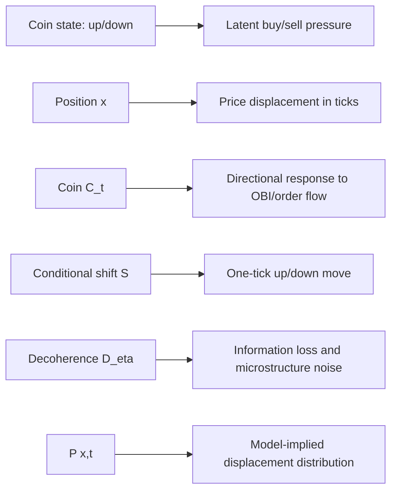

# 3. Ánh xạ QRW sang vi cấu trúc thị trường

## 3.1. Nguyên tắc

Ánh xạ trong dự án là một mô hình toán học lấy cảm hứng từ quantum walk, không phải
tuyên bố rằng order book là một hệ lượng tử vật lý. "Amplitude", "coin" và
"decoherence" là latent modeling constructs. Giá trị của framework phải được đánh giá
bằng khả năng tạo dự báo/phân phối có thể kiểm định, không bằng độ hấp dẫn của phép ẩn
dụ.

Ba nguyên tắc được giữ:

1. Mỗi đối tượng QRW phải có một đại lượng thị trường quan sát hoặc ước lượng được.
2. Mỗi parameter phải có protocol calibration và miền hợp lệ.
3. Mọi diễn giải phải có baseline cổ điển tương ứng để falsify lợi ích của coherence.

## 3.2. Sơ đồ ánh xạ



Biểu diễn văn bản tương đương:

```text
market features z_t -> adaptive coin C(z_t) -> conditional one-tick shift
       |                                               |
       +------------ decoherence/noise ----------------+
                            |
                  P(displacement = x | data up to t)
```

## 3.3. Bảng ánh xạ và justification

| Thành phần QRW | Thành phần thị trường | Justification | Giới hạn |
|---|---|---|---|
| $x\in\mathbb Z$ | Price displacement theo tick so với mốc | LOB có grid giá rời rạc theo tick size | Mid-price có thể đi nửa tick; cần quy ước |
| $|\uparrow\rangle$ | Latent upward/buy pressure | Gắn hướng coin với dịch phải | Không đồng nhất với một lệnh buy cụ thể |
| $|\downarrow\rangle$ | Latent downward/sell pressure | Gắn hướng coin với dịch trái | Trade side và price direction có thể khác |
| $C_t$ | Directional response operator | Trộn/persist pressure trước price move | Không phải xác suất nếu còn coherence |
| $S$ | Một bước dịch chuyển tick có điều kiện | Giữ causal local move | Jumps nhiều tick cần generalized shift |
| Relative phase | Interference giữa histories order flow | Cho phép path histories tăng/triệt tiêu | Pha là latent, không quan sát trực tiếp |
| $P(x,t)$ | Phân phối displacement có điều kiện | Là output dự báo có thể score | Không đồng nhất trực tiếp với LOB depth |
| $\mathcal D_\eta$ | Mất memory do noise/latency/impact | Giảm cross-history interference | Nhiều nguồn noise không nhận dạng riêng |
| Measurement | Chốt một outcome/quan sát giá | Chuyển distribution thành observation | Đo mỗi tick thay đổi dynamics |

## 3.4. Position là price level tương đối

Chọn reference price $p_0$, tick size $\delta p$, và định nghĩa

$$
x_t=\operatorname{round}\left(\frac{p_t-p_0}{\delta p}\right).
$$

QRW position $x$ nên được hiểu là displacement tương đối, không phải absolute price.
Điều này giữ lattice gần gốc và làm các phiên/asset có thể so sánh sau scale. Với
mid-price nằm ở nửa tick, có thể chọn lattice spacing $\delta p/2$ hoặc map microprice
vào bin; lựa chọn phải cố định trước calibration.

Một step QRW không bắt buộc bằng một giây. Ba clock hợp lý:

- event time: một trade hoặc một LOB update;
- volume time: mỗi block khối lượng cố định;
- calendar time: mỗi interval cố định như 100 ms.

Event time phù hợp nhất với conditional one-tick shift, nhưng intensity thay đổi. Nếu
dùng calendar time, generalized shift cần cho phép stay-put và multi-tick jumps.

## 3.5. Coin state là latent directional pressure

Coin basis được gắn với hai hướng:

$$
|\uparrow\rangle\leftrightarrow\text{upward pressure},\qquad
|\downarrow\rangle\leftrightarrow\text{downward pressure}.
$$

Đây không phải mapping một-một giữa $|\uparrow\rangle$ và buyer-initiated trade. Một
market buy có thể không đổi mid-price nếu depth đủ lớn; cancellation ở ask có thể làm
giá tăng mà không có trade. Coin state vì vậy đại diện cho latent directional tendency
tổng hợp từ signed order flow, cancellation và imbalance.

State ban đầu đối xứng thích hợp cho unconditional experiment. Với conditional forecast,
initial density matrix có thể được ước lượng từ recent tick directions. Cần regularize
để tránh vừa fit initial state vừa fit coin và tạo non-identifiability.

## 3.6. Adaptive coin như response operator

Order book imbalance ở top $K$ levels:

$$
\operatorname{OBI}_t=
\frac{\sum_{k=1}^K q^{bid}_{k,t}-\sum_{k=1}^K q^{ask}_{k,t}}
{\sum_{k=1}^K q^{bid}_{k,t}+\sum_{k=1}^K q^{ask}_{k,t}}
\in[-1,1].
$$

Một parameterization tối giản là

$$
\theta_t=\frac{\pi}{4}+\alpha\,\operatorname{OBI}_t,
$$

$$
C_t=C(\theta_t).
$$

$\alpha$ là sensitivity. Để tránh coin đi qua regime khó diễn giải, clamp
$\theta_t\in[\epsilon,\pi/2-\epsilon]$. Dấu của $\alpha$ phải được chọn sau khi kiểm
tra convention bằng synthetic case: OBI dương phải tăng expected displacement nếu mô
hình tuyên bố buy pressure đẩy giá lên.

Một parameterization tổng quát hơn dùng pha:

$$
C(\theta,\phi,\lambda)=
\begin{pmatrix}
e^{i\phi}\cos\theta & e^{i\lambda}\sin\theta\\
-e^{-i\lambda}\sin\theta & e^{-i\phi}\cos\theta
\end{pmatrix}.
$$

Pha có thể biểu diễn memory/asymmetry mà transition magnitude đơn thuần không capture.
Tuy nhiên parameter pha khó nhận dạng từ price observations; Phase 3 nên bắt đầu bằng
một parameter $\theta_t$ và chỉ mở rộng nếu out-of-sample score cải thiện.

## 3.7. Shift và các biến thể thực tế

Shift chuẩn:

$$
S|\uparrow,x\rangle=|\uparrow,x+1\rangle,\qquad
S|\downarrow,x\rangle=|\downarrow,x-1\rangle.
$$

nói rằng mỗi model step thay đổi một lattice unit. Dữ liệu thật có zero return và jump.
Ba cách mở rộng:

1. Thêm coin state `flat`, tạo lazy three-state walk.
2. Dùng event clock chỉ tại thời điểm mid-price thay đổi.
3. Dùng shift kernel phụ thuộc liquidity cho jump nhiều tick.

Phase 1 giữ mô hình hai trạng thái để có benchmark giải tích. Khi triển khai dữ liệu,
event filtering phải được ghi rõ; nếu bỏ zero-return events thì intensity là một feature
riêng, không được âm thầm biến mất.

## 3.8. Decoherence như mất thông tin

Market impact, hidden liquidity, latency, asynchronous updates và information
asymmetry làm history quan sát được không đầy đủ. Một dephasing channel:

$$
\mathcal D_{\eta_t}(\rho)
=(1-\eta_t)\rho+
\eta_t\sum_{c,x}\Pi_{c,x}\rho\Pi_{c,x},
$$

xóa dần off-diagonal terms. Có thể đặt

$$
\eta_t=\operatorname{sigmoid}
(\beta_0+\beta_1\text{spread}_t+\beta_2\text{latency}_t
-\beta_3\text{depth}_t).
$$

Đây là giả thuyết có thể kiểm định: spread/latency cao làm coherence time ngắn hơn,
depth cao có thể làm state ổn định hơn. Dấu hệ số không nên áp đặt nếu dữ liệu không hỗ
trợ.

Điều quan trọng là dùng density matrix và CPTP map. Công thức trộn trực tiếp
`psi_new = (1-gamma)*psi + gamma*classical_component` nói chung không bảo toàn norm,
không xác định "classical_component" duy nhất và không phải một quantum channel hợp lệ.
Nếu cần classical mixture, phải trộn density matrices:

$$
\rho'=(1-\eta)\rho_{\rm coherent}+\eta\rho_{\rm dephased}.
$$

## 3.9. Classical limit

Khi $\eta=1$ sau mỗi bước trong basis coin-position,

$$
\rho\mapsto\sum_{c,x}\Pi_{c,x}\rho\Pi_{c,x},
$$

mọi cross term biến mất. Diagonal probability chuyển theo

$$
\Pr(c',x'|c,x)=|C_{c'c}|^2
\mathbf 1[x'=x+s(c')],
$$

với $s(\uparrow)=1$, $s(\downarrow)=-1$. Hadamard cho transition magnitude $1/2$, nên
position marginal trở thành classical symmetric walk (sau khi xử lý coin memory đúng
protocol). Vì vậy "decoherence hoàn toàn" phải nghĩa là một channel cụ thể được áp dụng
ở một vị trí cụ thể trong step; ký hiệu chung chung $D\to1$ là chưa đủ.

## 3.10. $P(x,t)$ là gì trong market context?

Output

$$
P(x,t)=\sum_c\langle c,x|\rho_t|c,x\rangle
$$

được diễn giải là model-implied conditional distribution của price displacement sau
$t$ model steps. Nó có thể được đánh giá bằng log score, CRPS, Wasserstein distance,
coverage của prediction interval và calibration curve.

Không nên gọi $P(x,t)$ trực tiếp là "order flow density tại price level" nếu không có
observation model nối displacement probability với resting depth. LOB depth là stock
của limit orders; order flow là event flow; price displacement là outcome. Chúng liên
quan nhưng không đồng nhất. Nếu muốn dự báo order-flow density, cần likelihood riêng
$p(\text{flow}_{x,t}|\rho_t)$.

## 3.11. Calibration và identifiability

Một protocol tối thiểu:

1. Chọn clock, tick mapping và forecast horizon trước khi fit.
2. Fit $\alpha$ từ train set bằng proper scoring rule của distribution, không chỉ OLS
   của mean return.
3. Fit decoherence $\eta$ từ decay của predictive gain/coherence proxy; không đồng nhất
   máy móc $\eta=-\log|\rho_1|$ vì autocorrelation có thể âm hoặc bằng zero.
4. So sánh với CRW, correlated RW và empirical transition model có cùng số parameter.
5. Báo cáo out-of-sample score và uncertainty qua block bootstrap.

Coin bias, initial state, decoherence và time scaling đều có thể làm distribution hẹp
hoặc lệch. Để nhận dạng, nên fit theo stages hoặc dùng priors/constraints. Nếu nhiều bộ
parameter cho score gần như nhau, kết luận về "market coherence" không được xác định.

## 3.12. Giả thuyết có thể bác bỏ

Framework tạo ra các giả thuyết:

- Low-decoherence regime có variance exponent lớn hơn baseline diffusive ở horizon ngắn.
- OBI-adaptive coin cải thiện conditional distribution score so với coin cố định.
- Khi spread/latency tăng, fitted decoherence tăng và interference oscillation giảm.
- Full-dephasing model khớp với classical transition baseline trong numerical tolerance.

Nếu các giả thuyết không được dữ liệu hỗ trợ, QRW analogy bị bác bỏ ở scale đang xét.
Đó là kết quả khoa học hợp lệ, không phải lỗi cần "cứu" bằng chọn mẫu.

## 3.13. Kết luận

Ánh xạ tốt nhất là: position bằng price displacement theo tick; coin state bằng latent
directional pressure; adaptive coin bằng response của pressure với market features;
shift bằng local price move; decoherence bằng channel mất thông tin; và $P(x,t)$ bằng
conditional forecast distribution. Mọi thành phần đều có caveat và baseline. Cách đặt
vấn đề này giữ được cấu trúc toán học hữu ích của QRW mà không biến một phép ẩn dụ thành
tuyên bố vật lý về thị trường.

